# The *las* and *rhl* Quorum Sensing Systems in *Pseudomonas aeruginosa* Form a Multi-Signal Reciprocal Network Which Can Tune Reactivity to Variations in Physical and Social Environments

Stephen Thomas1, Ayatollah Samir El-Zayat2, James Gurney3, Jennifer Rattray1, Sam P. Brown1

> 1.  School of Biological Sciences, Georgia Institute of Technology, Atlanta, GA USA 30332.
> 2.  Faculty of Agriculture, Cairo University, Cairo, Egypt 12613.
> 3.  Department of Biology, College of Arts and Sciences, Georgia State University, Atlanta, GA USA 30303.

**Abstract:** Bacterial quorum sensing is often mediated by multiple signaling systems that interact with each other. The quorum sensing systems of *Pseudomonas aeruginosa,* for example, have been considered hierarchical, with the *las* system acting as a master regulator. By experimentally controlling the concentration of auto-inducer signals in a signal deficient strain (PAO1Δ*lasI*Δ*rhlI*), we show that the two primary quorum sensing systems—*las* and *rhl*—act reciprocally rather than hierarchically. Just as the *las* system’s 3‑oxo‑C12‑HSL can induce increased expression of *rhlI,* the *rhl* system’s C4‑HSL increases the expression level of *lasI.* We develop a mathematical model to quantify relationships both within and between the *las* and *rhl* quorum sensing systems and the downstream genes they influence. The results show that not only do the systems interact reciprocally, but they do so cooperatively and nonlinearly, with the combination of C4‑HSL and 3‑oxo‑C12‑HSL increasing expression level far more than the sum of their individual effects. We computationally assess how our parameterized model responds to variation in social (population density) and physical (mass transfer) environment and demonstrate that a reciprocal architecture is more responsive to density and more robust to mass transfer than a strict hierarchy.

## Introduction

Bacterial cells of many species communicate with each other by exchanging diffusible signal molecules (Papenfort and Bassler 2016; Whiteley, Diggle, and Greenberg 2017). This mechanism, known as quorum sensing (QS), has been well-studied at the level of specific molecular interactions. We now understand how those interactions shape the creation of and response to signal molecules in model organisms such as *Pseudomonas aeruginosa* (Pearson, Pesci, and Iglewski 1997). We have identified downstream effector genes such as virulence factors whose production depends on QS signals (Chugani et al. 2001; Kiratisin, Tucker, and Passador 2002), and we have recognized that many species possess multiple QS circuits (Papenfort and Bassler 2016). Despite this knowledge, we face gaps in our understanding of how quorum sensing influences bacterial behavior. How does QS guide bacterial actions in response to environmental conditions? What benefits do multiple QS circuits provide? And ultimately, how does QS contribute to bacterial fitness? Answering these questions requires an understanding of quorum sensing at the dynamical systems level as well as the molecular level.

Quorum sensing relies on several components interacting in a dynamical system (Popat et al. 2015; Pérez-Velázquez and Hense 2018). Individual cells synthesize small molecules called signals or inducers. These diffuse or are actively transported between the intracellular and extracellular environments (Pearson, Van Delden, and Iglewski 1999). Within cells, signal molecules bind to receptor proteins that serve as transcription factors (Bottomley et al. 2007). As signal concentration grows, genes activated by these transcription factors trigger a change in the cell's behavior (Whiteley, Lee, and Greenberg 1999). Those molecules related to a particular signal—the signal synthase, the signal molecule, and the cognate receptor—form a quorum sensing system. Some bacterial species have multiple QS systems, the opportunistic pathogen *Pseudomonas aeruginosa* among them. Among its multiple systems, *las* and *rhl* acyl-homoserine lactone (AHL) signaling systems have been especially well studied (Pesci et al. 1997; Lee and Zhang 2015). The *las* system includes the LasI signal synthase, N-(3-oxododecanoyl)-l-homoserine lactone (3‑oxo‑C12‑HSL) signal, and LasR receptor. The corresponding components of the *rhl* system are RhlI, N-butyryl-homoserine lactone (C4‑HSL), and RhlR. Schuster and Greenberg (2007) estimate that these two systems control expression of as much as 10% of the bacterial genome.

*P. aeruginosa* provides a model for understanding interactions between multiple QS systems. How does the behavior of one system, determined by the concentration of signal it produces, affect the behavior of a different system? How does expression of the one system’s synthase or receptor respond to the concentration of another systems signal? We classify possible multi-system architectures into three broad patterns shown in Figure 1. *Independent systems* (Figure 1A) have no influence on each other; *hierarchical systems* (Figure 1B) have a relationship but only in one direction, and *reciprocal systems* (Figure 1C) each exert influence on the other. At this level we do not consider the underlying mechanism(s) of the inter-system effects. For example, the signal of one system may bind directly to the receptor of the other; alternatively, the signal/receptor complex of one system may act as a transcriptional regulator of components in the second system. In both cases we simply denote the first system as influencing the second.

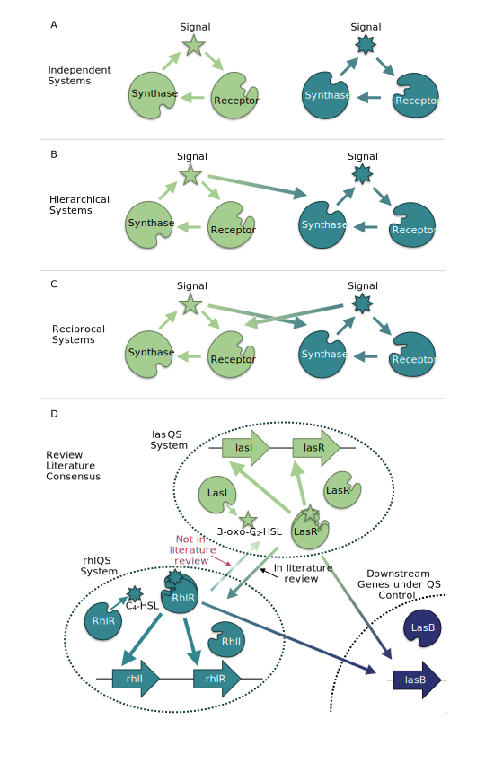

**Figure 1. The relationship between quorum sensing systems may be  classified as independent, hierarchical, or reciprocal.** (A) Independent: the signal of each has no influence on the expression of synthase or receptor in the other. (B) Hierarchical: one system’s signal influences expression of the other’s components, but without reciprocation. (C) Reciprocal: both systems’ signals influence the others’ components.

In the case of *las* and *rhl,* independent, isolated operation was eliminated as early as 1996 when Latifi et al. (1996) used *lacZ* transcriptional fusions to show that the combination of LasR and 3‑oxo‑C12‑HSL controls expression of *rhlR,* demonstrating that the *las* system influences the *rhl* system. These and other results have led many researchers to view *las* and *rhl* as a hierarchy, with the *las* system serving as master QS system controlling both its own activation and that of the *rhl* system (Figure 2). We confirm this consensus view via a structured literature review (Tables S.1 and S.2). The review literature is silent on whether the *rhl* signal C4‑HSL can influence the expression of the *las* synthase or receptor. If *lasI* or *lasR* respond to the *rhl* signal, then the strict hierarchical view may be missing an important factor that determines the overall system response.

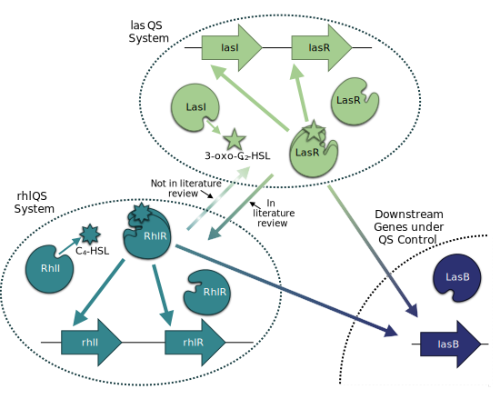

**Figure 2. The *P. aeruginosa* QS regulatory network is typically viewed as a hierarchy, with the *las* system on top.** Solid arrows summarize the relationships depicted in 17 review papers published since 1996 (Tables SI.1 and SI.2). All papers show the *las* system affecting the *rhl* system, but none identify a *las* synthase or receptor gene as a target of the *rhl* system (dashed line).

Our experiments explicitly examine the influence of both QS systems on each other, and the resulting data reveal three key insights. First, the traditional hierarchical view of *las* and *rhl* is incomplete. Our results confirm that *las* can exert control over the *rhl* system, but we also observe the converse: *rhl* influences the *las* system, specifically expression of *lasI.* Second, we show that maximum expression of genes in both QS systems requires both signals in combination, highlighting the importance of understanding the nature of the relationship between these systems. Finally, we demonstrate how that relationship can affect QS-controlled behavior. In particular, we show that, compared to a strict hiearchy, the reciprocity we observe provides more sensitivity to population density and more robustness to interfering physical environmental variation.

## Results

To uncover interactions between the *las* and *rhl* systems, we experimentally assess QS gene expression in an AHL null strain (PAO1Δ*lasI*Δ*rhlI*) exposed to defined, exogenous concentrations of the signal molecules 3‑oxo‑C12‑HSL (*las* system) and C4‑HSL (*rhl* system). We use bioluminescence (lux) reporters for *lasI* and *rhlI* to estimate expression levels of the respective signal synthase genes. We then develop mathematical models to quantify the effects of each system on the other and their consequent responses to environmental variation.

### The *las* and *rhl* Systems Influence Each Other

We first evaluate quorum sensing behavior under the influence of a single signal. We establish a baseline expression level by measuring reporter luminescence with no signal present. We then observe the increase in luminescence as exogenously controlled signal concentration increases. The ratio of luminescence with signal to luminescence with no signal represents the fold-change in expression induced by the defined signal concentration. Figure 3 shows the results for 3‑oxo‑C12‑HSL. As expected, expression of both genes increases as signal concentration increases. The availability of the *las* signal molecule influences the expression of *rhlI* as well as *lasI,* and, therefore, the *las* system affects the *rhl* system.

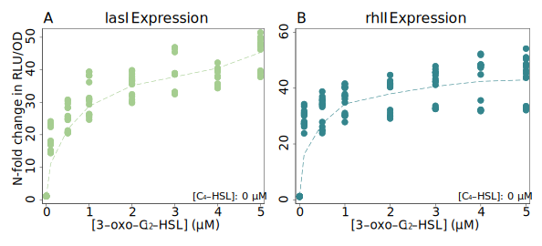

**Figure 3. The *las* signal 3‑oxo‑C12‑HSL increases the expression of *lasI* and *rhlI* in a signal null PAO1.** Plots show fold-change in RLU/OD (relative light units per optical density) values compared to baseline with no exogenous signals in NPAO1∆*lasI*∆*rhlI* cultures. Genomic reporter fusions *lasI:luxCDABE,* *rhlI:luxCDABE,* and *lasB:luxCDABE* were used to generate luminescence. Points are individual observations within the time window of peak expression; dashed lines show a locally weighted regression of the mean fold-change for each concentration value. Figures S.1 and S.2 show the underlying expression data for the entire time course of the experiments.

While we find no surprises with 3‑oxo‑C12‑HSL, our experiments with C4‑HSL challenge the conventional hierarchical view. Figure 4 shows those results: expression of *las* and *rhlI* increases with higher C4‑HSL concentration. The response of *lasI* (Figure 4A) does not correspond to a simple hierarchy with *las* as the master. Here we find that the *rhl* system affects the *las* system.

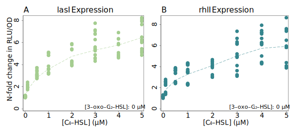

**Figure 4. The *rhl* signal C4‑HSL increases the expression of *lasI* and *rhlI* in a signal null PAO1.** Expression of both genes grows with increased concentration of C4‑HSL. Plots are constructed as in Figure 3. Strains and reporters also as in Figure 3. Note that panel A shows results are not captured by the consensus *las→rhl* hierarchy, as it clearly indicates that *lasI,* in the *las* system, responds to the signal produced by the *rhl* system. As above, Figures S.1 and S.2 show the underlying expression data for the entire time course of the experiments.

To quantify the impact of each signal alone, we model gene expression using Michaelis-Menten kinetics under quasi-steady state assumptions. The resulting dynamics provide a simple model of transcription factor binding (Santillán 2008; Bolouri 2008, chap. 9) as well as more general processes such as enzyme activity and substrate-receptor binding.

For a single signal, gene expression is defined by equation 1, where *ɑ0* is basal expression, *ɑ* is the maximum increase in expression from auto-induction, \[*S* \] is the signal concentration, and *K* is the disassociation constant of the binding event or, equivalently, the signal concentration corresponding to half of the maximum expression gain. With this model we quantify two qualities: how strongly a signal can increase gene expression above its basal level (*ɑ*), and how sensitive gene expression is to the presence of the signal (*K*).

$$
E(S) = \alpha_0 + 
\alpha \frac{[S]}{[S] + K}
\qquad{(1)}
$$

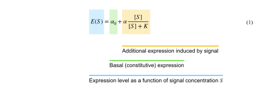

By minimizing the sum of squared error (with non-linear regression using the Gauss-Newton algorithm), we estimate model parameters from our data, using only those observations in which a single signal is present. Table 1 presents the results as maximum fold-change ((*ɑ* + *ɑ*0) / *ɑ*0) and half-concentration values (*K*) for both signals. Our model fits illustrate that while the *las* and *rhl* systems have reciprocal impacts, those impacts are not symmetrical. The *las* signal 3‑oxo‑C12‑HSL has a substantially greater influence on gene expression than C4‑HSL. In both cases the potential fold-change from 3‑oxo‑C12‑HSL is approximately six times greater than the potential fold-change from C4‑HSL. Both *lasI* and *rhlI* are also more sensitive to 3‑oxo‑C12‑HSL than to the C4‑HSL as the concentrations required to reach half of maximal expression are roughly 4 times and 30 times higher for the latter.

| Gene   | Signal                   | Parameter        |                Derivation                 |          Estimate          |      95% C.I. |
|--------|--------------------------|------------------|:-----------------------------------------:|:--------------------------:|--------------:|
| *lasI* |                          | Basal expression |              *ɑ*0              | 1670 <small>RLU/OD</small> |   1619 – 1721 |
|        | 3‑oxo‑C12‑HSL | Max fold-change  | (*ɑ* + *ɑ*0) / *ɑ*0 |            38 ×            |       36 – 40 |
|        |                          | ½ conc.          |                    *K*                    |          0.24 μM           |   0.17 – 0.30 |
|        | C4‑HSL        | Max fold-change  | (*ɑ* + *ɑ*0) / *ɑ*0 |           6.4 ×            |     5.8 – 7.0 |
|        |                          | ½ conc.          |                    *K*                    |           1.0 μM           |     0.7 – 1.4 |
| *rhlI* |                          | Basal expression |              *ɑ0*              | 1861 <small>RLU/OD</small> |   1798 – 1923 |
|        | 3‑oxo‑C12‑HSL | Max fold-change  | (*ɑ* + *ɑ*0) / *ɑ*0 |            35 ×            |       34 – 36 |
|        |                          | ½ conc.          |                    *K*                    |          0.052 μM          | 0.031 – 0.073 |
|        | C4‑HSL        | Max fold-change  | (*ɑ* + *ɑ*0) / *ɑ*0 |           6.4 ×            |     5.3 – 7.4 |
|        |                          | ½ conc.          |                    *K*                    |           1.6 μM           |     0.8 – 2.4 |

**Table 1. Single Signal Parameter Estimates.** Estimated fold-change, derived from raw parameters of equation 1 as (*ɑ* + *ɑ*0) / *ɑ*0 , and half-concentration, *K*, values for gene expression as a function of a single signal in isolation. Values shown with 95% confidence intervals.

### *las* and *rhl* Combine Synergistically

Figures 3 and 4 consider the effects of each signal in isolation, but wildtype cells with functioning synthase genes can produce both signals. To understand environments where both signals are present, we use controlled concentrations of both signals in combination. Figure 5 presents those results in the form of heat maps. The qualitative responses of both genes are similar: raising the concentration of either signal increases expression regardless of the concentration of the other signal. As with our observations of C4‑HSL alone, these results demonstrate again that the *rhl* system (via C4‑HSL) affects the *las* system (*lasI* expression).

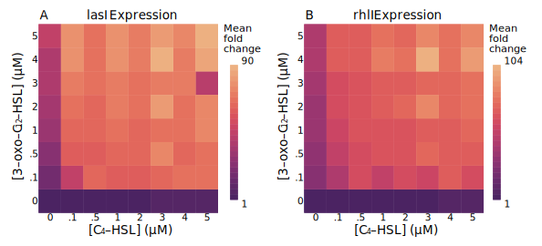

**Figure 5. Expression of *lasI* and *rhlI* is maximal in the presence of both C4‑HSL and 3‑oxo‑C12‑HSL.** Expression of both genes grows with increased concentration of either signal when both signals are combined. Heatmaps show fold-change in RLU/OD values compared to baseline with no exogenous signals. All underlying expression data through time is shown in Figures S.1 and S.2.

Having established a simple model for each signal in isolation, we next consider whether that model is sufficient to explain the effect of the signals in combination. Can we estimate total expression as the sum of expression induced by each signal alone? Such a response could result from two independent binding sites in the promoter regions (Buchler, Gerland, and Hwa 2003), one site for LasR/3‑oxo‑C12‑HSL and a separate site for RhlR/C4‑HSL. Figure 6 clearly shows that we cannot. The maximum expression observed, shown as a “ceiling” in that figure’s panels, far exceeds the sum of the signals’ individual influence. The presence of both signals boosts expression by as much as 30-fold beyond the level of what a simple sum would predict.

**Figure 6. Neither 3‑oxo‑C12‑HSL nor C4‑HSL alone can achieve maximal expression of *lasI* or *rhlI.*** Both genes require non-zero concentrations of both signals to achieve maximum expression. The flat surfaces in the plots indicate the maximum mean expression level measured across all combinations of signal concentrations. The plotted points represent observed expression levels when C4‑HSL is withheld (red) and when 3‑oxo‑C12‑HSL is withheld (yellow). Lines indicate the model predictions (Equation 1, parameters in Table 1).

To account for the synergy between the signals, we incorporate a cooperativity term in the gene expression model. Note that the cooperativity term is a multiplication of signals, and it alone cannot explain the full response, as the product is necessarily zero when any signal is absent. This term accounts for any non-additive interaction, for example the ability of one bound transcription factor to recruit the binding of a second transcription factor (Kaplan et al. 2008). Equation 2 shows the result. Each gene has a basal expression level, amplification from each signal alone, and additional amplification from each pair-wise combination of signals. The interaction from these pair-wise combinations captures the cooperative enhancement from the combined signals.

$$
E_i(\mathbf{S}) \ \ = \ \ \alpha_{i,0} \ \ \ + \ \ \ 
\sum_{j=1}^{\mathrm{N_S}}\alpha_{i,j}\frac{[S_j]}{[S_j] + K_{i,j}} \ \ \ + \ \ \
\sum_{j=1}^{\mathrm{N_S}-1}\sum_{j' = j+1}^{\mathrm{N_S}}
\alpha_{i,j,j'}\frac{[S_j][S_{j'}]}{([S_j] + K_{Qi,j,j'})([S_{j'}] + K_{Qi,j',j})}
\qquad{(2)}
$$

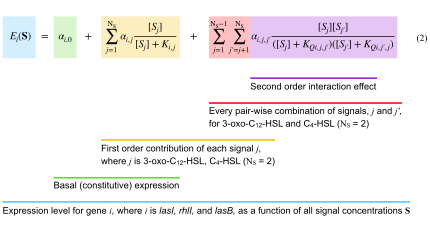

For both *lasI* and *rhlI* we again minimize the sum of squared errors to estimate parameter values. The resulting multi-signal models in Table 2 have R2 values of 0.82 and 0.77.

| Gene   | Signal                   | Parameter                            |                          Derivation                           |          Estimate          |      95% C.I. |
|--------|--------------------------|--------------------------------------|:-------------------------------------------------------------:|:--------------------------:|--------------:|
| *lasI* |                          | Basal expression                     |                       *ɑ*1,0                       | 1670 <small>RLU/OD</small> |   1619 – 1721 |
|        | 3‑oxo‑C12‑HSL | Max fold-change                      |  (*ɑ*1,1 + *ɑ*1,0) / *ɑ*1,0  |            38 ×            |       36 – 40 |
|        |                          | ½ conc.                              |                       *K*1,1                       |          0.24 μM           |   0.17 – 0.30 |
|        | C4‑HSL        | Max fold-change                      |  (*ɑ*1,2 + *ɑ*1,0) / *ɑ*1,0  |           6.4 ×            |     5.8 – 7.0 |
|        |                          | ½ conc.                              |                       *K*1,2                       |           1.0 μM           |     0.7 – 1.4 |
|        | Combined                 | Max fold-change                      | (*ɑ*1,1,2 + *ɑ*1,0) / *ɑ*1,0 |            30 ×            |       29 – 31 |
|        |                          | ½ conc. for 3‑oxo‑C12‑HSL |                    *K**Q*1,1,2                     |        \< 0.001 μM         |               |
|        |                          | ½ conc. for C4-HSL        |                    *K**Q*1,2,1                     |          0.003 μM          |     0 – 0.011 |
| *rhlI* |                          | Basal expression                     |                       *ɑ*2,0                       | 1861 <small>RLU/OD</small> |   1798 – 1923 |
|        | 3‑oxo‑C12‑HSL | Max fold-change                      |  (*ɑ*2,1 + *ɑ*2,0) / *ɑ*2,0  |            35 ×            |       34 – 36 |
|        |                          | ½ conc.                              |                       *K*2,1                       |          0.052 μM          | 0.031 – 0.073 |
|        | C4‑HSL        | Max fold-change                      |  (*ɑ*2,2 + *ɑ*2,0) / *ɑ*2,0  |           6.4 ×            |     5.3 – 7.4 |
|        |                          | ½ conc.                              |                       *K*2,2                       |           1.6 μM           |     0.8 – 2.4 |
|        | Combined                 | Max fold-change                      | (*ɑ*2,1,2 + *ɑ*1,0) / *ɑ*1,0 |            27 ×            |       26 – 28 |
|        |                          | ½ conc. for 3‑oxo‑C12‑HSL |                    *K**Q*2,1,2                     |        \< 0.001 μM         |               |
|        |                          | ½ conc. for C4-HSL        |                    *K**Q*2,2,1                     |        \< 0.001 μM         |               |

**Table 2. Multi-signal parameter estimates.** Model parameters for gene expression as a function of multiple signal concentrations. Parameters are the same as in Table 1 with addition of cooperative fold-change, again derived from raw parameters as (*ɑ* + *ɑ*0) / *ɑ*0 ,and cooperative half-concentration *KQ.* Values shown with 95% confidence intervals.

Figure 7 compares the model estimates with observations. For both genes, the model captures the effect of either signal in isolation and both signals in combination.

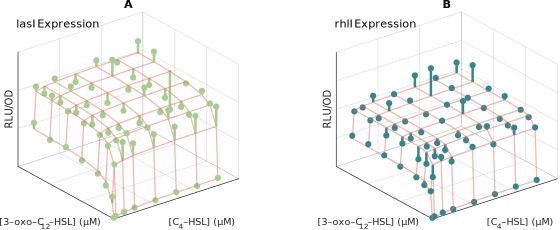

**Figure 7. Multi-signal models of Equation 2 for *lasI* and *rhlI* expression capture the synergistic effects of both signals.** Model estimates are shown as orange grid lines. Spheres show the mean value of expression observed at each combination of signal concentrations. Lines extend from these mean values to the relevant grid point for clarity. The coefficient of determination (R2) for the models is 0.82 and 0.77, respectively. Figures S.4 and S.5 present more detailed comparisons between model and observations.

The parameter estimates in Table 2 quantify the relative effect of individual and combined signals. For both *lasI* and *rhlI,* a single signal increases expression no more than 38- or 35-fold. Both signals combined, however, increase expression an *additional* 30- or 27-fold. The maximum expression induced by both signals nearly doubles compared to the maximum expression induced by any signal alone. Figure 8 summarizes the model parameters graphically. It answers the question posed in Figure 2—the *rhl* system does influence the *las* system—and it shows the relative magnitudes of the effects.

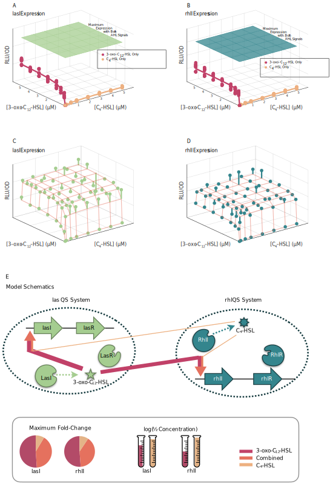

**Figure 8. The *las* and *rhl* quorum sensing systems have a reciprocal, but unequal relationship.** Red arrows represent maximum fold-change induction from *las*’s 3‑oxo‑C12‑HSL and yellow arrows maximum fold-change induction from *rhl’*s C4‑HSL. The orange component is additional induction from the combination of both signals. Arrow thickness is proportional to fold-change. Inset shows relative contribution of each signal to total maximum fold-change for expression levels of *lasI* and *rhlI,* and half concentration values for each.

### The Resulting Quorum Sensing Architecture Shapes the Response to Environmental Variation

Having established that both signals influence the expression levels of both synthase genes, we next consider how that relationship affects the overall quorum sensing response to environmental variation. Does a reciprocal architecture result in behavior that significantly differs from a hierarchical or independent architecture?

We begin by focusing on the canonical QS environmental variables: bacterial population density and mass transfer (e.g. diffusion or advective flow). We first characterize the QS response as the extracellular signal concentration. Building on previous models of extracellular signal dynamics (James et al. 2000; Dockery and Keener 2001; Ward et al. 2001; Brown 2013; Cornforth et al. 2014) we assume that signal concentration increases in proportion to the corresponding synthase’s expression level, multiplied by the number of cells expressing synthase, and decreases due to a constant rate of decay and removal via mass transfer. These assumptions lead to the differential equation model of equation 3, where *Si* is the concentration of signal *i*, *Ei* (**S**) is the expression level of the synthase for signal *i* (as a function of both signal concentrations, **S**, see equation 2) and *ci* a proportionality constant, *N* is the population density; *𝛿i* is the decay rate of signal *i,* and *m* is the rate of mass transfer.

$$
\frac{\mathrm{d}S_i}{\mathrm{dt}} \ \ = \ \ 
c_i E_i(\mathbf{S})\cdot N \ \ - \ \ 
 \delta_i \cdot S_i \ \ - \ \ 
 m \cdot S_i
\qquad{(3)}
$$

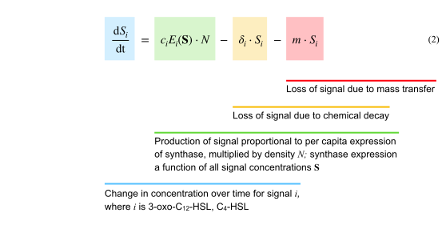

This equation models the dynamics of signal concentration in response to environmental conditions. In particular, its equilibrium values define the final signal concentrations that result from given values of population density and mass transfer rate. To solve for those equilibrium values, we estimate expression levels *Ei* (**S**) from our experimental data (Equation 2, Table 2). The remaining parameters, *ci* and *𝜹i*, we estimate from published literature as detailed in the supporting information and summarized in Table S.3. Figure S.7 compares the model predictions with observations.

As our interest is ultimately in bacterial behavior in response to quorum sensing, we next consider the expression level of a representative effector gene under quorum sensing control. The *lasB* gene codes for the secreted elastase protein LasB and is widely used as a model of QS-mediated virulence (Casilag et al. 2016; Cigana et al. 2021) and cooperation (Diggle et al. 2007; Allen et al. 2016; Sexton and Schuster 2017). Significantly, *lasB* expression is known to be influenced by both 3‑oxo‑C12‑HSL and C4‑HSL (Pearson, Pesci, and Iglewski 1997; Nouwens et al. 2003). To quantify that influence we use the same approach as with *lasI* and *rhlI:* measure luminescence of a *lasB* reporter in a signal null strain exposed to defined, exogenous concentrations of both signals. Figure 9 shows the resulting measurements.

**Figure 9. Expression of *lasB* is maximal in the presence of both C4‑HSL and 3‑oxo‑C12‑HSL.** (A) Heatmap showing fold-change in RLU/OD values compared to baseline with no exogenous signals. (B) Surface plot showing raw RLU/OD values and compares maximum measured expression (blue “ceiling”) with observed expression levels when C4‑HSL is withheld (red) and when 3‑oxo‑C12‑HSL is withheld (yellow). Lines indicate the model predictions (Equation 1, parameters in Table 3). Figure S.3 shows underlying expression data for full time course of experiments, and Figure S.6 provides a detailed comparison of model predictions and observations.

These measurements allow us to estimate parameters for a *lasB* model based on equation 2; Table 3 lists the results.

| Signal                   | Parameter                            |                          Derivation                           |          Estimate          |    95% C.I. |
|--------------------------|--------------------------------------|:-------------------------------------------------------------:|:--------------------------:|------------:|
|                          | Basal Expression                     |                       *ɑ*3,0                       | 1588 <small>RLU/OD</small> |  1516 –1660 |
| 3‑oxo‑C12‑HSL | Max fold-change                      |  (*ɑ*3,1 + *ɑ*3,0) / *ɑ*3,0  |           6.1 ×            |   5.6 – 6.7 |
|                          | ½ conc.                              |                       *K*3,1                       |           2.5 μM           |   1.0 – 3.0 |
| C4‑HSL        | Max fold-change                      |  (*ɑ*3,2 + *ɑ*3,0) / *ɑ*3,0  |           1.1 ×            |   1.1 – 1.1 |
|                          | ½ conc.                              |                       *K*3,2                       |        \< 0.001 μM         |             |
| Combined                 | Max fold-change                      | (*ɑ*3,1,2 + *ɑ*3,0) / *ɑ*3,0 |            23 ×            |     22 – 24 |
|                          | ½ conc. for 3‑oxo‑C12‑HSL |                    *K**Q*3,1,2                     |          0.42 μM           | 0.35 – 0.48 |
|                          | ½ conc. for C4-HSL        |                    *K**Q*3,2,1                     |          0.22 μM           | 0.18 – 0.25 |

**Table 3. Multi-signal parameter estimates for *lasB.*** Model parameters for *lasB* expression as a function of multiple signal concentrations. Parameters are the same as in Table 2. Values shown with 95% confidence intervals. Half-concentration estimates less than 0.001 μM are below the limits of precision of the experimental data.

With the parameter values from Figure 9 data (Table 3) we can predict *lasB* expression for combinations of signal concentrations. Furthermore, our parameterized models (Equation 3) can estimate equilibrium signal concentrations based on underlying evironmental properties (bacterial density and mass transfer). Integrating both models allows us to probe how *lasB* expression varies as those environmental conditions change. Figure 10 shows an example of that variation as a reaction norm (Stearns 1989; Rattray et al. 2022) of *lasB* expression against population density. The result is noteworthy as it captures a graded response rather than a threshold response traditionally assumed for quorum sensing. This graded response is consistent with the experimental observations of Rattray et al (2022).

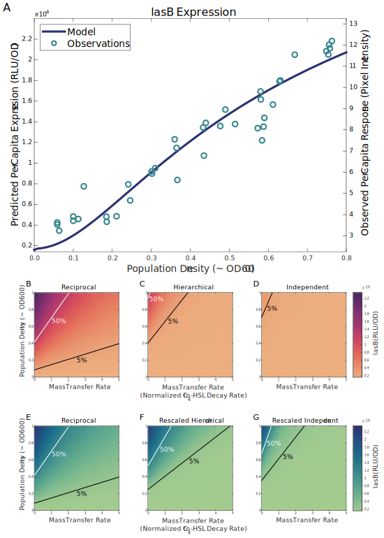

**Figure 10. *lasB* responds to increasing bacterial density in a graded manner.** Predicted *lasB* expression level is plotted against population density. For each density value, equation 3 provides an estimate of equilibrium signal concentrations for 3‑oxo‑C12‑HSL and C4‑HSL. The model of equation 2, parameterized by the estimates of Table 3, then predicts *lasB* expression from those concentrations.

### Responses to Environmental Variation Clarify Quorum Sensing Design Principles

Knowing that the *lasI/rhlI* reciprocal architecture creates the response of Figure 10, we next ask how that response differs from the response of hypothetical, alternative architectures. To answer that question, we recognize that Equation 2 is general enough to model hierarchical and independent architectures in addition to reciprocal architectures. Those alternatives emerge when specific *ɑ* parameter values are equal to zero. To understand the consequences of alternative architectures for *P. aeruginosa* we set the appropriate parameters to zero and note how the response changes. Table 4 shows the parameter values we use for the alternative architectures.

| Gene   | Signal                   | Parameter       |                          Derivation                           | Reciprocal Architecture | Hierarchical Architecture | Independent Architecture |
|--------|--------------------------|-----------------|:-------------------------------------------------------------:|:-----------------------:|:-------------------------:|:------------------------:|
| *lasI* | 3‑oxo‑C12‑HSL | Max fold-change |  (*ɑ*1,1 + *ɑ*1,0) / *ɑ*1,0  |          38 ×           |           38 ×            |           38 ×           |
|        | C4‑HSL        | Max fold-change |  (*ɑ*1,2 + *ɑ*1,0) / *ɑ*1,0  |          6.4 ×          |            1 ×            |           1 ×            |
|        | Combined                 | Max fold-change | (*ɑ*1,1,2 + *ɑ*1,0) / *ɑ*1,0 |          30 ×           |            1 ×            |           1 ×            |
| *rhlI* | 3‑oxo‑C12‑HSL | Max fold-change |  (*ɑ*2,1 + *ɑ*2,0) / *ɑ*2,0  |          35 ×           |           35 ×            |           1 ×            |
|        | C4‑HSL        | Max fold-change |  (*ɑ*2,2 + *ɑ*2,0) / *ɑ*2,0  |          6.4 ×          |           6.4 ×           |          6.4 ×           |
|        | Combined                 | Max fold-change | (*ɑ*2,1,2 + *ɑ*1,0) / *ɑ*1,0 |          27 ×           |           27 ×            |           1 ×            |

**Table 4. Hierarchical and independent architectures are special cases of the reciprocal architecture.** The multi-signal model of Equation 2 can represent hypothetical, alternative QS architectures by setting appropriate *ɑ* values to zero. Zero *ɑ* values result in a corresponding maximum fold-change of 1. For a hierarchical architecture, this setting nullifies the effect of C4‑HSL on *lasI.* For an independent archictecture, this setting additionally nullifies the effect of 3‑oxo‑C12‑HSL on *rhlI.*

Figure 11 plots *lasB* expression as reaction norms (Stearns 1989; Rattray et al. 2022) against population density (A) and mass transfer rate (B) for the three architectures. These results rely on the equilibrium signal concentrations estimated from the model parameters in Table 4. Compared to the baseline reciprocal architecture, the figure predicts that removing the influence of *rhl* on *las* (hierarchical architecture, dark green line) results in a delayed response to increasing density. Removing all *las/rhl* interactions (independent architecture, light green line) attenuates and delays the response to density. The reciprocal architecture is the most sensitive to changes in population density as its *lasB* expression fold-change increases the most for a given density value. Figure 10B examines the impact of different architectures on the bacteria’s response to the physical environment. In this case we show expression level as a function of processes affecting mass transfer such as advective flow or diffusive loss of signal. Here, the reciprocal architecture is the least sensitive to changes as its *lasB* expression has the smallest decline for a given mass transfer rate.

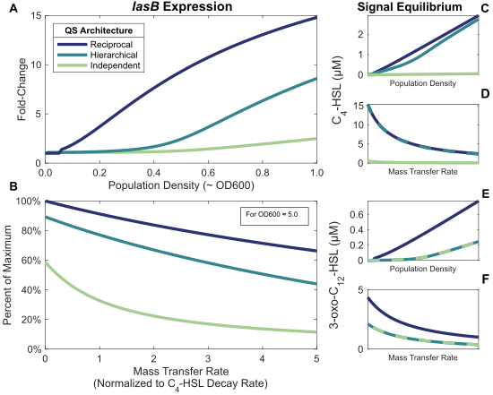

**Figure 11. The reciprocal QS architecture is more sensitive to population density and more robust to environmental interference.** Panels A and B show expression of a effector gene under quorum sensing control (*lasB*). All graphs include the results for three QS architectures: independent *las* and *rhl* systems, a hierarchy with the *las* system controlling the *rhl* system, and a reciprocal architecture in which both systems influence each other. Panel A shows estimated fold-change in expression as a function of population density approximately equivalent to OD600. Panel B shows percentage decline from maximum expression as a function of mass transfer rate normalized to C4‑HSL decay rate. Response calculated from equation 2 model with parameters from Tables 4 and 3. Panels C through F show the equilibrium signal concentrations the model estimates. Table S.4 and Figure S.8 present an alternative analysis that normalizes maximum expression levels; that analysis yields the same qualitative results.

## Discussion

In this study we consider different architectures for multi-signal quorum sensing systems (Figure 1) and show that the conventional *las-rhl* hierarchical view of QS in *P. aeruginosa* (Figure 2) is incomplete. Specifically, we find that both the *las* and *rhl* systems regulate each other. Figure 3 corroborates the influence of *las* on *rhl*, but, contrary to the hierarchical view, we also show in Figure 4 that the *rhl* signal C4‑HSL can influence the *las* synthase *lasI.* This effect is substantial, as C4‑HSL alone induces more than a six-fold increase in *lasI* expression compared to basal levels. We confirm these results when both signals are present simultaneously (Figure 5), and further show that both *las* and *rhl* synthase genes require both signals for maximal expression. By fitting a mathematical model, we demonstrate that simple additive effects are insufficient to explain our data (Figure 6). Closing the gap apparent in Figure 6 requires that the signals interact cooperatively to augment their additive effects. By modeling both the reciprocal relationship and the effect of cooperativity, we provide a quantitative model for QS in a model system, and conclude that the *las*-*rhl* relationship forms a biased reciprocal network (Figure 8). We then model the effect of this architecture on a representative QS-controlled gene (*lasB*) and compare the results with other architectures. We demonstrate that the type of architecture can have a qualitative effect on QS-mediated behavior. In particular, we find that, compared to a strict hierarchy, the reciprocal architecture results in *lasB* expression that is more sensitive to population density and more robust in the presence of environmental interference (Figure 11).

By focusing on signal concentration as the factor determining behavior, our approach accommodates multiple possible molecular mechanisms. It does mean, however, that we cannot easily distinguish between them. For example, C4‑HSL could be causing an increase in *lasI* expression by enabling the formation of LasR dimers, albeit less efficiently than 3‑oxo‑C12‑HSL. Alternatively, it could be the case that the RhlR/C4‑HSL complex serves as an activating transcription factor for *lasI.* Additional experiments would be required to distinguish between these two cases.

It should be noted that our use of *ΔlasIΔrhlI* cells might cause differences between our observations and wild type responses. In particular, we make two assumptions about the mutant strain. First, we assume that the only effect of the *lasI* and *rhlI* deletions is an inability to successfully produce LasI and RhlI proteins. Secondly, we assume that the only relevant phenotypic function of those proteins is the synthesis of the corresponding signal molecules. Although we cannot rule out pleiotropic effects from the strain construction or lack of synthase proteins, we find no reports of pleiotropic effects in the literature and do not expect that any such effects would alter our conclusions.

Our first key result demonstrates that the *las* and *rhl* systems form a reciprocal architecture, extending existing research into the relationship between those systems. Many researchers (Pesci et al. 1997; Kievit et al. 2002; Medina et al. 2003) have shown that the *las* system is essential for maximal expression of genes in the *rhl* system. Our data substantiates those results, but we also show the converse: the *rhl* system, in particular its signal C4‑HSL, is essential for maximum expression of a gene in the *las* system. We further extend prior results by considering the combination of both signals and by quantifying the relationship between the systems. Most previous attempts at this quantification have assumed a hierarchical architecture. For example, de Kievit et al. (2002) demonstrate that LasR/3‑oxo‑C12‑HSL alone influences *rhlI* expression more than RhlR/C4‑HSL alone, a result consistent with our data. Their analysis, however, is limited to measuring the response of the *rhl* system. Analyses of the effect of C4‑HSL on the *las* system are much less common, though Wargo and Hogan (2007) do report that a *rhlI* mutant produced the same 3‑oxo‑C12‑HSL concentrations as wild type. Those experiments were conducted in *Escherichia coli,* however, and the authors acknowledge that *E. coli* may include its own regulators that mimic the behavior of C4‑HSL. As with other published reports, the focus is on single signals in isolation, which necessarily neglects the effect of both signals combined.

In shifting from the molecular to the population level, we adopt common single signal QS mathematical models (Dockery and Keener 2001; Brown 2013). This approach has produced both theoretical conjectures (Pai and You 2009) and experimental interpretations (Fekete et al. 2010). Our analysis extends the models to account for multiple QS signals and interactions between them. In this way we can study not only isolated quorum sensing systems, but also networks of interrelated systems. We can both characterize the architectures of those systems and quantify the intra-system and inter-system effects.

By choosing the *las* and *rhl* quorum sensing systems for this study, we focus on a relatively straightforward QS architecture. It consists of only two systems that reinforce each other. *P. aeruginosa* has other QS systems such as *pqs* (Pesci et al. 1999), however, and it is not unique in having more than two. Other species (*V. cholerae,* *A. fischeri,* and *V. harveyi*) have at least three parallel systems (Waters and Bassler 2005), and some may have as many as eight (Brachmann et al. 2013). Our modeling approach can accomodate all of these species as Equations 2 and 3 allow for any number of distinct QS systems.

Furthermore, different systems do not always reinforce each other. In some cases one system can repress another, as is the case with the *pqs* system of *P. aeruginosa* (McGrath, Wade, and Pesci 2004). Cross-system repression has been identified in *B. subtilis* (Lazazzera, Solomon, and Grossman 1997), *V. fluvialis* (Wang et al. 2013), and *V. cholerae* (Herzog et al. 2019). Quantifying that repression with our models can distinguish different population-level behaviors. Repression by one system can limit expression of the other system, or it can stop expression entirely. Those possibilities, illustrated in Figure 12, may have vastly different effects on the population-level response to changes in stationary phase density.

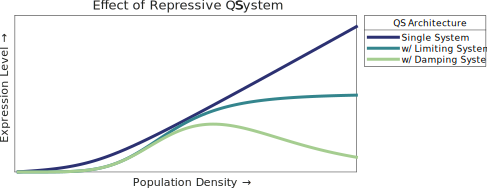

**Figure 12. Repressive quorum sensing systems can have various effects on the overall response.** The plot shows the overall response (e.g. expression level of a downstream gene) to population density for two types of repressive systems. It also shows the response of an unconstrained single system for comparison.

Finally, although we are able to model QS architectures at the cellular and population level, it is not clear how traditional gene regulatory networks can achieve the responses we observe. Long et al. (2009) suggest that multiple activating transcription factors combine additively, but that can only be true if the effects of each are independent. In contrast, Kaplan et al. (2008) claim that multiple inputs controlling gene expression usually combine multiplicatively. This relationship holds when the binding of one factor to the promoter depends on the presence of the second at that promoter. As Figure 6 makes clear, neither approach can adequately explain our data.

Sauer et al. (1995) make related observations for a protein complex in *Drosophila melanogaster*; both of the developmental regulators BCD and HB alone induce a 6-fold increase by themselves but combine to induce a greater than 65-fold increase. Their results offer a tantalizing possibility that further investigations into the mechanisms of *P. aeruginosa* quorum sensing interactions can provide insights into more general gene regulatory networks.

## Methods

### Data Collection

We used three strains for the experimental observations: l*asB:luxCDABE* genomic reporter fusion in NPAO1∆*lasI*∆*rhlI,* *lasI:luxCDABE* genomic reporter fusion in NPAO1∆*lasI*∆*rhlI,* and *rhlI:luxCDABE* genomic reporter fusion in NPAO1∆*lasI*∆*rhlI.* We streaked out all strains in Luria-Bertani (LB) agar at 37°C for 24 hours and then subcultured a single colony in 10 mL LB, incubated at 37°C under shaking conditions (180 rpm) for 24 hours.

We prepared 3‑oxo‑C12‑HSL and C4‑HSL in methanol at 7 different concentrations: 0.1, 0.5, 1, 2, 3, 4 and 5 µM, each diluted from 100 mM stock. We centrifuged all cultures and washed each three times using PBS. We then re-suspended in LB and diluted to an OD (600) of 0.05. We then transferred 200 µl of each culture to a black 96-well plate with a clear bottom and inoculated with signals at the indicated concentrations. We repeated each experiment to generate five replicates. Methanol with no signal was used as a control. The plates were incubated in BioSpa at 37°c for 18 h. Measurements of OD (600) and RLU (Relative Luminescence Units) were collected every hour.

### Data Analysis

We estimated parameter values in Tables 1, 2, 4, and 3 with non-linear regression by least squares using the Gauss-Newton algorithm (Ratkowsky 1983). Observations were limited to time ranges with peak expression values. (See supporting Information for detailed time course analysis.) Comparisons of model predictions and observed values are available in supporting Information. Equilibrium values shown in Figure 10 were computed using a Trust-Region-Dogleg Algorithm (Powell 1968). Analyses performed and data visualizations created with *MATLAB: Version 9.13 (R2022b)* from The MathWorks Inc., Natick, MA and *Stata Statistical Software: Release 17* from StataCorp LLC, College Station, TX. All original code is available on GitHub at https://github.com/GaTechBrownLab.

Additional third-party modules:

Jann B. “PALETTES: Stata module to provide color palettes, symbol palettes, and line pattern palettes,” *Statistical Software Components* S458444, Boston College Department of Economics, 2017, revised 27 May 2020.

Jann B. “COLRSPACE: Stata module providing a class-based color management system in Mata,” *Statistical Software Components* S458597, Boston College Department of Economics, 2019, revised 06 Jun 2020.

Jann B. “HEATPLOT: Stata module to create heat plots and hexagon plots,” *Statistical Software Components* S458598, Boston College Department of Economics, 2019, revised 13 Oct 2020.

Custom color schemes adapted from seaboarn.

Watson ML. “seaborn: statistical data visualization.” *Journal of Open Source Software* 2021 Apr 06;**6(60)**: doi: 10.21105/joss.03021.

## References

Allen, RC, L McNally, R Popat, and SP Brown. 2016. “Quorum Sensing Protects Bacterial Co-Operation from Exploitation by Cheats.” *ISME J* 10 (7): 1706–16.

Bolouri, Hamid. 2008. *Computational Modeling of Gene Regulatory Networks: A Primer*. Imperial College Press.

Bottomley, MJ, E Muraglia, R Bazzo, and A Carfì. 2007. “Molecular Insights into Quorum Sensing in the Human Pathogen *Pseudomonas Aeruginosa* from the Structure of the Virulence Regulator LasR Bound to Its Autoinducer.” *J Biol Chem* 282 (18): 13592–600.

Brachmann, AO, S Brameyer, D Kresovic, I Hitkova, Y Kopp, C Manske, K Schubert, HB Bode, and R Heermann. 2013. “Pyrones as Bacterial Signaling Molecules.” *Nat Chem Biol* 9 (9): 573–78.

Brown, D. 2013. “Linking Molecular and Population Processes in Mathematical Models of Quorum Sensing.” *Bull Math Biol* 75 (10): 1813–39.

Buchler, NE, U Gerland, and T Hwa. 2003. “On Schemes of Combinatorial Transcription Logic.” *Proc Natl Acad Sci U S A* 100 (9): 5136–41.

Casilag, F, A Lorenz, J Krueger, F Klawonn, S Weiss, and S Häussler. 2016. “The LasB Elastase of *Pseudomonas Aeruginosa* Acts in Concert with Alkaline Protease AprA to Prevent Flagellin-Mediated Immune Recognition.” *Infect Immun* 84 (1): 162–71.

Chugani, SA, M Whiteley, KM Lee, D D’Argenio, C Manoil, and EP Greenberg. 2001. “QscR, a Modulator of Quorum-Sensing Signal Synthesis and Virulence in *Pseudomonas Aeruginosa*.” *Proc Natl Acad Sci U S A* 98 (5): 2752–57.

Cigana, Cristina, Jérôme Castandet, Nicolas Sprynski, Medede Melessike, Lilha Beyria, Serena Ranucci, Beatriz Alcalá-Franco, Alice Rossi, Alessandra Bragonzi, and Magdalena Zalacain. 2021. “*Pseudomonas Aeruginosa* Elastase Contributes to the Establishment of Chronic Lung Colonization and Modulates the Immune Response in a Murine Model.” *Frontiers in Microbiology* 11: 620819.

Cornforth, DM, R Popat, L McNally, J Gurney, TC Scott-Phillips, A Ivens, SP Diggle, and SP Brown. 2014. “Combinatorial Quorum Sensing Allows Bacteria to Resolve Their Social and Physical Environment.” *Proc Natl Acad Sci U S A* 111 (11): 4280–84.

Diggle, SP, AS Griffin, GS Campbell, and SA West. 2007. “Cooperation and Conflict in Quorum-Sensing Bacterial Populations.” *Nature* 450 (7168): 411–14.

Dockery, JD, and JP Keener. 2001. “A Mathematical Model for Quorum Sensing in *Pseudomonas Aeruginosa*.” *Bull Math Biol* 63 (1): 95–116.

Fekete, A, C Kuttler, M Rothballer, BA Hense, D Fischer, K Buddrus-Schiemann, M Lucio, J Müller, P Schmitt-Kopplin, and A Hartmann. 2010. “Dynamic Regulation of n-Acyl-Homoserine Lactone Production and Degradation in *Pseudomonas Putida* IsoF.” *FEMS Microbiol Ecol* 72 (1): 22–34.

Herzog, R, N Peschek, KS Fröhlich, K Schumacher, and K Papenfort. 2019. “Three Autoinducer Molecules Act in Concert to Control Virulence Gene Expression in Vibrio Cholerae.” *Nucleic Acids Res* 47 (6): 3171–83.

James, S, P Nilsson, G James, S Kjelleberg, and T Fagerström. 2000. “Luminescence Control in the Marine Bacterium *Vibrio Fischeri:* An Analysis of the Dynamics of Lux Regulation.” *J Mol Biol* 296 (4): 1127–37.

Kaplan, S, A Bren, A Zaslaver, E Dekel, and U Alon. 2008. “Diverse Two-Dimensional Input Functions Control Bacterial Sugar Genes.” *Mol Cell* 29 (6): 786–92.

Kievit, TR de, Y Kakai, JK Register, EC Pesci, and BH Iglewski. 2002. “Role of the *Pseudomonas Aeruginosa* *Las* and *Rhl* Quorum-Sensing Systems in *rhlI* Regulation.” *FEMS Microbiol Lett* 212 (1): 101–6.

Kiratisin, P, KD Tucker, and L Passador. 2002. “LasR, a Transcriptional Activator of *Pseudomonas Aeruginosa* Virulence Genes, Functions as a Multimer.” *J Bacteriol* 184 (17): 4912–19.

Latifi, A, M Foglino, K Tanaka, P Williams, and A Lazdunski. 1996. “A Hierarchical Quorum-Sensing Cascade in *Pseudomonas Aeruginosa* Links the Transcriptional Activators LasR and RhIR (VsmR) to Expression of the Stationary-Phase Sigma Factor RpoS.” *Mol Microbiol* 21 (6): 1137–46.

Lazazzera, BA, JM Solomon, and AD Grossman. 1997. “An Exported Peptide Functions Intracellularly to Contribute to Cell Density Signaling in b. Subtilis.” *Cell* 89 (6): 917–25.

Lee, J, and L Zhang. 2015. “The Hierarchy Quorum Sensing Network in *Pseudomonas Aeruginosa*.” *Protein Cell* 6 (1): 26–41.

Long, T, KC Tu, Y Wang, P Mehta, NP Ong, BL Bassler, and NS Wingreen. 2009. “Quantifying the Integration of Quorum-Sensing Signals with Single-Cell Resolution.” *PLoS Biol* 7 (3): e68.

McGrath, S, DS Wade, and EC Pesci. 2004. “Dueling Quorum Sensing Systems in *Pseudomonas Aeruginosa* Control the Production of the Pseudomonas Quinolone Signal (PQS).” *FEMS Microbiol Lett* 230 (1): 27–34.

Medina, G, K Juárez, R Díaz, and G Soberón-Chávez. 2003. “Transcriptional Regulation of *Pseudomonas Aeruginosa* *rhlR,* Encoding a Quorum-Sensing Regulatory Protein.” *Microbiology (Reading)* 149 (Pt 11): 3073–81.

Nouwens, AS, SA Beatson, CB Whitchurch, BJ Walsh, HP Schweizer, JS Mattick, and SJ Cordwell. 2003. “Proteome Analysis of Extracellular Proteins Regulated by the *Las* and *Rhl* Quorum Sensing Systems in *Pseudomonas Aeruginosa* PAO1.” *Microbiology (Reading)* 149 (Pt 5): 1311–22.

Pai, A, and L You. 2009. “Optimal Tuning of Bacterial Sensing Potential.” *Mol Syst Biol* 5: 286.

Papenfort, K, and BL Bassler. 2016. “Quorum Sensing Signal-Response Systems in Gram-Negative Bacteria.” *Nat Rev Microbiol* 14 (9): 576–88.

Pearson, JP, EC Pesci, and BH Iglewski. 1997. “Roles of *Pseudomonas Aeruginosa* *Las* and *Rhl* Quorum-Sensing Systems in Control of Elastase and Rhamnolipid Biosynthesis Genes.” *J Bacteriol* 179 (18): 5756–67.

Pearson, JP, C Van Delden, and BH Iglewski. 1999. “Active Efflux and Diffusion Are Involved in Transport of *Pseudomonas Aeruginosa* Cell-to-Cell Signals.” *J Bacteriol* 181 (4): 1203–10.

Pérez-Velázquez, J, and BA Hense. 2018. “Differential Equations Models to Study Quorum Sensing.” *Methods Mol Biol* 1673: 253–71.

Pesci, EC, JB Milbank, JP Pearson, S McKnight, AS Kende, EP Greenberg, and BH Iglewski. 1999. “Quinolone Signaling in the Cell-to-Cell Communication System of *Pseudomonas Aeruginosa*.” *Proc Natl Acad Sci U S A* 96 (20): 11229–34.

Pesci, EC, JP Pearson, PC Seed, and BH Iglewski. 1997. “Regulation of *Las* and *Rhl* Quorum Sensing in *Pseudomonas Aeruginosa*.” *J Bacteriol* 179 (10): 3127–32.

Popat, R, DM Cornforth, L McNally, and SP Brown. 2015. “Collective Sensing and Collective Responses in Quorum-Sensing Bacteria.” *J R Soc Interface* 12 (103): 20140882.

Powell, Michael JD. 1968. “A Fortran Subroutine for Solving Systems of Nonlinear Algebraic Equations.”

Ratkowsky, David A. 1983. *Nonlinear Regression Modeling: A Unified Practical Approach*. Marcel Dekker Incorporated.

Rattray, JB, SA Thomas, Y Wang, E Molotkova, J Gurney, JJ Varga, and SP Brown. 2022. “Bacterial Quorum Sensing Allows Graded and Bimodal Cellular Responses to Variations in Population Density.” *mBio* 13 (3): e0074522.

Santillán, Moises. 2008. “On the Use of the Hill Functions in Mathematical Models of Gene Regulatory Networks.” *Mathematical Modelling of Natural Phenomena* 3 (2): 85–97.

Sauer, F, SK Hansen, and R Tjian. 1995. “Multiple TAFIIs Directing Synergistic Activation of Transcription.” *Science* 270 (5243): 1783–88.

Schuster, M, and EP Greenberg. 2007. “Early Activation of Quorum Sensing in *Pseudomonas Aeruginosa* Reveals the Architecture of a Complex Regulon.” *BMC Genomics* 8: 287.

Sexton, DJ, and M Schuster. 2017. “Nutrient Limitation Determines the Fitness of Cheaters in Bacterial Siderophore Cooperation.” *Nat Commun* 8 (1): 230.

Stearns, SC. 1989. “The Evolutionary Significance of Phenotypic Plasticity.” *Bioscience*.

Wang, Y, H Wang, W Liang, AJ Hay, Z Zhong, B Kan, and J Zhu. 2013. “Quorum Sensing Regulatory Cascades Control Vibrio Fluvialis Pathogenesis.” *J Bacteriol* 195 (16): 3583–89.

Ward, JP, JR King, AJ Koerber, P Williams, JM Croft, and RE Sockett. 2001. “Mathematical Modelling of Quorum Sensing in Bacteria.” *IMA J Math Appl Med Biol* 18 (3): 263–92.

Wargo, MJ, and DA Hogan. 2007. “Examination of *Pseudomonas Aeruginosa* *lasI* Regulation and 3-Oxo-C12-Homoserine Lactone Production Using a Heterologous *Escherichia Coli* System.” *FEMS Microbiol Lett* 273 (1): 38–44.

Waters, CM, and BL Bassler. 2005. “Quorum Sensing: Cell-to-Cell Communication in Bacteria.” *Annu Rev Cell Dev Biol* 21: 319–46.

Whiteley, M, SP Diggle, and EP Greenberg. 2017. “Progress in and Promise of Bacterial Quorum Sensing Research.” *Nature* 551 (7680): 313–20.

Whiteley, M, KM Lee, and EP Greenberg. 1999. “Identification of Genes Controlled by Quorum Sensing in Pseudomonas Aeruginosa.” *Proc Natl Acad Sci U S A* 96 (24): 13904–9.
