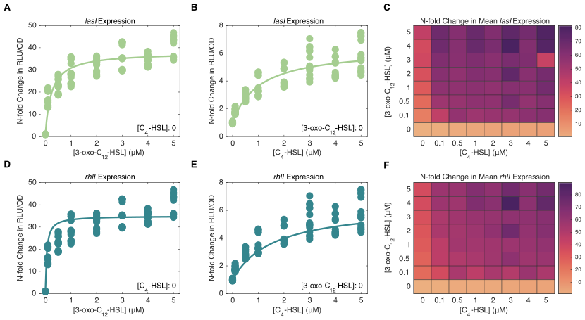
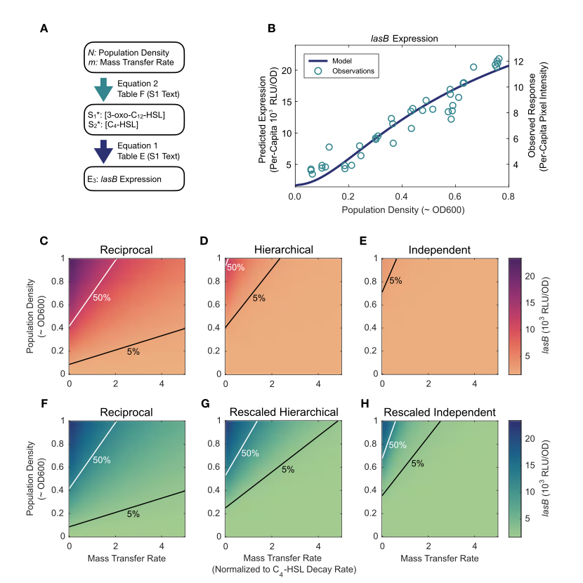

# Quantitative modeling of multi-signal quorum sensing maps environment to bacterial regulatory responses

Stephen Thomas<sup>1</sup>, Ayatollah S. El-Zayat<sup>2</sup>, James Gurney<sup>3</sup>, Jennifer Rattray<sup>1,4</sup>, Sam P. Brown<sup>1</sup>

> 1.  School of Biological Sciences, Georgia Institute of Technology, Atlanta, GA USA 30332.
> 2.  Department of Microbiology, Faculty of Agriculture, Cairo University, Giza 12613, Egypt.
> 3.  Department of Biology, College of Arts and Sciences, Georgia State University, Atlanta, GA USA 30303.
> 4.  Present address: Sandia National Laboratories, Albuquerque, NM, USA.

**Abstract:** Bacterial quorum sensing is often mediated by multiple signaling systems that interact with each other. The quorum sensing systems of *Pseudomonas aeruginosa,* for example, are considered hierarchical, with the *las* system acting as a master regulator. By experimentally controlling the concentration of auto-inducer signals in a signal deficient strain (PAO1Δ*lasI*Δ*rhlI*), we show that the two primary quorum sensing systems—*las* and *rhl*—act reciprocally rather than hierarchically. Just as the *las* system’s 3‑oxo‑C<sub>12</sub>‑HSL can induce increased expression of *rhlI,* the *rhl* system’s C<sub>4</sub>‑HSL increases the expression level of *lasI.* We develop a mathematical model to quantify relationships both within and between the *las* and *rhl* quorum sensing systems and the downstream genes they influence. The results show that not only do the systems interact in a reciprocal manner, but they do so asymmetrically, cooperatively, and nonlinearly, with the combination of C<sub>4</sub>‑HSL and 3‑oxo‑C<sub>12</sub>‑HSL increasing expression level far more than the sum of their individual effects. We next extend our parameterized mathematical model to generate quantitative predictions on how a QS-controlled effector gene (*lasB*) responds to changes in wildtype bacterial stationary phase density, and find close quantitative agreement with an independent dataset. Finally, we use our parameterized model to assess how changes in multi-signal interactions modulate functional responses to variation in social (population density) and physical (mass transfer) environment and demonstrate that a reciprocal architecture is more responsive to density and more robust to mass transfer than a strict hierarchy.

### Significance Statement

Bacteria often sense and respond to their environment via quorum sensing. While we understand the core components of signal production and response in great molecular detail, we face a fundamental gap in our understanding of how these components combine to quantitatively map environmental properties onto behavioral responses. To address this gap, we develop a dynamical-systems approach, using controlled experimental data to parameterize and test a mathematical model of multi-signal QS, using *Pseudomonas aeruginosa* as a model system. Our approach provides a general and flexible methodology to quantify the multi-signal “wiring diagrams” of QS bacteria and functionally link these wiring diagrams to QS-controlled responses to environmental variation.

## Introduction

Within many bacterial species, cells communicate with each other by exchanging diffusible signal molecules (Papenfort and Bassler 2016; Whiteley, Diggle, and Greenberg 2017). This mechanism, known as quorum sensing (QS), has been well-studied at the level of specific molecular interactions. We now understand how those molecular interactions shape the creation of and response to signal molecules in model organisms such as *Pseudomonas aeruginosa* (Pearson, Pesci, and Iglewski 1997). We have identified downstream effector genes such as virulence factors whose production depends on QS signals (Chugani et al. 2001; Kiratisin, Tucker, and Passador 2002), and we have recognized that many species possess multiple QS circuits (Papenfort and Bassler 2016). Despite this knowledge, we face gaps in our understanding of how quorum sensing influences bacterial behavior. How does QS quantitatively guide bacterial actions in response to defined environmental conditions? What benefits do multiple QS circuits provide? And ultimately, how does QS contribute to bacterial fitness? Answering these questions requires an understanding of quorum sensing at the dynamical systems level as well as the molecular level.

Quorum sensing relies on several components interacting in a dynamical system (Popat et al. 2015; Pérez-Velázquez and Hense 2018). Individual cells synthesize small molecules called signals or inducers. These diffuse or are actively transported between the intracellular and extracellular environments (Pearson, Van Delden, and Iglewski 1999). Within cells, signal molecules bind to receptor proteins that can then serve as transcription factors (Bottomley et al. 2007). As signal concentration grows, genes activated by these transcription factors trigger a change in the cell's behavior (Whiteley, Lee, and Greenberg 1999). Those molecules related to a particular signal—the signal synthase, the signal molecule, and the cognate receptor—form a quorum sensing system. Some bacterial species have multiple QS systems, the opportunistic pathogen *Pseudomonas aeruginosa* among them. Among its multiple systems, *las* and *rhl* acyl-homoserine lactone (AHL) signaling systems have been especially well studied (Pesci et al. 1997; Lee and Zhang 2015). The *las* system includes the LasI signal synthase, N-(3-oxododecanoyl)-l-homoserine lactone (3‑oxo‑C<sub>12</sub>‑HSL) signal, and LasR receptor. The corresponding components of the *rhl* system are RhlI, N-butyryl-homoserine lactone (C<sub>4</sub>‑HSL), and RhlR. Schuster and Greenberg (2007) estimate that these two systems control expression of as much as 10% of the bacterial genome.

*P. aeruginosa* provides a model for understanding interactions between multiple QS systems. How does the behavior of one system, determined by the concentration of signal it produces, affect the behavior of a different system? How does expression of one system’s synthase or receptor respond to the concentration of another systems signal? We classify possible multi-system architectures into three broad patterns shown in Figure 1. *Independent systems* (Figure 1A) have no influence on each other. *Hierarchical systems* (Figure 1B) have a relationship but only in one direction; one QS system exerts an influence on the other, but the second has no effect on the first. Finally, *reciprocal systems* (Figure 1C) each exert influence on the other. At this level we do not make any assumptions concerning the underlying mechanism(s) of the inter-system effects. For example, the signal of one system may bind directly to the receptor of the other; alternatively, the signal/receptor complex of one system may act as a transcriptional regulator of components in the second system. In both cases we simply denote the first system as influencing the second and focus on *quantifying* the degree of influence, regardless of mechanistic pathway.


<figcaption aria-hidden="true">Figure 1: architectures</figcaption>

**Figure 1. The *P. aeruginosa* QS regulatory network is typically viewed as a hierarchy with the *las* system on top.** In general, the regulatory network of two QS systems may be organized in three architectures: (A) Independent, in which the signal of each has no influence on the expression of synthase or receptor in the other. (B) Hierarchical, where one system’s signal influences expression of the other’s components but without reciprocation. And (C) reciprocal, where both systems’ signals influence the others’ components. The consensus of the review literature for *P. aeruginosa* (D) as summarized in 17 review papers published since 1996 (Tables S1 and S2) suggests a hierarchical architecture for the *las* and *rhl* systems.

In the case of *las* and *rhl,* independent, isolated operation was eliminated as early as 1996 when Latifi et al. (1996) used *lacZ* transcriptional fusions to show that the combination of LasR and 3‑oxo‑C<sub>12</sub>‑HSL controls expression of *rhlR,* demonstrating that the *las* system influences the *rhl* system. These and other results have led many researchers to view *las* and *rhl* as a hierarchy, with the *las* system serving as the master QS system controlling both its own activation and that of the *rhl* system (Figure 1D). Notably, in a strict hierarchy, the *rhl* system exerts no influence on the *las* system. We confirm this consensus perspective via a structured literature search of review articles (Tables S1 and S2). All papers show the *las* system affecting the *rhl* system, but none identify the *las* synthase or receptor gene as a target of the *rhl* system. Despite its prevalence in the review literature, experimental studies have flagged limitations in the hierarchical model. For example, several studies demonstrate that the *rhl* system can self-activate and drive expression of QS-controlled virulence factors, even when the “top of the hierarchy” *lasR* gene is experimentally deleted (Dekimpe and Déziel 2009) or functionally compromised during experimental or clinical evolution (Kostylev et al. 2019). These results indicate a potential genetic transition to an independent signal architecture (Figure 1A) with one functional signal system (*rhl*) and raise the broader question of how changes in multi-signal wiring impact QS functionality. We approach this question by using experimental data from the model *P. aeruginosa* strain PAO1 to test all three wiring models in Figure 1A-C. If *lasI* or *lasR* respond to the *rhl* signal, then the strict hierarchical view is potentially missing an important factor affecting the overall system response, a factor potentially captured by a reciprocal wiring diagram (Figure 1C).

Our experiments explicitly examine the influence of both QS systems on each other, and the resulting data reveal three key results. First, the traditional, strict hierarchical view of *las* and *rhl* is incomplete. Our results confirm that *las* can exert control over the *rhl* system, but we also observe the converse: *rhl* substantially influences the *las* system, specifically expression of *lasI.* Second, we use our data to parameterize a new mathematical model of multi-signal regulatory dynamics, producing quantitative estimates on how signal modules influence each other and the expression of downstream effector genes. Finally, we embed our multi-signal model in an explicit environmental context to produce and test quantitative predictions on how QS-controlled behaviors change with changing environmental conditions. Specifically, we show that, compared to a strict hierarchy, the reciprocity we observe provides more sensitivity to population density and more robustness to interfering physical environmental variation.

## Results

To uncover interactions between the *las* and *rhl* systems, we begin by experimentally assessing QS gene expression in an AHL null strain (PAO1Δ*lasI*Δ*rhlI*) exposed to defined, exogenous concentrations of the signal molecules 3‑oxo‑C<sub>12</sub>‑HSL (*las* system) and C<sub>4</sub>‑HSL (*rhl* system). We use bioluminescence (lux) transcriptional fusion reporters for *lasI* and *rhlI* to estimate expression levels of the respective signal synthase genes. We then develop mathematical models to quantify the effects of each system on the other and their consequent responses to environmental variation. In a final experimental step, we test our predicted QS responses to differing bacterial densities in a strain with intact regulatory feedbacks governing endogenous signal production.

### The *las* and *rhl* Systems Interact Reciprocally

We first evaluate quorum sensing behavior under the influence of a single signal. We establish a baseline expression level by measuring reporter luminescence with no signal present. We then observe the increase in luminescence as exogenously controlled signal concentration increases. We chose signal concentrations to reflect experimentally observed concentrations typically ranging from 0.1 to 5 μM (Juříková et al. 2023). The ratio of luminescence with signal to luminescence with no signal represents the fold-change in expression induced by the defined signal concentration. Figure 2A,D shows the results for 3‑oxo‑C<sub>12</sub>‑HSL. As expected, expression of both *lasI* and *rhlI* genes increases as signal concentration increases. The availability of the *las* signal molecule influences the expression of *rhlI* as well as *lasI,* and, therefore, the *las* system affects the *rhl* system.


<figcaption aria-hidden="true">Figure 2: observations</figcaption>

**Figure 2. Both the *las* signal 3‑oxo‑C<sub>12</sub>‑HSL and the *rhl* signal C<sub>4</sub>‑HSL increase the expression of *lasI* and *rhlI* in a signal null PAO1.** (A-C) *lasI* expression level as a function of defined concentrations of 3‑oxo‑C<sub>12</sub>‑HSL alone (A), C<sub>4</sub>‑HSL alone (B), and both signals together (C). (D-F) *rhlI* expression level under the same conditions. All plots show fold-change in RLU/OD (relative light units per optical density) values compared to baseline with no exogenous signals in NPAO1∆*lasI*∆*rhlI* cultures. Genomic reporter fusions *lasI:luxCDABE* and *rhlI:luxCDABE* were used to generate luminescence. Points are individual observations within the time window of peak expression; lines show predictions from the Michaelis-Menten model of Equation S1 parameterized according to Table S3. Figures S1 and S2 show the underlying expression data for the entire time course of the experiments. Additional observations at lower signal concentrations were used to validate the model parameters and showed strong agreement (R<sup>2</sup> = 0.82) as detailed in Figure S4. (The data underlying this Figure and the code used to analyze it can be found in https://doi.org/10.5281/zenodo.14230778.)

While we find no surprises with 3‑oxo‑C<sub>12</sub>‑HSL, our experiments with C<sub>4</sub>‑HSL challenge the conventional hierarchical view. Figure 2B,E shows those results: expression of *lasI* and *rhlI* increases with higher C<sub>4</sub>‑HSL concentration. The response of *lasI* (Figure 2B) does not correspond to a strict hierarchy with *las* as the master. Here we find that the *rhl* system affects the *las* system.

To quantify the impact of each signal alone, we model gene expression using Michaelis-Menten kinetics under quasi-steady state assumptions (Methods), allowing us to estimate both the maximal fold-change under signal activation and sensitivity to signal (Table S3). Our model fits (Figures 2A,B,D,E, S4) indicate that while the *las* and *rhl* systems have reciprocal impacts, those impacts are not symmetrical. The *las* signal 3‑oxo‑C<sub>12</sub>‑HSL has a substantially greater influence on gene expression than C<sub>4</sub>‑HSL. In both cases the potential fold-change from 3‑oxo‑C<sub>12</sub>‑HSL is approximately six times greater than the potential fold-change from C<sub>4</sub>‑HSL. Both *lasI* and *rhlI* are also more sensitive to 3‑oxo‑C<sub>12</sub>‑HSL than to the C<sub>4</sub>‑HSL as the concentrations required to reach half of maximal expression are roughly 4 times and 30 times higher for the latter.

Figure 2A,B,D,E considers the effects of each signal in isolation, but wildtype cells with functioning synthase genes can produce both signals. To understand environments where both signals are present, we use controlled concentrations of both signals in combination. Figure 2C,F presents those results in the form of heat maps. The qualitative responses of both genes are similar: raising the concentration of either signal increases expression regardless of the concentration of the other signal. As with our observations of C<sub>4</sub>‑HSL alone, these results demonstrate again that the *rhl* system (via C<sub>4</sub>‑HSL) affects the *las* system (*lasI* expression).

### Quantifying the *las* and *rhl* Interactions Reveals Non-Linear and Synergistic Effects

Having established a simple Michaelis-Menten model for each signal in isolation (Figure 2A,B,D,E), we next consider whether that model is sufficient to explain the effect of the signals in combination (Figure 2C,F). Can we estimate total expression as the sum of expression induced by each signal alone? Such a response could result from two independent binding sites in the promoter regions (Buchler, Gerland, and Hwa 2003), one site for LasR/3‑oxo‑C<sub>12</sub>‑HSL and a separate site for RhlR/C<sub>4</sub>‑HSL. Figure 3A,B clearly shows that we cannot. The maximum expression observed, shown as a “ceiling” in that figure’s panels, far exceeds the sum of the signals’ individual influence.


<figcaption aria-hidden="true">Figure 3: reciprocal</figcaption>

**Figure 3. The *las* and *rhl* QS systems have a reciprocal, synergistic, and unequal relationship.** (A,B) Single-signal models demonstrate that the summed effects of single signals (3‑oxo‑C<sub>12</sub>‑HSL alone, red; C<sub>4</sub>‑HSL alone, orange) cannot account for the maximal expression of *lasI* or *rhlI.* The upper green, flat surfaces in the plots indicate the maximum mean expression level measured across all combinations of signal concentrations while the lower semi-transparent surfaces mark the sum of single signal effects. The plotted points represent observed expression levels when C<sub>4</sub>‑HSL is withheld (red) and when 3‑oxo‑C<sub>12</sub>‑HSL is withheld (yellow). Lines indicate the model predictions (Equation S1, parameters in Table S3). (C,D) Multi-signal non-linear models capture the synergistic effects of both signals and match observed expression levels. Model estimates are shown as grid lines. Horizontal bars show the mean value of expression observed at each combination of signal concentrations. Lines extend from these mean values to the relevant grid point for clarity. The coefficient of determination (R<sup>2</sup>) for the models is 0.82 and 0.77, respectively. Figures S5 and S6 present more detailed comparisons between model and observations. (E) The data of Figure 2 shows that relationship of the *las* and *rhl* systems is reciprocal, and the multi-signal model quantifies the strength of those interactions. In particular, it reveals the contribution of bvoth signals to the maximum fold-change in expression of both synthases. The charts in this panel summarize the contribution of 3‑oxo‑C<sub>12</sub>‑HSL (red), C<sub>4</sub>‑HSL (yellow), and the synergistic combination of both (orange). (The data underlying this Figure and the code used to analyze it can be found in https://doi.org/10.5281/zenodo.14230778.)

To account for the synergy between the signals, we incorporate a cooperativity term in the gene expression model. Note that the cooperativity term is a multiplication of signals, and it alone cannot explain the full response, as the product is necessarily zero when any signal is absent. This term accounts for any non-additive interaction, for example the ability of one bound transcription factor to recruit the binding of a second transcription factor (Kaplan et al. 2008). Equation 1 shows the result. Each gene has a basal expression level, amplification from each signal alone, and additional amplification from each pair-wise combination of signals. The interaction from these pair-wise combinations captures the cooperative enhancement from the combined signals.

``` math
E_i(\mathbf{S}) \ \ = \ \ \alpha_{i,0} \ \ \ + \ \ \ 
\sum_{j=1}^{\mathrm{N_S}}\alpha_{i,j}\frac{[S_j]}{[S_j] + K_{i,j}} \ \ \ + \ \ \
\sum_{j=1}^{\mathrm{N_S}-1}\sum_{j' = j+1}^{\mathrm{N_S}}
\alpha_{i,j,j'}\frac{[S_j][S_{j'}]}{([S_j] + K_{Qi,j,j'})([S_{j'}] + K_{Qi,j',j})}
\qquad{(1)}
```


For both *lasI* and *rhlI* we again minimize the sum of squared errors to estimate parameter values (non-linear regression using the Gauss-Newton algorithm). The resulting multi-signal models in Table S4 have R<sup>2</sup> values of 0.82 and 0.77. Figure 3C,D compares the model estimates with observations. For both genes, the model captures the effect of each signal in isolation and also both signals in combination.

The parameter estimates in Table S4 quantify the relative effect of individual and combined signals. The maximum expression induced by both signals nearly doubles compared to the maximum expression induced by any signal alone. Figure 3E summarizes the model parameters graphically and revises the consensus view of Figure 1D—the *rhl* system does influence the *las* system—and it shows the relative magnitudes of the effects.

### *las* and *rhl* Synergy Also Shapes Control of Quorum Sensing Effector Genes

Our results, summarized in Figure 3, establish that both AHL signals influence the expression levels of both synthase genes in a synergistic manner. We note that the methods outlined in Figures 2–3 for the *lasI* and *rhlI* synthase genes can be applied to any QS-controlled gene of interest and can quantify dual (or more) signal control over expression levels. Here we look at *lasB,* a classic QS effector gene that codes for the secreted digestive enzyme LasB and is widely used as a model of QS-mediated virulence (Casilag et al. 2016; Cigana et al. 2021) and cooperation (Diggle et al. 2007; Allen et al. 2016; Sexton and Schuster 2017).

The prior literature provides a clear expectation that *lasB* expression will be positively influenced by both AHL signal molecules (Pearson, Pesci, and Iglewski 1997; Nouwens et al. 2003), but does not provide a quantitative partitioning of the relative importance of each signal’s contribution—alone and via synergistic effects. Using the approach outlined above, we measure luminescence of a *lasB* reporter in an AHL signal null strain exposed to defined, exogenous concentrations of both AHL signals, revealing maximal activation under dual-signal exposure (Figure 4A,B). As illustrated for *lasI* and *rhlI* (Figure 3), fitting the baseline single signal model (Equation S1) cannot account for the maximal expression of *lasB* (Figure 4A), while the multi-signal model (equation 1) can fit the data (Figure 4B). Fitting Equation 1 to the *lasB* data (Table S5) supports previous conclusions that 3‑oxo‑C<sub>12</sub>‑HSL has a stronger effect than C<sub>4</sub>‑HSL on *lasB* expression (Anderson, Zimprich, and Rust 1999; J. B. Rattray et al. 2023). Our results add that *lasB* expression is dominated by the synergistic combination of both signals rather than either signal in isolation. We further note that *lasB* expression is more sensitive to C<sub>4</sub>‑HSL alone than to 3‑oxo‑C<sub>12</sub>‑HSL alone. (Figure 4C); the maximum increase in expression in response to C<sub>4</sub>‑HSL is much less than to 3‑oxo‑C<sub>12</sub>‑HSL, but C<sub>4</sub>‑HSL requires a significantly lower concentration to achieve that maximum increase (Table S5).


<figcaption aria-hidden="true">Figure 4: lasb</figcaption>

**Figure 4. Expression of *lasB* is maximal in the presence of both C<sub>4</sub>‑HSL and 3‑oxo‑C<sub>12</sub>‑HSL.** An analysis similar to Figure 3 shows that (A) a single-signal model cannot account for the maximal expression of *lasB,* while (B) a multi-signal model incorporating synergistic effects can match observations. Panel C summarizes qualitative differences in the relative effects of each signal on *lasB* response compared to *lasI* and *rhlI.* Pie charts break down the contribution to maximum fold-change in expression levels. For both *lasI* and *rhlI,* 3‑oxo‑C<sub>12</sub>‑HSL alone is responsible for slightly more than half of their maximum expression, while for *lasB* 3‑oxo‑C<sub>12</sub>‑HSL alone accounts for less than a quarter. The combined effect of both 3‑oxo‑C<sub>12</sub>‑HSL and C<sub>4</sub>‑HSL together dominates *lasB* expression.The half concentration values also show a qualitative difference. While *lasI* and *rhl* are nearly equally sensitive to 3‑oxo‑C<sub>12</sub>‑HSL and C<sub>4</sub>‑HSL, *lasB* is substantially more sensitive to C<sub>4</sub>‑HSL than to 3‑oxo‑C<sub>12</sub>‑HSL. Figure S3 shows underlying expression data for full time course of experiments; Table S5 lists the parameter values, and Figure S7 provides a detailed comparison of model predictions and observations. (The data underlying this Figure and the code used to analyze it can be found in https://doi.org/10.5281/zenodo.14230778.)

### Mathematical Models Incorporating Multi-signal Interactions Predict Wildtype Quorum Sensing Response to Environmental Variation

Our parameterized gene expression model (Equation 1) predicts gene *i*’s expression *E<sub>i</sub>* as a function of the AHL signal environment **S** (Figures 3C,D, 4B, and S7), which leaves open the question of how the signal environment **S** relates to underlying dimensions of environmental variation—the hypothesized sensing targets of quorum sensing (population density (Fuqua, Winans, and Greenberg 1994), diffusion (Redfield 2002), efficiency (Hense et al. 2007), containment (Boedicker, Vincent, and Ismagilov 2009), genotypes (Eldar 2011; Allen et al. 2016), combinations (Cornforth et al. 2014), etc.)

To connect our gene expression model to critical environmental dimensions of bacterial population density and mass transfer (e.g. diffusion or advective flow), we build on previous models of extracellular signal dynamics (James et al. 2000; Dockery and Keener 2001; Ward et al. 2001; Brown 2013; Cornforth et al. 2014). While our earlier experimental and modeling analyses (Figures 2-4, Equation 1) treated signal concentration as an experimentally fixed exogenous factor, we now treat signal concentration as a dynamical variable that emerges from the interplay of regulatory feedbacks (both within- and among signal modules) and environmental conditions

We assume that signal concentration increases in proportion to the corresponding synthase’s expression level, multiplied by the number of cells expressing synthase, and decreases due to a constant rate of decay and removal via mass transfer. These assumptions lead to the differential equation model of Equation 2, where *S<sub>i</sub>* is the concentration of signal *i*, *E<sub>i</sub>* (**S**) is the expression level of the synthase for signal *i* (as a function of both signal concentrations, **S**, see Equation 1) and *c<sub>i</sub>* a proportionality constant. *N* is the population density; *𝛿<sub>i</sub>* is the decay rate of signal *i,* and *m* is the rate of mass transfer.

``` math
\frac{\mathrm{d}S_i}{\mathrm{dt}} \ \ = \ \ 
c_i E_i(\mathbf{S})\cdot N \ \ - \ \ 
 \delta_i \cdot S_i \ \ - \ \ 
 m \cdot S_i
\qquad{(2)}
```


This equation models the dynamics of extracellular signal concentrations in response to environmental conditions defined by density *N* and mass transfer rate *m.* While it is possible to derive analytical equilibrium solutions to Equation 2 for either independent (Figure 2A,B,D,E, Equation S1) or synergistic (Equation 1) signal activation *E<sub>i</sub>*(**S**), the resulting solutions are cumbersome and do not yield clear insights into system behavior. (See supporting information.)

To numerically solve for equilibrium signal values in Equation 2 that result from given values of population density and mass transfer, we derive parameter estimates for synergistic *E<sub>i</sub>*(**S**) from our experimental data (Equation 1, Table S4). The remaining parameters, *c<sub>i</sub>* and *𝜹<sub>i</sub>*, we estimate from published literature as detailed in the supporting information and summarized in Table S6 and Figure S8. We can connect these equilibrium environmental signal values to QS-controlled effector behavior using our parameterized model of *lasB* expression (Figure 4, Equation 1 as parameterized by Table S5). Integrating these steps allows us to predict how *lasB* expression varies in wildtype bacteria (with intact signal synthases) as the social (*N*) and physical (*m*) environment changes.

In Figure 5A,B we illustrate our integrated model prediction of wildtype *lasB* expression as a function of change in stationary phase population density, *N* (solid line, Figure 5B), capturing the causal chain (Figure 5A) from environment *N* to signal levels **S** (Equation 2) and signals **S** to *lasB* expression (Equation 1, Figure 4, Table S5). To test this prediction using an independent dataset, we use previously published data on wildtype *lasB* expression as a function of stationary phase density (J. Rattray et al. 2022). Our model prediction is in strong agreement with the independently derived data (R<sup>2</sup> = 0.91), demonstrating not only the utility of our approach but also providing theoretical support for the conclusions of the prior experimental study (J. Rattray et al. 2022): QS controlled behaviors in *P. aeruginosa* are not governed by a critical cell density or ‘quorum’ threshold separating off/on states, but are better described as producing graded or rheostatic responses to changes in stationary phase density.


<figcaption aria-hidden="true">Figure 5: environment</figcaption>

**Figure 5. The models of Equations 1 and 2 in combination can quantitatively predict wildtype QS-controlled *lasB* response to environmental variation.** (A) Mathematical model schematic: Given values for population density and mass transfer rate, Equation 2 (parameterized by Table S6) predicts equilibrium concentrations of 3‑oxo‑C<sub>12</sub>‑HSL and C<sub>4</sub>‑HSL. With those values Equation 1 (parameterized by Table S5) can predict the resulting *lasB* expression level. (B) Independently parameterized model predictions compared to experimental observations. The plot shows a reaction norm (Stearns 1989) of predicted *lasB* expression level (solid line) as a function of population carrying capacity. The figure also shows independent experimental observations of wildtype *lasB* expression as a function of bacterial carrying capacity, manipulated by varying the concentration of limiting carbon (J. Rattray et al. 2022). Model predictions are in good agreement with independent experimental data (R<sup>2</sup> = 0.91), together showing that *lasB* responds to changes in population density and mass transfer in a graded manner. Note that the model parameters are not fitted to the data in this figure. (C-H) Heat maps of model predicted *lasB* expression level as a function of both mass transfer *m* and population density *N* given three quorum sensing architectures. (C-E) Architectures without rescaling; (F-H) architectures with rescaling to standardize maximum expression levels. The lines on each heat map indicate density and mass transfer values for which *lasB* expression is constant, either 50% of its maximum value (white) or 5% of its maximum value (black). (The data underlying this Figure and the code used to analyze it can be found in https://doi.org/10.5281/zenodo.14230778.)

### Multi-Signal Architectures Govern Functional Responses to Environmental Variation

Following an initial validation of our quantitative predictions linking environmental properties to wildtype QS-controlled behaviors (Figure 5B), we now turn to a counter-factual approach to assess how changes in model architecture translate to changes in the ability to sense and respond to differences in environmental conditions. Specifically, we ask: how do reciprocal versus hierarchical versus independent architectures (Figure 1) influence QS signal and effector responses to variation in bacterial density and mass transfer? To answer that question, we recognize that Equation 1 is general enough to model hierarchical and independent architectures in addition to reciprocal architectures. Those alternatives emerge when specific *ɑ* parameter values are equal to zero.

Starting with our full reciprocal activation model (Table S4), we can derive a *las*-controlled hierarchical model by setting *ɑ*<sub>1,2</sub> and *ɑ*<sub>1,1,2</sub> to zero (removing influences of the *rhl* system on the *las* system). To derive an independent model we additionally set *ɑ*<sub>2,1</sub> and *ɑ*<sub>2,1,2</sub> to zero (removing influences of the *las* system on the *rhl* system). These adjustments (parameters summarized in Table S6) allow the multi-signal architecture to represent the alternate models Figure 1 depicts, but they also diminish the total weight of QS activation processes. To compensate for this diminished activation we also examine rescaled hierarchical and rescaled independent parameter sets, where the maximal activation weightings are held constant across models (parameters in Table S7).

Using our alternate “counterfactual” models, we examine in Figure 5C-H how equilibrium *lasB* expression changes over a range of population densities *N* and mass transfer rates *m*, for all three architectures. Note that in Figure 5C (reciprocal architecture) with *m =* 0, we recover the graded response to increasing stationary density *N* predicted theoretically and confirmed empirically in Figure 5B. Looking across alternate models without rescaling (Figures 5C-E) we see that removing activating processes from *rhl* to *las* (hierarchical model) and also from *las* to *rhl* (independent model) leads unsurprisingly to a general weakening of QS maximal response. In the re-scaled models (Figures 5F-H) we normalize maximal expression, so we can contrast functional responses to changes in density and mass transfer. Comparing these panels we can see that changes in architecture change the functional response to environmental variables. In comparison to the hierarchical or independent models, the reciprocal architecture broadens the environmental parameter space where *lasB* expression is elevated (areas above 5% black line, and above 50% white line), and also reduces the slope of activation contours (angles of black and white lines). The change in contour slope indicates a greater robustness to increasing mass transfer, given a reciprocal activation architecture. In Figure S9 we assess the temporal activation dynamics of *lasB* under the three alternate architectures, and highlight that even under the rescaled model the reciprocal architecture provides the most rapid activation process (given high density and low mass transfer).

## Discussion

As our knowledge of quorum sensing deepens across species, it is increasingly clear that the use of multiple QS signal molecules is the norm (e.g. *E. coli* (Mayer et al. 2023), *B. subtilis* (Auchtung, Lee, and Grossman 2006), *P. polymyxa* (Voichek et al. 2020), *V. harveyi* (Henke and Bassler 2004; Long et al. 2009), and *V. cholerae* (Bridges and Bassler 2019); Jung, Hawver, and Ng (2016)). While this widespread design feature has been probed extensively on a molecular mechanistic scale to produce detailed intracellular “wiring diagrams” (Papenfort and Bassler 2016; Mok, Wingreen, and Bassler 2003). we still lack a general understanding of the dynamical capacities and functional sensing role(s) of these more complex architectures. Functional analyses in *Vibrio harveyi* have documented how downstream behavioral responses to dual signal inputs follow a simple additive rule that potentially buffers against signal noise (Long et al. 2009; Mehta et al. 2009, 2009), but the extent to which signal modules directly impact each other has not been directly defined. In this study we use the model QS organism *Pseudomonas aeruginosa* to quantify the dynamical interactions within and among the *las* and *rhl* signaling sub-systems, and place this dynamical behavior in the functional context of sensing both physical and social environmental variation.

Our experimental data show that the conventional *las-rhl* hierarchical view of QS in *P. aeruginosa* (Figure 1D) is incomplete. Specifically, we quantify a substantial (six-fold) increase in *lasI* expression compared to basal levels given exposure to the *rhl* signal C<sub>4</sub>‑HSL (Figure 2B). Fitting mathematical models to data, we quantify within- and among-module interactions, and we demonstrate that the *las-rhl* system functions as a biased, reciprocally-activating and cooperative network (Figure 3E). To place this intracellular network in an environmental context, we extend our mathematical model to incorporate environmental properties, and find close quantitative support for our model predictions using wildtype QS data (Figure 5B). Finally, we use our parameterized model to examine the impact of changing inter-module wiring, and conclude that the reciprocal architecture results in QS-controlled gene expression that is more sensitive to population density and more robust in the presence of environmental interference (Figure 5C-H).

Turning to the most common functional rationales for QS, our final parameterized model (Figure 5C-F) rejects both the pure “density sensing” (only responsive to density) and pure “diffusion sensing” (only responsive to mass transfer) limit cases, as responsiveness to a fixed density is dependent on the level of mass transfer, and vice-versa (Hense et al. 2007; West et al. 2012; Cornforth et al. 2014). While the reciprocal architecture allows greater robustness to increasing mass transfer *m,* it is still the case that maximal *lasB* expression is concentrated in conditions of high density and low mass transfer, consistent with previous models of “efficiency sensing” (Hense et al. 2007) and combinatorial quorum sensing (Cornforth et al. 2014). Under the combinatorial QS model, information on both social and physical conditions (*N* and *m*) are encoded into the distribution of multiple signals (given differences in signal decay, *𝛿<sub>i</sub>*, and auto-regulation, *ɑ<sub>i,i</sub>*, across signals), which can then be decoded by effectors given non-additive responses to multiple signal inputs. Prior work supports the assumptions of differing rates of environmental decay across AHL signals, and varied non-additive responses across effector genes, including AND-gate control of *lasB* (Cornforth et al. 2014), while our current analysis additionally supports specific predictions on auto-regulation rates (stronger rates of auto-regulation for the more fragile 3‑oxo‑C<sub>12</sub>‑HSL signal, Table S4).

Prior analyses of the combinatorial QS model (Cornforth et al. 2014) assumed independent signal activation and a simple threshold activation model for each signal, assumptions that are rejected by the results of the current study. To further assess the combinatorial QS model in light of our new model and data, we repeat our “counter-factual” exercise to explore distinct multi-signal wirings (Figure 5F-H), but now applied to signal concentrations as a function of environmental conditions instead of *lasB* expression. Our analyses (Figure S10) illustrate that the prediction of differential signal responses to changing environmental parameters is substantial given the independent architecture (different contour slopes in Figure S10C,F), but is attenuated given the reciprocal architecture (Figure S10A,D). This attenuation is not surprising given that a reciprocal architecture of activation will strengthen the coupling of activation levels between the two signals, therefore limiting the ability of two signals to report independently on distinct environmental conditions. In Figure S11 we show that despite the attenuation of differences between the two signals, the ratio of signals still changes substantially (two-fold) across the (*m, N*) parameter space examined, therefore maintaining an encoding of environmental conditions in the distribution of signals.

By focusing on extracellular signal concentration as the factor determining behavior, our approach accommodates multiple possible intracellular mechanisms of gene activation. And although they do not explicitly model specific mechanisms, our methods can suggest some mechanisms and rule out others. For example, the results shown in Figure 4C highlight a clear difference between the response of *lasB* and that of *lasI* or *rhlI.* Specifically, while all three genes require both signals for maximal expression, the contribution of C<sub>4</sub>‑HSL *alone* to the expression of *lasB* is negligible compared to *lasI* or *rhlI.* Maximum expression of *lasB* only increases by a factor of 1.1 (Table S5) with the addition of C<sub>4</sub>‑HSL alone, in contrast to the six-fold increases for both *lasI* and *rhlI* (Table S4). These results are consistent with cooperative promoter binding as a mechanism in the case of *lasB,* and they preclude cooperative promoter binding as the *sole* mechanism in the case of *lasI* and *rhlI.* They are also consistent with the results of Keegan et al. (2023), who identify a RhlR promoter binding domain for *lasB* but find no such domain for *lasI.* More generally, our *lasI* and *rhlI* results raise challenges for standard additive (Long et al. 2009) or multiplicative (Kaplan et al. 2008) models of gene expression as a function of multiple inputs. Neither can fully explain our results. Sauer et al. (1995) make related observations for a protein complex in *Drosophila melanogaster;* both of the developmental regulators BCD and HB alone induce a 6-fold increase by themselves but combine to induce a greater than 65-fold increase. These convergent results across large phylogenetic distances showcasing both additive and multiplicative regulatory components offer a tantalizing possibility that further investigations into the mechanisms of *P. aeruginosa* quorum sensing interactions can provide insights into more general gene regulatory network models.

Finally, we highlight that our model is not constrained to dual-signal QS, or to mutually enhancing interactions among signal systems. Figure S12 takes our two-signal *las*–*rhl* baseline and adds a third signal module (parameterized by Table S8) that qualitatively mirrors the *pqs* system of *P. aeruginosa* (*pqs* is both induced by the *las* system and repressed by the *rhl* system and it, in turn, can induce the *rhl* system (McGrath, Wade, and Pesci 2004; Lee and Zhang 2015)). Figure S12 shows that shifts in the relative strengths of activation and repression can result in qualitative difference in behavioral outputs of the three-signal system. In sum, our methodology provides a general and flexible methodology to quantify the multi-signal “wiring diagrams” of quorum-sensing bacteria and functionally link these wiring diagrams to QS-controlled responses to environmental variation.

## Methods

### Literature Review

The PubMed database of the US National Institutes of Health was queried on 20 July 2021 using the query [`PubMed Search ("review"[Title/Abstract] OR "review"[Publication Type]) AND "quorum sensing"[Title] AND "pseudomonas aeruginosa"[Title/Abstract]`](https://pubmed.ncbi.nlm.nih.gov/?term=%28%22review%22%5BTitle%2FAbstract%5D+OR+%22review%22%5BPublication+Type%5D%29+AND+%22quorum+sensing%22%5BTitle%5D+AND+%22pseudomonas+aeruginosa%22%5BTitle%2FAbstract%5D&sort=), resulting in 76 results with publication dates from 1996 to 2021. Papers that included a diagram of the gene transcription networks for the *las* and *rhl* quorum sensing systems were further analyzed to interpret the interactions present in those diagrams. Tables S1 and S2 show the results. Of the papers analyzed, all show the *las* system positively activating the *rhl* system, and none show the *rhl* system postively activating the *las* system.

### Data Collection

We used three strains for the experimental observations: l*asB:luxCDABE* genomic reporter fusion in NPAO1∆*lasI*∆*rhlI,* *lasI:luxCDABE* genomic reporter fusion in NPAO1∆*lasI*∆*rhlI,* and *rhlI:luxCDABE* genomic reporter fusion in NPAO1∆*lasI*∆*rhlI.* The transcriptional reporters are based on the mini-CTX-lux reporters (Becher and Schweizer 2000). Promoter regions of the genes of interest were cloned upstream of the lux operon, creating a transcriptional fusion reporter. The CTX system ensures a single chromosomally integrated reporter. We streaked out all strains in Luria-Bertani (LB) agar at 37°C for 24 hours and then subcultured a single colony in 10 mL LB, incubated at 37°C under shaking conditions (180 rpm) for 24 hours.

We prepared 3‑oxo‑C<sub>12</sub>‑HSL and C<sub>4</sub>‑HSL in methanol at 7 different concentrations: 0.1, 0.5, 1, 2, 3, 4 and 5 µM, each diluted from 100 mM stock. We centrifuged all cultures and washed each three times using PBS. We then re-suspended in LB and diluted to an OD (600) of 0.05. We then transferred 200 µl of each culture to a black 96-well plate with a clear bottom and inoculated with signals at the indicated concentrations. We repeated each experiment to generate five replicates. Methanol with no signal was used as a control. The plates were incubated in BioSpa at 37°c for 18 h. Measurements of OD (600) and RLU (Relative Luminescence Units) were collected every hour.

### Data Analysis

We estimated parameter values in Tables S3, S4, S5, and S6 with non-linear regression by least squares using the Gauss-Newton algorithm (Ratkowsky 1983). Observations were limited to time ranges with peak expression values. (See supporting Information for detailed time course analysis.) Comparisons of model predictions and observed values are available in supporting Information. Equilibrium values shown in Figure 5 were computed using a Trust-Region-Dogleg Algorithm (Powell 1968). Analyses performed and data visualizations created with *MATLAB: Version 9.13 (R2022b)* from The MathWorks Inc., Natick, MA and *Stata Statistical Software: Release 17* from StataCorp LLC, College Station, TX. All original code is available on GitHub at https://github.com/GaTechBrownLab.

Additional third-party modules:

Jann B. “PALETTES: Stata module to provide color palettes, symbol palettes, and line pattern palettes,” *Statistical Software Components* S458444, Boston College Department of Economics, 2017, revised 27 May 2020.

Jann B. “COLRSPACE: Stata module providing a class-based color management system in Mata,” *Statistical Software Components* S458597, Boston College Department of Economics, 2019, revised 06 Jun 2020.

Jann B. “HEATPLOT: Stata module to create heat plots and hexagon plots,” *Statistical Software Components* S458598, Boston College Department of Economics, 2019, revised 13 Oct 2020.

Custom color schemes adapted from seaboarn.

Watson ML. “seaborn: statistical data visualization.” *Journal of Open Source Software* 2021 Apr 06;**6(60)**: doi: 10.21105/joss.03021.

**Acknowledgements:** We are grateful to Diego Sunga and Prisha Sharma for their support in conducting follow-up experiments. We thank Steve Diggle, Marvin Whitely, Joshua Weitz and members of the Center for Microbial Dynamics and Infection (CMDI) for valuable comments and discussion on this work. This research was supported by the National Science Foundation (NSF MCB 2321502; NSF DEB 2406985) and the Army Research Office (ARO W9IINF230140).

## References

Allen, RC, L McNally, R Popat, and SP Brown. 2016. “Quorum Sensing Protects Bacterial Co-Operation from Exploitation by Cheats.” *ISME J* 10 (7): 1706–16.

Anderson, R M, C A Zimprich, and L Rust. 1999. “A Second Operator Is Involved in Pseudomonas Aeruginosa Elastase (lasB) Activation.” *J Bacteriol* 181 (20): 6264–70.

Auchtung, JM, CA Lee, and AD Grossman. 2006. “Modulation of the ComA-Dependent Quorum Response in Bacillus Subtilis by Multiple Rap Proteins and Phr Peptides.” *J Bacteriol* 188 (14): 5273–85.

Becher, Anna, and Herbert P Schweizer. 2000. “Integration-Proficient Pseudomonas Aeruginosa Vectors for Isolation of Single-Copy Chromosomal lacZ and Lux Gene Fusions.” *Biotechniques* 29 (5): 948–52.

Boedicker, JQ, ME Vincent, and RF Ismagilov. 2009. “Microfluidic Confinement of Single Cells of Bacteria in Small Volumes Initiates High-Density Behavior of Quorum Sensing and Growth and Reveals Its Variability.” *Angew Chem Int Ed Engl* 48 (32): 5908–11.

Bottomley, MJ, E Muraglia, R Bazzo, and A Carfì. 2007. “Molecular Insights into Quorum Sensing in the Human Pathogen *Pseudomonas Aeruginosa* from the Structure of the Virulence Regulator LasR Bound to Its Autoinducer.” *J Biol Chem* 282 (18): 13592–600.

Bridges, AA, and BL Bassler. 2019. “The Intragenus and Interspecies Quorum-Sensing Autoinducers Exert Distinct Control over Vibrio Cholerae Biofilm Formation and Dispersal.” *PLoS Biol* 17 (11): e3000429.

Brown, D. 2013. “Linking Molecular and Population Processes in Mathematical Models of Quorum Sensing.” *Bull Math Biol* 75 (10): 1813–39.

Buchler, NE, U Gerland, and T Hwa. 2003. “On Schemes of Combinatorial Transcription Logic.” *Proc Natl Acad Sci U S A* 100 (9): 5136–41.

Casilag, F, A Lorenz, J Krueger, F Klawonn, S Weiss, and S Häussler. 2016. “The LasB Elastase of *Pseudomonas Aeruginosa* Acts in Concert with Alkaline Protease AprA to Prevent Flagellin-Mediated Immune Recognition.” *Infect Immun* 84 (1): 162–71.

Chugani, SA, M Whiteley, KM Lee, D D’Argenio, C Manoil, and EP Greenberg. 2001. “QscR, a Modulator of Quorum-Sensing Signal Synthesis and Virulence in *Pseudomonas Aeruginosa*.” *Proc Natl Acad Sci U S A* 98 (5): 2752–57.

Cigana, Cristina, Jérôme Castandet, Nicolas Sprynski, Medede Melessike, Lilha Beyria, Serena Ranucci, Beatriz Alcalá-Franco, Alice Rossi, Alessandra Bragonzi, and Magdalena Zalacain. 2021. “*Pseudomonas Aeruginosa* Elastase Contributes to the Establishment of Chronic Lung Colonization and Modulates the Immune Response in a Murine Model.” *Frontiers in Microbiology* 11: 620819.

Cornforth, DM, R Popat, L McNally, J Gurney, TC Scott-Phillips, A Ivens, SP Diggle, and SP Brown. 2014. “Combinatorial Quorum Sensing Allows Bacteria to Resolve Their Social and Physical Environment.” *Proc Natl Acad Sci U S A* 111 (11): 4280–84.

Dekimpe, V, and E Déziel. 2009. “Revisiting the Quorum-Sensing Hierarchy in Pseudomonas Aeruginosa: The Transcriptional Regulator RhlR Regulates LasR-Specific Factors.” *Microbiology (Reading)* 155 (Pt 3): 712–23.

Diggle, SP, AS Griffin, GS Campbell, and SA West. 2007. “Cooperation and Conflict in Quorum-Sensing Bacterial Populations.” *Nature* 450 (7168): 411–14.

Dockery, JD, and JP Keener. 2001. “A Mathematical Model for Quorum Sensing in *Pseudomonas Aeruginosa*.” *Bull Math Biol* 63 (1): 95–116.

Eldar, A. 2011. “Social Conflict Drives the Evolutionary Divergence of Quorum Sensing.” *Proc Natl Acad Sci U S A* 108 (33): 13635–40.

Fuqua, WC, SC Winans, and EP Greenberg. 1994. “Quorum Sensing in Bacteria: The LuxR-LuxI Family of Cell Density-Responsive Transcriptional Regulators.” *J Bacteriol* 176 (2): 269–75.

Henke, JM, and BL Bassler. 2004. “Three Parallel Quorum-Sensing Systems Regulate Gene Expression in Vibrio Harveyi.” *J Bacteriol* 186 (20): 6902–14.

Hense, BA, C Kuttler, J Müller, M Rothballer, A Hartmann, and JU Kreft. 2007. “Does Efficiency Sensing Unify Diffusion and Quorum Sensing.” *Nat Rev Microbiol* 5 (3): 230–39.

James, S, P Nilsson, G James, S Kjelleberg, and T Fagerström. 2000. “Luminescence Control in the Marine Bacterium *Vibrio Fischeri:* An Analysis of the Dynamics of Lux Regulation.” *J Mol Biol* 296 (4): 1127–37.

Jung, SA, LA Hawver, and WL Ng. 2016. “Parallel Quorum Sensing Signaling Pathways in Vibrio Cholerae.” *Curr Genet* 62 (2): 255–60.

Juříková, Tereza, Hynek Mácha, Vanda Lupjanová, Tomáš Pluháček, Helena Marešová, Barbora Papoušková, Dominika Luptáková, et al. 2023. “The Deciphering of Growth-Dependent Strategies for Quorum-Sensing Networks in Pseudomonas Aeruginosa.” *Microorganisms* 11 (9): 2329.

Kaplan, S, A Bren, A Zaslaver, E Dekel, and U Alon. 2008. “Diverse Two-Dimensional Input Functions Control Bacterial Sugar Genes.” *Mol Cell* 29 (6): 786–92.

Keegan, Nicholas R, Nathalie J Colón Torres, Anne M Stringer, Lia I Prager, Matthew W Brockley, Charity L McManaman, Joseph T Wade, and Jon E Paczkowski. 2023. “Promoter Selectivity of the RhlR Quorum-Sensing Transcription Factor Receptor in Pseudomonas Aeruginosa Is Coordinated by Distinct and Overlapping Dependencies on C4-Homoserine Lactone and PqsE.” *PLoS Genet* 19 (12): e1010900.

Kiratisin, P, KD Tucker, and L Passador. 2002. “LasR, a Transcriptional Activator of *Pseudomonas Aeruginosa* Virulence Genes, Functions as a Multimer.” *J Bacteriol* 184 (17): 4912–19.

Kostylev, M, DY Kim, NE Smalley, I Salukhe, EP Greenberg, and AA Dandekar. 2019. “Evolution of the Pseudomonas Aeruginosa Quorum-Sensing Hierarchy.” *Proc Natl Acad Sci U S A* 116 (14): 7027–32.

Latifi, A, M Foglino, K Tanaka, P Williams, and A Lazdunski. 1996. “A Hierarchical Quorum-Sensing Cascade in *Pseudomonas Aeruginosa* Links the Transcriptional Activators LasR and RhIR (VsmR) to Expression of the Stationary-Phase Sigma Factor RpoS.” *Mol Microbiol* 21 (6): 1137–46.

Lee, J, and L Zhang. 2015. “The Hierarchy Quorum Sensing Network in *Pseudomonas Aeruginosa*.” *Protein Cell* 6 (1): 26–41.

Long, T, KC Tu, Y Wang, P Mehta, NP Ong, BL Bassler, and NS Wingreen. 2009. “Quantifying the Integration of Quorum-Sensing Signals with Single-Cell Resolution.” *PLoS Biol* 7 (3): e68.

Mayer, C, A Borges, SC Flament-Simon, and M Simões. 2023. “Quorum Sensing Architecture Network in Escherichia Coli Virulence and Pathogenesis.” *FEMS Microbiol Rev* 47 (4): fuad031.

McGrath, S, DS Wade, and EC Pesci. 2004. “Dueling Quorum Sensing Systems in *Pseudomonas Aeruginosa* Control the Production of the Pseudomonas Quinolone Signal (PQS).” *FEMS Microbiol Lett* 230 (1): 27–34.

Mehta, Pankaj, Sidhartha Goyal, Tao Long, Bonnie L Bassler, and Ned S Wingreen. 2009. “Information Processing and Signal Integration in Bacterial Quorum Sensing.” *Mol Syst Biol* 5: 325.

Mok, KC, NS Wingreen, and BL Bassler. 2003. “Vibrio Harveyi Quorum Sensing: A Coincidence Detector for Two Autoinducers Controls Gene Expression.” *EMBO J* 22 (4): 870–81.

Nouwens, AS, SA Beatson, CB Whitchurch, BJ Walsh, HP Schweizer, JS Mattick, and SJ Cordwell. 2003. “Proteome Analysis of Extracellular Proteins Regulated by the *Las* and *Rhl* Quorum Sensing Systems in *Pseudomonas Aeruginosa* PAO1.” *Microbiology (Reading)* 149 (Pt 5): 1311–22.

Papenfort, K, and BL Bassler. 2016. “Quorum Sensing Signal-Response Systems in Gram-Negative Bacteria.” *Nat Rev Microbiol* 14 (9): 576–88.

Pearson, JP, EC Pesci, and BH Iglewski. 1997. “Roles of *Pseudomonas Aeruginosa* *Las* and *Rhl* Quorum-Sensing Systems in Control of Elastase and Rhamnolipid Biosynthesis Genes.” *J Bacteriol* 179 (18): 5756–67.

Pearson, JP, C Van Delden, and BH Iglewski. 1999. “Active Efflux and Diffusion Are Involved in Transport of *Pseudomonas Aeruginosa* Cell-to-Cell Signals.” *J Bacteriol* 181 (4): 1203–10.

Pérez-Velázquez, J, and BA Hense. 2018. “Differential Equations Models to Study Quorum Sensing.” *Methods Mol Biol* 1673: 253–71.

Pesci, EC, JP Pearson, PC Seed, and BH Iglewski. 1997. “Regulation of *Las* and *Rhl* Quorum Sensing in *Pseudomonas Aeruginosa*.” *J Bacteriol* 179 (10): 3127–32.

Popat, R, DM Cornforth, L McNally, and SP Brown. 2015. “Collective Sensing and Collective Responses in Quorum-Sensing Bacteria.” *J R Soc Interface* 12 (103): 20140882.

Powell, Michael JD. 1968. “A Fortran Subroutine for Solving Systems of Nonlinear Algebraic Equations.”

Ratkowsky, David A. 1983. *Nonlinear Regression Modeling: A Unified Practical Approach*. Marcel Dekker Incorporated.

Rattray, JB, SA Thomas, Y Wang, E Molotkova, J Gurney, JJ Varga, and SP Brown. 2022. “Bacterial Quorum Sensing Allows Graded and Bimodal Cellular Responses to Variations in Population Density.” *mBio* 13 (3): e0074522.

Rattray, Jennifer B, Patrick J Kramer, James Gurney, Stephen Thomas, and Sam P Brown. 2023. “The Dynamic Response of Quorum Sensing to Density Is Robust to Signal Supplementation and Individual Signal Synthase Knockouts.” *Microbiology (Reading)* 169 (5): 001321.

Redfield, RJ. 2002. “Is Quorum Sensing a Side Effect of Diffusion Sensing.” *Trends Microbiol* 10 (8): 365–70.

Sauer, F, SK Hansen, and R Tjian. 1995. “Multiple TAFIIs Directing Synergistic Activation of Transcription.” *Science* 270 (5243): 1783–88.

Schuster, M, and EP Greenberg. 2007. “Early Activation of Quorum Sensing in *Pseudomonas Aeruginosa* Reveals the Architecture of a Complex Regulon.” *BMC Genomics* 8: 287.

Sexton, DJ, and M Schuster. 2017. “Nutrient Limitation Determines the Fitness of Cheaters in Bacterial Siderophore Cooperation.” *Nat Commun* 8 (1): 230.

Stearns, SC. 1989. “The Evolutionary Significance of Phenotypic Plasticity.” *Bioscience*.

Voichek, M, S Maaß, T Kroniger, D Becher, and R Sorek. 2020. “Peptide-Based Quorum Sensing Systems in Paenibacillus Polymyxa.” *Life Sci Alliance* 3 (10): e202000847.

Ward, JP, JR King, AJ Koerber, P Williams, JM Croft, and RE Sockett. 2001. “Mathematical Modelling of Quorum Sensing in Bacteria.” *IMA J Math Appl Med Biol* 18 (3): 263–92.

West, Stuart A, Klaus Winzer, Andy Gardner, and Stephen P Diggle. 2012. “Quorum Sensing and the Confusion about Diffusion.” *Trends Microbiol* 20 (12): 586–94.

Whiteley, M, SP Diggle, and EP Greenberg. 2017. “Progress in and Promise of Bacterial Quorum Sensing Research.” *Nature* 551 (7680): 313–20.

Whiteley, M, KM Lee, and EP Greenberg. 1999. “Identification of Genes Controlled by Quorum Sensing in Pseudomonas Aeruginosa.” *Proc Natl Acad Sci U S A* 96 (24): 13904–9.
