# Quantitative modeling of multi-signal quorum sensing maps environment to bacterial regulatory responses

## Supporting Information

### Literature Search

| Paper | PMID | →*lasI* | →*lasR* | →*rhlI* | →*rhlR* | →elastase |
|----|:--:|:--:|:--:|:--:|:--:|:--:|
| García-Reyes, Soberón-Chávez, and Cocotl-Yanez 2020\[1\] | [31794380](https://pubmed.ncbi.nlm.nih.gov/31794380/) | ● | ○ | ● | ● | ● |
| Rutherford and Bassler 2012\[2\] | [23125205](https://pubmed.ncbi.nlm.nih.gov/23125205/) | ● | ○ | ● | ● |  |
| Proctor, McCarron, and Ternan 2020\[3\] | [31971503](https://pubmed.ncbi.nlm.nih.gov/31971503/) | ● | ○ | ○ | ● |  |
| Jakobsen et al. 2013\[4\] | [23841636](https://pubmed.ncbi.nlm.nih.gov/23841636/) | ● | ○ | ● | ● |  |
| Soukarieh et al. 2018\[5\] | [29999316](https://pubmed.ncbi.nlm.nih.gov/29999316/) | ● | ● | ● | ● |  |
| Tateda 2005\[6\] | [15926474](https://pubmed.ncbi.nlm.nih.gov/15926474/) | ● | ○ | ● | ○ | ● |
| Williams et al. 2007\[7\] | [19249239](https://pubmed.ncbi.nlm.nih.gov/19249239/) | ○ | ○ | ● | ● |  |
| Heurlier, Dénervaud, and Haas 2006\[8\] | [16503417](https://pubmed.ncbi.nlm.nih.gov/16503417/) | ● | ○ | ● | ○ |  |
| Le Berre et al. 2006\[9\] | [16631332](https://pubmed.ncbi.nlm.nih.gov/16631332/) | ○ | ○ | ● | ● |  |
| Juhas, Eberl, and Tümmler 2005\[10\] | [15816912](https://pubmed.ncbi.nlm.nih.gov/15816912/) | ● | ● | ● | ● | ● |
| Donabedian 2003\[11\] | [12799145](https://pubmed.ncbi.nlm.nih.gov/12799145/) | ● | ○ | ● | ● | ● |
| Reuter, Steinbach, and Helms 2016\[12\] | [26819549](https://pubmed.ncbi.nlm.nih.gov/26819549/) | ● | ○ | ○ | ● | ● |
| Yong and Zhong 2013\[13\] | [22767136](https://pubmed.ncbi.nlm.nih.gov/22767136/) | ● | ○ | ● | ● | ● |
| Welsh and Blackwell 2016\[14\] | [27268906](https://pubmed.ncbi.nlm.nih.gov/27268906/) |  |  | ● | ● | ● |
| De Sordi and Mühlschlegel 2009\[15\] | [19845041](https://pubmed.ncbi.nlm.nih.gov/19845041/) | ● | ○ | ● | ○ |  |
| Winzer and Williams 2001\[16\] | [11437336](https://pubmed.ncbi.nlm.nih.gov/11437336/) | ● | ○ | ○ | ● | ● |
| Schuster et al. 2013\[17\] | [23682605](https://pubmed.ncbi.nlm.nih.gov/23682605/) | ● | ○ | ● | ● |  |
| Papaioannou, Utari, and Quax 2013\[18\] | [24065108](https://pubmed.ncbi.nlm.nih.gov/24065108/) | ● | ● | ○ | ● | ● |
| Roy, Adams, and Bentley 2011\[19\] | [22112397](https://pubmed.ncbi.nlm.nih.gov/22112397/) | ● | ○ | ● | ● |  |

**Table A. Activation of QS genes by LasR/3‑oxo‑C<sub>12</sub>‑HSL in review of published literature.** Solid dots indicate positive activation in the paper’s diagram of gene transcription, while hollow dots indicate that the diagram shows no effect. No diagrams indicated repression. Note that some papers made no attempt to indicate particular interactions; several, for example, concentrated strictly on the QS genes themselves and did not show the effect on downstream genes such as those for elastase.

| Paper | PMID | →*lasI* | →*lasR* | →*rhlI* | →*rhlR* | →elastase |
|----|:--:|:--:|:--:|:--:|:--:|:--:|
| García-Reyes, Soberón-Chávez, and Cocotl-Yanez 2020\[1\] | [31794380](https://pubmed.ncbi.nlm.nih.gov/31794380/) | ○ | ○ | ○ | ○ | ● |
| Rutherford and Bassler 2012\[2\] | [23125205](https://pubmed.ncbi.nlm.nih.gov/23125205/) | ○ | ○ | ● | ○ |  |
| Proctor, McCarron, and Ternan 2020\[3\] | [31971503](https://pubmed.ncbi.nlm.nih.gov/31971503/) | ○ | ○ | ● | ○ |  |
| Jakobsen et al. 2013\[4\] | [23841636](https://pubmed.ncbi.nlm.nih.gov/23841636/) | ○ | ○ | ● | ○ |  |
| Soukarieh et al. 2018\[5\] | [29999316](https://pubmed.ncbi.nlm.nih.gov/29999316/) | ○ | ○ | ○ | ○ |  |
| Tateda 2005\[6\] | [15926474](https://pubmed.ncbi.nlm.nih.gov/15926474/) | ○ | ○ | ● | ○ | ● |
| Williams et al. 2007\[7\] | [19249239](https://pubmed.ncbi.nlm.nih.gov/19249239/) | ○ | ○ | ○ | ○ |  |
| Heurlier, Dénervaud, and Haas 2006\[8\] | [16503417](https://pubmed.ncbi.nlm.nih.gov/16503417/) | ○ | ○ | ● | ○ |  |
| Le Berre et al. 2006\[9\] | [16631332](https://pubmed.ncbi.nlm.nih.gov/16631332/) | ○ | ○ | ○ | ○ |  |
| Juhas, Eberl, and Tümmler 2005\[10\] | [15816912](https://pubmed.ncbi.nlm.nih.gov/15816912/) | ○ | ○ | ● | ● | ● |
| Donabedian 2003\[11\] | [12799145](https://pubmed.ncbi.nlm.nih.gov/12799145/) | ○ | ○ | ○ | ○ | ● |
| Reuter, Steinbach, and Helms 2016\[12\] | [26819549](https://pubmed.ncbi.nlm.nih.gov/26819549/) | ○ | ○ | ○ | ○ | ● |
| Yong and Zhong 2013\[13\] | [22767136](https://pubmed.ncbi.nlm.nih.gov/22767136/) | ○ | ○ | ● | ○ | ● |
| Welsh and Blackwell 2016\[14\] | [27268906](https://pubmed.ncbi.nlm.nih.gov/27268906/) | ○ | ○ |  |  | ○ |
| De Sordi and Mühlschlegel 2009\[15\] | [19845041](https://pubmed.ncbi.nlm.nih.gov/19845041/) | ○ | ○ | ● | ○ |  |
| Winzer and Williams 2001\[16\] | [11437336](https://pubmed.ncbi.nlm.nih.gov/11437336/) | ○ | ○ | ● | ○ | ● |
| Schuster et al. 2013\[17\] | [23682605](https://pubmed.ncbi.nlm.nih.gov/23682605/) | ○ | ○ | ● | ○ |  |
| Papaioannou, Utari, and Quax 2013\[18\] | [24065108](https://pubmed.ncbi.nlm.nih.gov/24065108/) | ○ | ○ | ● | ○ | ● |
| Roy, Adams, and Bentley 2011\[19\] | [22112397](https://pubmed.ncbi.nlm.nih.gov/22112397/) | ○ | ○ | ○ | ○ |  |

**Table B. Activation of QS genes by RhlR/C<sub>4</sub>‑HSL in review of published literature.** Same notation as previous table.

### Data Analysis

Gene expression data for *lasI,* *rhlI,* and *lasB* was collected every hour for a 24-hour period. Observations used for analysis were limited to a two-hour window that contained the peak expression level for each gene. Figs A, B, and C show the full time course of expression levels and highlight the intervals used for analysis. Those windows were 8–10 hours, 3–5 hours, and 4–6 hours for *lasI,* *rhlI,* and *lasB,* respectively.

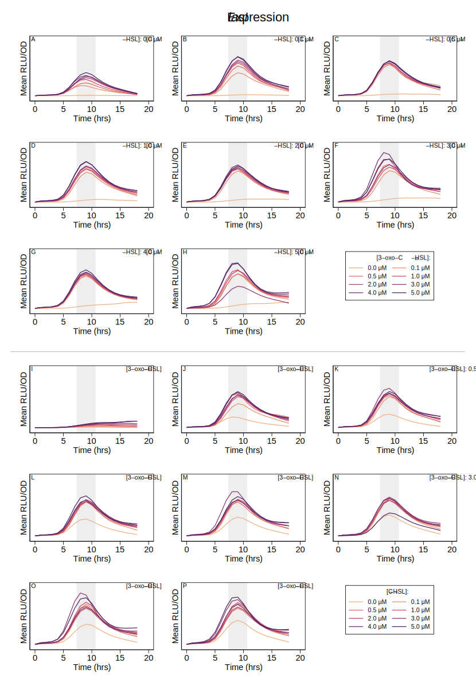


**Figure A. Expression level of *lasI* over time course of experiment.** Shaded regions highlight peak expression and indicate two-hour period used in analysis. (The data underlying this Figure and the code used to analyze it can be found in https://doi.org/10.5281/zenodo.15808353.)

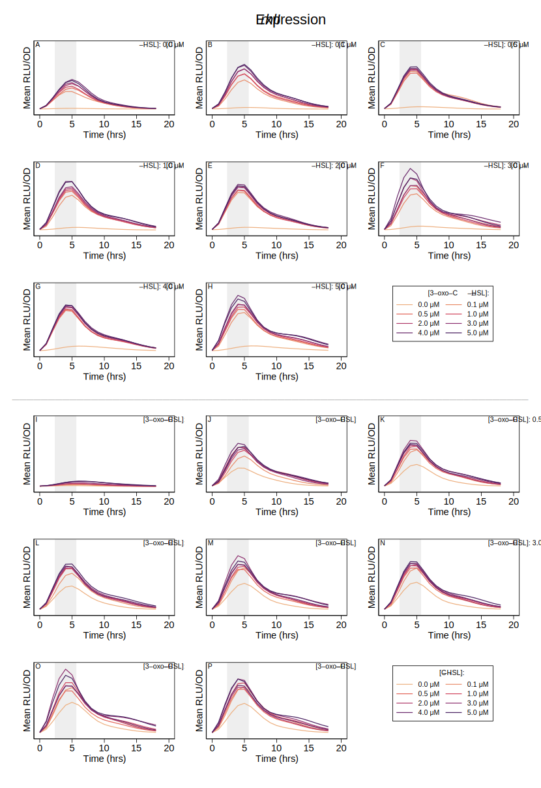


**Figure B. Expression level of *rhlI* over time course of experiment.** Shaded regions highlight peak expression and indicate two-hour period used in analysis. (The data underlying this Figure and the code used to analyze it can be found in https://doi.org/10.5281/zenodo.15808353.)

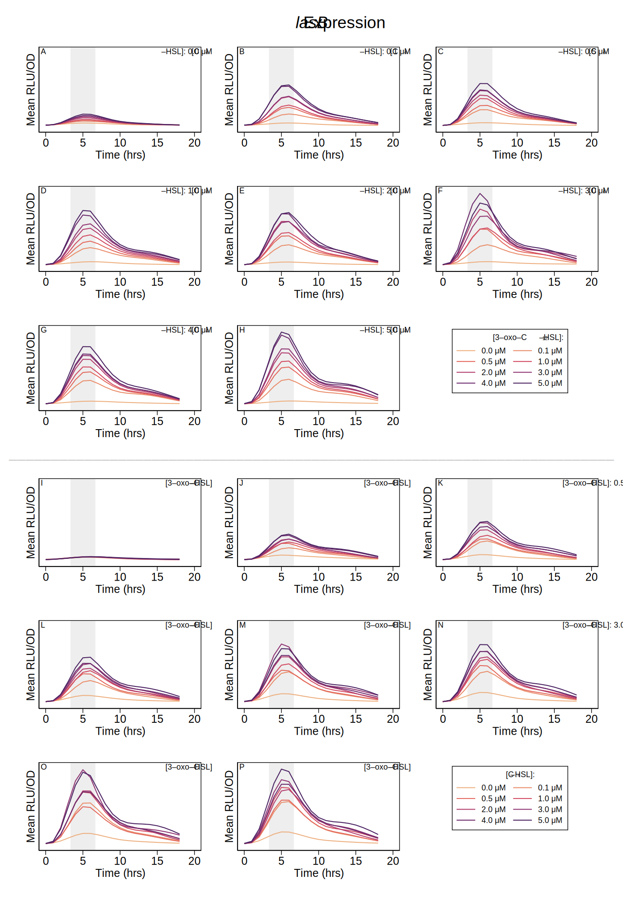


**Figure C. Expression level of *lasB* over time course of experiment.** Shaded regions highlight peak expression and indicate two-hour period used in analysis. (The data underlying this Figure and the code used to analyze it can be found in https://doi.org/10.5281/zenodo.15808353.)

### Single-Signal Models

Table C shows the parameter estimates for the single-signal model below as maximum fold-change ((*ɑ* + *ɑ*<sub>0</sub>) / *ɑ*<sub>0</sub>) and half-concentration values (*K*) for both signals.
``` math
E(S) = \alpha_0 + \alpha \frac{[S]}{[S] + K}
\qquad{(\mathrm{A})}
```

**Equation A. Expression level as a function of a single signal’s concentration.**

| Gene | Signal | Parameter | Derivation | Estimate | 95% C.I. |
|----|----|----|:--:|:--:|---:|
| *lasI* |  | Basal expression | *ɑ*<sub>0</sub> | 1670 <small>RLU/OD</small> | 1619 – 1721 |
|  | 3‑oxo‑C<sub>12</sub>‑HSL | Max fold-change | (*ɑ* + *ɑ*<sub>0</sub>) / *ɑ*<sub>0</sub> | 38 × | 36 – 40 |
|  |  | ½ conc. | *K* | 0.24 μM | 0.17 – 0.30 |
|  | C<sub>4</sub>‑HSL | Max fold-change | (*ɑ* + *ɑ*<sub>0</sub>) / *ɑ*<sub>0</sub> | 6.4 × | 5.8 – 7.0 |
|  |  | ½ conc. | *K* | 1.0 μM | 0.7 – 1.4 |
| *rhlI* |  | Basal expression | *ɑ<sub>0</sub>* | 1861 <small>RLU/OD</small> | 1798 – 1923 |
|  | 3‑oxo‑C<sub>12</sub>‑HSL | Max fold-change | (*ɑ* + *ɑ*<sub>0</sub>) / *ɑ*<sub>0</sub> | 35 × | 34 – 36 |
|  |  | ½ conc. | *K* | 0.052 μM | 0.031 – 0.073 |
|  | C<sub>4</sub>‑HSL | Max fold-change | (*ɑ* + *ɑ*<sub>0</sub>) / *ɑ*<sub>0</sub> | 6.4 × | 5.3 – 7.4 |
|  |  | ½ conc. | *K* | 1.6 μM | 0.8 – 2.4 |

**Table C. Single Signal Parameter Estimates.** Estimated fold-change, derived from raw parameters of Eq A as (*ɑ* + *ɑ*<sub>0</sub>) / *ɑ*<sub>0</sub> , and half-concentration, *K*, values for gene expression as a function of a single signal in isolation. Values shown with 95% confidence intervals.

The primary data set focuses on a full range of signal concentrations from 0 to 5μM. To further validate the model, additional measurements were collected for low values of signal concentration. Fig D overlays those observations on the primary data set, demonstrating further strong agreement between observations and model predictions.

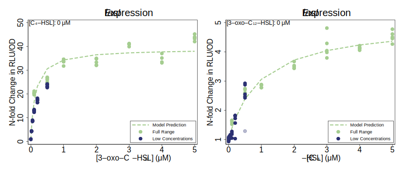


**Figure D. Effect of each signal in isolation on the expression level of *lasI*** Plotted points are observations and dashed lines show model (Eq A) predictions when parameterized per Table C. Dark blue points are additional observations collected using low signal concentrations. (A single data point identified as a faulty outlier is indicated in light blue and excluded from the analysis.) These data points are not used in estimating model parameters yet still show strong agreement with the model. Coefficient of determination R<sup>2</sup> between additional observations and initial model predictions is 0.82. (The data underlying this Figure and the code used to analyze it can be found in https://doi.org/10.5281/zenodo.15808353.)

### Multi-Signal Models

Table D shows the parameter estimates for the multi-signal model of Eq 1 (main text).

| Gene | Signal | Parameter | Derivation | Estimate | 95% C.I. |
|----|----|----|:--:|:--:|---:|
| *lasI* |  | Basal expression | *ɑ*<sub>1,0</sub> | 1670 <small>RLU/OD</small> | 1619 – 1721 |
|  | 3‑oxo‑C<sub>12</sub>‑HSL | Max fold-change | (*ɑ*<sub>1,1</sub> + *ɑ*<sub>1,0</sub>) / *ɑ*<sub>1,0</sub> | 38 × | 36 – 40 |
|  |  | ½ conc. | *K*<sub>1,1</sub> | 0.24 μM | 0.17 – 0.30 |
|  | C<sub>4</sub>‑HSL | Max fold-change | (*ɑ*<sub>1,2</sub> + *ɑ*<sub>1,0</sub>) / *ɑ*<sub>1,0</sub> | 6.4 × | 5.8 – 7.0 |
|  |  | ½ conc. | *K*<sub>1,2</sub> | 1.0 μM | 0.7 – 1.4 |
|  | Combined | Max fold-change | (*ɑ*<sub>1,1,2</sub> + *ɑ*<sub>1,0</sub>) / *ɑ*<sub>1,0</sub> | 30 × | 29 – 31 |
|  |  | ½ conc. for 3‑oxo‑C<sub>12</sub>‑HSL | *K*<sub>*Q*1,1,2</sub> | \< 0.001 μM |  |
|  |  | ½ conc. for C<sub>4</sub>-HSL | *K*<sub>*Q*1,2,1</sub> | 0.003 μM | 0 – 0.011 |
| *rhlI* |  | Basal expression | *ɑ*<sub>2,0</sub> | 1861 <small>RLU/OD</small> | 1798 – 1923 |
|  | 3‑oxo‑C<sub>12</sub>‑HSL | Max fold-change | (*ɑ*<sub>2,1</sub> + *ɑ*<sub>2,0</sub>) / *ɑ*<sub>2,0</sub> | 35 × | 34 – 36 |
|  |  | ½ conc. | *K*<sub>2,1</sub> | 0.052 μM | 0.031 – 0.073 |
|  | C<sub>4</sub>‑HSL | Max fold-change | (*ɑ*<sub>2,2</sub> + *ɑ*<sub>2,0</sub>) / *ɑ*<sub>2,0</sub> | 6.4 × | 5.3 – 7.4 |
|  |  | ½ conc. | *K*<sub>2,2</sub> | 1.6 μM | 0.8 – 2.4 |
|  | Combined | Max fold-change | (*ɑ*<sub>2,1,2</sub> + *ɑ*<sub>1,0</sub>) / *ɑ*<sub>1,0</sub> | 27 × | 26 – 28 |
|  |  | ½ conc. for 3‑oxo‑C<sub>12</sub>‑HSL | *K*<sub>*Q*2,1,2</sub> | \< 0.001 μM |  |
|  |  | ½ conc. for C<sub>4</sub>-HSL | *K*<sub>*Q*2,2,1</sub> | \< 0.001 μM |  |

**Table D. Multi-signal parameter estimates.** Model parameters for gene expression as a function of multiple signal concentrations. Parameter definitions are the same as in Table C with addition of cooperative fold-change, again derived from raw parameters as (*ɑ* + *ɑ*<sub>0</sub>) / *ɑ*<sub>0</sub> , and cooperative half-concentration *K<sub>Q</sub>.* Values shown with 95% confidence intervals.

Figs 3C and 3D in the main text summarize the predictions of the multi-signal models for *lasI* and *rhlI* expression. The following figures provide a more detailed comparison of the model predictions for both genes.

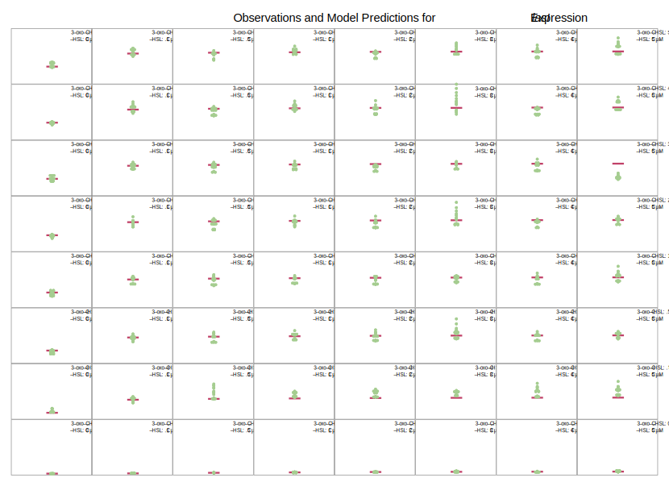


**Figure E. Multi-signal model for *lasI* expression.** Panels compare model predictions to observations for all combinations of signal concentrations. Horizontal bars indicate model predictions, while plotted points show observed values. (The data underlying this Figure and the code used to analyze it can be found in https://doi.org/10.5281/zenodo.15808353.)

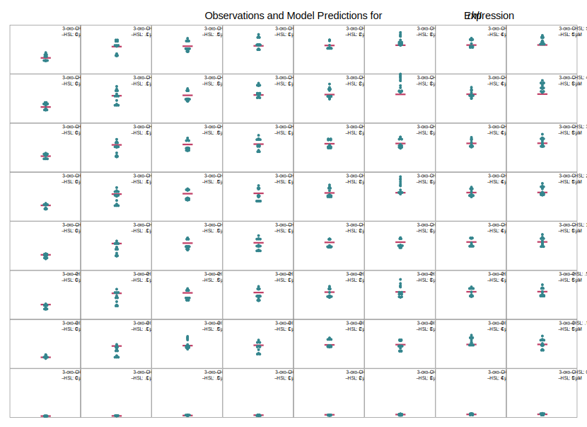


**Figure F. Multi-signal model for *rhlI* expression.** Panels compare model predictions to observations for all combinations of signal concentrations. Horizontal bars indicate model predictions, while plotted points show observed values. (The data underlying this Figure and the code used to analyze it can be found in https://doi.org/10.5281/zenodo.15808353.)

Table E shows the parameter estimates for *lasB* expression.

| Signal | Parameter | Derivation | Estimate | 95% C.I. |
|----|----|:--:|:--:|---:|
|  | Basal Expression | *ɑ*<sub>3,0</sub> | 1588 <small>RLU/OD</small> | 1516 –1660 |
| 3‑oxo‑C<sub>12</sub>‑HSL | Max fold-change | (*ɑ*<sub>3,1</sub> + *ɑ*<sub>3,0</sub>) / *ɑ*<sub>3,0</sub> | 6.1 × | 5.6 – 6.7 |
|  | ½ conc. | *K*<sub>3,1</sub> | 2.5 μM | 1.0 – 3.0 |
| C<sub>4</sub>‑HSL | Max fold-change | (*ɑ*<sub>3,2</sub> + *ɑ*<sub>3,0</sub>) / *ɑ*<sub>3,0</sub> | 1.1 × | 1.1 – 1.1 |
|  | ½ conc. | *K*<sub>3,2</sub> | \< 0.001 μM |  |
| Combined | Max fold-change | (*ɑ*<sub>3,1,2</sub> + *ɑ*<sub>3,0</sub>) / *ɑ*<sub>3,0</sub> | 23 × | 22 – 24 |
|  | ½ conc. for 3‑oxo‑C<sub>12</sub>‑HSL | *K*<sub>*Q*3,1,2</sub> | 0.42 μM | 0.35 – 0.48 |
|  | ½ conc. for C<sub>4</sub>-HSL | *K*<sub>*Q*3,2,1</sub> | 0.22 μM | 0.18 – 0.25 |

**Table E. Multi-signal parameter estimates for *lasB.*** Model parameters for *lasB* expression as a function of multiple signal concentrations. Parameter definitions are the same as in Table D. Values shown with 95% confidence intervals. Half-concentration estimates less than 0.001 μM are below the limits of precision of the experimental data.

Using the parameter values, the model predicts *lasB* expression as shown in Fig G.

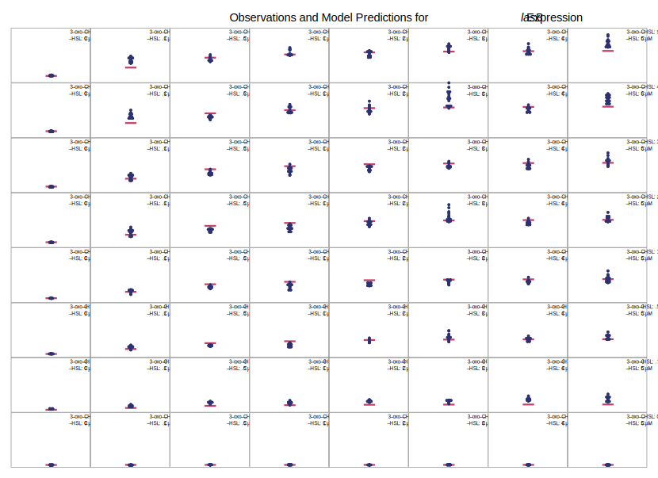


**Figure G. Multi-signal model for *lasB* expression.** Panels compare model predictions to observations for all combinations of signal concentrations. Horizontal bars indicate model predictions, while plotted points show observed values. (The data underlying this Figure and the code used to analyze it can be found in https://doi.org/10.5281/zenodo.15808353.)

### Signal Dynamics

We analyze signal dynamics using the model from the main text where the per-capita single production rater is assumed to be proportional to the synthase expression level, $`E_i(\mathbf{S})`$. The proportionality constant is $`c_i`$.

``` math
\frac{\mathrm{d}S_i}{\mathrm{dt}} \ \ = \ \ c_i E_i(\mathbf{S})\cdot N \ \ - \ \  \delta_i \cdot S_i \ \ - \ \  m \cdot S_i
\qquad{(\mathrm{B})}
```

We consider the equilibrium signal concentration (where $`\mathrm{d}S/\mathrm{dt} = 0`$) and normalize to the decay rate of C<sub>4</sub>‑HSL ($`\delta_2`$). When there is no mass transfer ($`m = 0`$), these simplifications result in an equation for C<sub>4</sub>‑HSL,

``` math
0 \ \ = \ \ \frac{ c_2 }{ \delta_2 } E_2(\mathbf{S})\cdot N \ \ - \ \ S_2
\qquad{(\mathrm{C})}
```

which can be solved for $`c_2 / \delta_2`$ in terms of *rhlI* expression $`E_2(\mathbf{S})`$, density $`N`$, and C<sub>4</sub>‑HSL concentration $`S_2`$. The corresponding equation for 3‑oxo‑C<sub>12</sub>‑HSL includes an additional factor $`\delta_1/\delta_2`$ which, from \[20\], we take to be approximately 1.7.

``` math
0 \ \ = \ \ \frac{ c_1 }{ \delta_2 } E_1(\mathbf{S})\cdot N \ \ - \ \ \frac{ \delta_1 }{ \delta_2 } S_1
\qquad{(\mathrm{D})}
```

Data from \[21\] includes measurements of equilibrium signal concentrations at multiple population densities. We combine those measurements of $`N`$ and $`S_i`$ with our model’s estimate of synthase expression level $`E_i(\mathbf{S})`$ and use non-linear least squares to estimate the proportionality constants.

| Signal *i*                   | Proportionality Constant $`c_i/\delta_2`$ |
|:-----------------------------|------------------------------------------:|
| **3‑oxo‑C<sub>12</sub>‑HSL** |                               12.7 pM/RLU |
| **C<sub>4</sub>‑HSL**        |                               25.4 pM/RLU |

**Table F. Estimated proportionality constants that relate synthase expression levels to per-capita signal production rates.** Final column shows adjusted R<sup>2</sup> of non-linear least squares estimate.

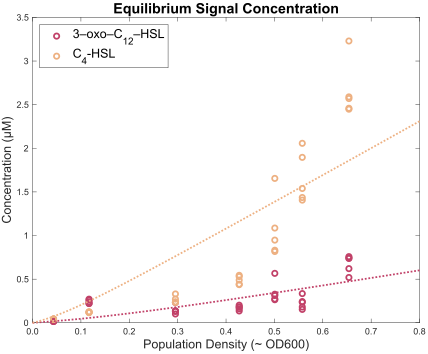


**Figure H. Equilibrium signal concentration predicted using proportionality constants.** Individual data points show experimental observations and dashed lines indicate model predictions. (The data underlying this Figure and the code used to analyze it can be found in https://doi.org/10.5281/zenodo.15808353.)

### Analytic Solutions for Equilibrium

It is possible to derive analytic solutions of Eq 2 (main text) for equilibrium concentrations in all architectures; however, the results are not especially helpful for deriving insights into the system behavior. For example, the independent architecture, which is the simplest considered, has the following equilibrium concentration of 3‑oxo‑C <sub>12</sub>‑HSL.
``` math
S_1^* = \frac{
\begin{align}
c_1\,N\,(\alpha_{1,0} +\alpha_{1,1}) \\ - K_{1,1}\,(m+\delta_1)
\end{align}
\;+\sqrt{
\begin{aligned}
{K_{1,1} }^2 \,{\delta_1 }^2 +2\,{K_{1,1} }^2 \,\delta_1 \,m+{K_{1,1} }^2 \,m^2
+2\,K_{1,1} \,N\,\alpha_{1,0} \,c_1 \,\delta_1 \\
+2\,K_{1,1} \,N\,\alpha_{1,0} \,c_1 \,m -2\,K_{1,1} \,N\,\alpha_{1,1} \,c_1 \,\delta_1 -2\,K_{1,1} \,N\,\alpha_{1,1} \,c_1 \,m \\
+N^2 \,{\alpha_{1,0} }^2 \,{c_1 }^2 +2\,N^2 \,\alpha_{1,0} \,\alpha_{1,1} \,{c_1 }^2
+N^2 \,{\alpha_{1,1} }^2 \,{c_1 }^2
\end{aligned}
}
}{2\,{\left(\delta_1 +m\right)}}
\qquad{(\mathrm{E})}
```

### Alternate QS Architectures

Table G shows the parameter values that allow Eq 1 (main text) to represent various QS architectures.

| Gene | Signal | Parameter | Derivation | Reciprocal Architecture | Hierarchical Architecture | Independent Architecture |
|----|----|----|:--:|:--:|:--:|:--:|
| *lasI* | 3‑oxo‑C<sub>12</sub>‑HSL | Max fold-change | (*ɑ*<sub>1,1</sub> + *ɑ*<sub>1,0</sub>) / *ɑ*<sub>1,0</sub> | 38 × | 38 × | 38 × |
|  | C<sub>4</sub>‑HSL | Max fold-change | (*ɑ*<sub>1,2</sub> + *ɑ*<sub>1,0</sub>) / *ɑ*<sub>1,0</sub> | 6.4 × | 1 × | 1 × |
|  | Combined | Max fold-change | (*ɑ*<sub>1,1,2</sub> + *ɑ*<sub>1,0</sub>) / *ɑ*<sub>1,0</sub> | 30 × | 1 × | 1 × |
| *rhlI* | 3‑oxo‑C<sub>12</sub>‑HSL | Max fold-change | (*ɑ*<sub>2,1</sub> + *ɑ*<sub>2,0</sub>) / *ɑ*<sub>2,0</sub> | 35 × | 35 × | 1 × |
|  | C<sub>4</sub>‑HSL | Max fold-change | (*ɑ*<sub>2,2</sub> + *ɑ*<sub>2,0</sub>) / *ɑ*<sub>2,0</sub> | 6.4 × | 6.4 × | 6.4 × |
|  | Combined | Max fold-change | (*ɑ*<sub>2,1,2</sub> + *ɑ*<sub>1,0</sub>) / *ɑ*<sub>1,0</sub> | 27 × | 27 × | 1 × |

**Table G. Hierarchical and independent architectures are special cases of the reciprocal architecture.** The multi-signal model of Eq 1 (main text) can represent hypothetical, alternative QS architectures by setting appropriate *ɑ* values to zero. Zero *ɑ* values result in a corresponding maximum fold-change of 1. For a hierarchical architecture, this setting nullifies the effect of C<sub>4</sub>‑HSL on *lasI.* For an independent architecture, this setting additionally nullifies the effect of 3‑oxo‑C<sub>12</sub>‑HSL on *rhlI.*

### Normalizing Alternate QS Architectures

Table G analyzes hypothetical, alternative architectures by eliminating the influence of specific signals on specific genes. For example, the hierarchical architecture nullifies the influence of C<sub>4</sub>‑HSL on *lasI* without modifying the effect of 3‑oxo‑C<sub>12</sub>‑HSL on *lasI.* This change necessarily reduces the maximum expression level of *lasI,* and that reduction partially explains the different *lasB* response in a hierarchical architecture. Reducing maximum *lasI* expression alone, however, does not explain all of the differences in the *lasB* response. To expose those additional differences, we make additional adjustments to the model. In particular, we increase the expression of *lasI* due to 3‑oxo‑C<sub>12</sub>‑HSL to precisely compensate for the loss of expression due to C<sub>4</sub>‑HSL. Table H shows the full set of adjustments required to normalize the maximum synthase expression levels across all architectures.

| Gene | Signal | Parameter | Derivation | Reciprocal Architecture | Hierarchical Architecture | Independent Architecture |
|----|----|----|:--:|:--:|:--:|:--:|
| *lasI* | 3‑oxo‑C<sub>12</sub>‑HSL | Max fold-change | (*ɑ*<sub>1,1</sub> + *ɑ*<sub>1,0</sub>) / *ɑ*<sub>1,0</sub> | 38 × | 73 × | 73 × |
|  | C<sub>4</sub>‑HSL | Max fold-change | (*ɑ*<sub>1,2</sub> + *ɑ*<sub>1,0</sub>) / *ɑ*<sub>1,0</sub> | 6.4 × | 1 × | 1 × |
|  | Combined | Max fold-change | (*ɑ*<sub>1,1,2</sub> + *ɑ*<sub>1,0</sub>) / *ɑ*<sub>1,0</sub> | 30 × | 1 × | 1 × |
| *rhlI* | 3‑oxo‑C<sub>12</sub>‑HSL | Max fold-change | (*ɑ*<sub>2,1</sub> + *ɑ*<sub>2,0</sub>) / *ɑ*<sub>2,0</sub> | 35 × | 35 × | 1 × |
|  | C<sub>4</sub>‑HSL | Max fold-change | (*ɑ*<sub>2,2</sub> + *ɑ*<sub>2,0</sub>) / *ɑ*<sub>2,0</sub> | 6.4 × | 6.4 × | 66 × |
|  | Combined | Max fold-change | (*ɑ*<sub>2,1,2</sub> + *ɑ*<sub>1,0</sub>) / *ɑ*<sub>1,0</sub> | 27 × | 27 × | 1 × |

**Table H. Models of hierarchical and independent architectures can be normalized to ensure that maximum synthase expression is the same for all architectures.** Parameters are the same as those in Table G but with increased values where appropriate.

### Temporal Dynamics

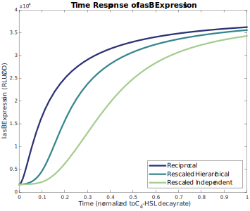


**Figure I. Time response of *lasB* expression for reciprocal, rescaled hierarchical, and rescaled independent architectures.** Dynamics are those of Eq 2 (main text) with parameters from Table H. (The data underlying this Figure and the code used to analyze it can be found in https://doi.org/10.5281/zenodo.15808353.)

### Signal Concentration Response

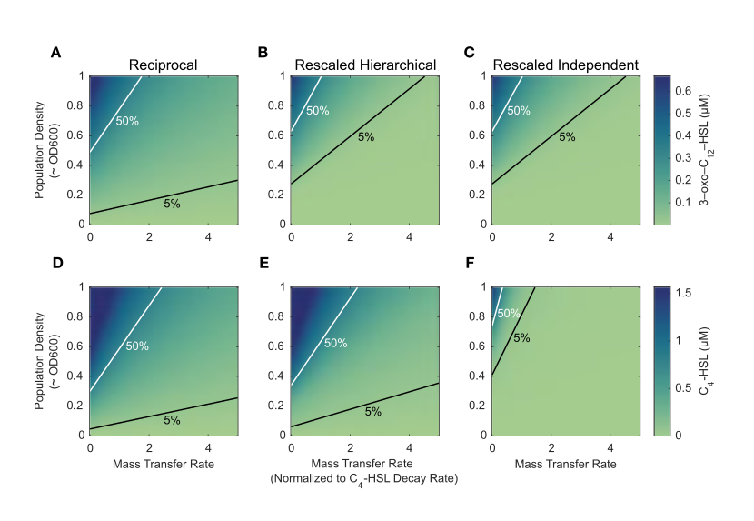


**Figure J. Extracellular signal concentration as a function of density and mass transfer varies based on the quorum sensing architecture.** Heat maps of equilibrium 3‑oxo‑C<sub>12</sub>‑HSL (A-C) and C<sub>4</sub>‑HSL (D-F) concentration for three quorum sensing architectures. Both population density and mass transfer rate are varied over the same ranges for all heatmaps. The lines on each heat map indicate density and mass transfer values for which equilibrium concentration is constant, either 50% of its maximum value (white) or 5% of its maximum value (black). Equilibrium concentrations calculated from Eq 2 model with parameters from Table D and architectural parameters normalized according to Table H. These results follow from the same model parameterization presented in Figs 5F-5H, which showcased the predicted outcome behavior of *lasB* expression. (The data underlying this Figure and the code used to analyze it can be found in https://doi.org/10.5281/zenodo.15808353.)

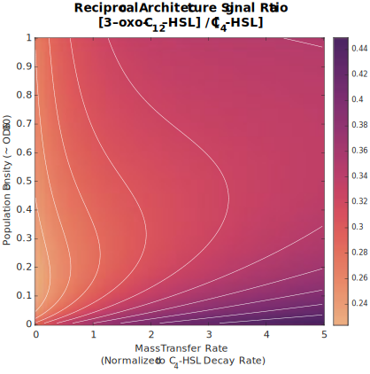


**Figure K. Ratio of signal concentrations as a function of density and mass transfer varies based on the quorum sensing architecture.** The figure shows heat maps of the ratio of equilibrium 3‑oxo‑C<sub>12</sub>‑HSL to C<sub>4</sub>‑HSL concentration for the reciprocal architecture. Equilibrium concentrations calculated from Eq 2 model with parameters from Table D. (The data underlying this Figure and the code used to analyze it can be found in https://doi.org/10.5281/zenodo.15808353.)

### Three Signal Models

The hypothetical three-signal models of the main text’s discussion are based oh a simplified version of the *las* and *rhl* interactions. Table D provides the starting point for the models. For ease of computation, the second-order effects are ignored by setting *ɑ<sub>i,j,j\`</sub>* to zero. Parameters for the third signal (*i* = 3) are initailly based on convenient intermediate values between those of *las* and *rhl* and then varied as neccessary to demontrate the various responses. Table I shows the values for all non-zero parameters in all models.

| Parameter | Weak | Strong | Limited | Damped |
|----|----|----|----|----|
| 𝛼<sub>1,0</sub> | 1670 | 1670 | 1670 | 1670 |
| 𝛼<sub>2,0</sub> | 1861 | 1861 | 1861 | 1861 |
| 𝛼<sub>3,0</sub> | 10000 | 10000 | 10000 | 10000 |
| 𝛼<sub>1,1</sub> | 61000 | 61000 | 61000 | 61000 |
| 𝛼<sub>2,2</sub> | 10000 | 10000 | 10000 | 10000 |
| 𝛼<sub>3,3</sub> | 10000 | 10000 | 10000 | 10000 |
| 𝛼<sub>1,2</sub> | 9000 | 9000 | 9000 | 9000 |
| 𝛼<sub>2,1</sub> | 63000 | 63000 | 63000 | 63000 |
| 𝛼<sub>2,3</sub> | 10000 | 10000 | 10000 | 10000 |
| 𝛼<sub>3,1</sub> | 10000 | 1000000 | 158000 | 630000 |
| 𝛼<sub>3,2</sub> | -10000 | -10000 | -245 | -1580000 |
| K<sub>1,1</sub> | 0.24 | 0.24 | 0.24 | 0.24 |
| K<sub>2,2</sub> | 1.6 | 1.6 | 1.6 | 1.6 |
| K<sub>3,3</sub> | 1 | 1 | 1 | 1 |
| K<sub>1,2</sub> | 1 | 1 | 1 | 1 |
| K<sub>2,1</sub> | 0.052 | 0.052 | 0.052 | 0.052 |
| K<sub>2,3</sub> | 0.32 | 0.32 | 0.32 | 0.32 |
| K<sub>3,1</sub> | 0.32 | 0.32 | 0.032 | 0.032 |
| K<sub>3,2</sub> | 0.32 | 0.32 | 4.0 | 3.2 |
| c<sub>1</sub>/𝛿<sub>2</sub> | 1.3⨉10<sup>-5</sup> | 1.3⨉10<sup>-5</sup> | 1.3⨉10<sup>-5</sup> | 1.3⨉10<sup>-5</sup> |
| c<sub>2</sub>/𝛿<sub>2</sub> | 2.5⨉10<sup>-5</sup> | 2.5⨉10<sup>-5</sup> | 2.5⨉10<sup>-5</sup> | 2.5⨉10<sup>-5</sup> |
| c<sub>3</sub>/𝛿<sub>2</sub> | 1.9⨉10<sup>-5</sup> | 1.9⨉10<sup>-5</sup> | 1.9⨉10<sup>-5</sup> | 1.9⨉10<sup>-5</sup> |
| 𝛿<sub>1</sub>/𝛿<sub>2</sub> | 1.7 | 1.7 | 1.7 | 1.7 |
| 𝛿<sub>2</sub>/𝛿<sub>2</sub> | 1 | 1 | 1 | 1 |
| 𝛿<sub>3</sub>/𝛿<sub>2</sub> | 1.35 | 1.35 | 1.35 | 1.35 |

**Table I. Model parameters for hypothetical three-signal architectures.** Different parameter values result in the different responses of the third QS system’s synthase expression level as population density increases.

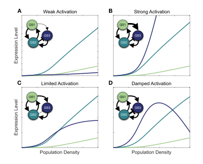


**Figure L. Interaction strength for both induction and repression determines population behavior.** The figure considers hypothetical architectures for a quorum sensing network with three QS systems. The first two, mimicking the architecture of *las* and *rhl,* are mutually reinforcing. The third system is both induced and repressed by the other two, matching the reported interactions of *pqs.* The panels show all three synthase expression levels as a function of population density. As the four panels show, even within the constraints of a particular architecture, a wide variety of responses are possible. (A) Baseline case with weak activation of system 3 by system 1 (low 𝛼<sub>3,1</sub>). (B) Strong activation (high 𝛼<sub>3,1</sub>). (C) Limited activation with weak repression of system 3 by system 2 (moderately negative 𝛼<sub>3,2</sub>). (D) Damped activation (strongly negative 𝛼<sub>3,2</sub>). (The data underlying this Figure and the code used to generate it can be found in https://doi.org/10.5281/zenodo.15808353.)

## References

1. García-Reyes S, Soberón-Chávez G, Cocotl-Yanez M. The third quorum-sensing system of *Pseudomonas aeruginosa:* Pseudomonas quinolone signal and the enigmatic PqsE protein. J Med Microbiol. 2020;69: 25–34. 

2. Rutherford S, Bassler B. Bacterial quorum sensing: Its role in virulence and possibilities for its control. Cold Spring Harb Perspect Med. 2012;2: a012427. 

3. Proctor C, McCarron P, Ternan N. Furanone quorum-sensing inhibitors with potential as novel therapeutics against *Pseudomonas aeruginosa.* J Med Microbiol. 2020;69: 195–206. 

4. Jakobsen T, Bjarnsholt T, Jensen P, Givskov M, Høiby N. Targeting quorum sensing in *Pseudomonas aeruginosa* biofilms: Current and emerging inhibitors. Future Microbiol. 2013;8: 901–921. 

5. Soukarieh F, Williams P, Stocks M, Cámara M. *Pseudomonas aeruginosa* quorum sensing systems as drug discovery targets: Current position and future perspectives. J Med Chem. 2018;61: 10385–10402. 

6. Tateda K. [*Pseudomonas aeruginosa* infection and the quorum-sensing mechanism]. Nihon Naika Gakkai Zasshi. 2005;94: 999–1004. 

7. Williams P, Winzer K, Chan W, Cámara M. Look who’s talking: Communication and quorum sensing in the bacterial world. Philos Trans R Soc Lond B Biol Sci. 2007;362: 1119–1134. 

8. Heurlier K, Dénervaud V, Haas D. Impact of quorum sensing on fitness of *Pseudomonas aeruginosa.* Int J Med Microbiol. 2006;296: 93–102. 

9. Le Berre R, Faure K, Nguyen S, Pierre M, Ader F, Guery B. [Quorum sensing: A new clinical target for *Pseudomonas aeruginosa*?]. Med Mal Infect. 2006;36: 349–357. 

10. Juhas M, Eberl L, Tümmler B. Quorum sensing: The power of cooperation in the world of *Pseudomonas.* Environ Microbiol. 2005;7: 459–471. 

11. Donabedian H. Quorum sensing and its relevance to infectious diseases. J Infect. 2003;46: 207–214. 

12. Reuter K, Steinbach A, Helms V. Interfering with bacterial quorum sensing. Perspect Medicin Chem. 2016;8: 1–15. 

13. Yong Y, Zhong J. Impacts of quorum sensing on microbial metabolism and human health. Adv Biochem Eng Biotechnol. 2013;131: 25–61. 

14. Welsh M, Blackwell H. Chemical probes of quorum sensing: From compound development to biological discovery. FEMS Microbiol Rev. 2016;40: 774–794. 

15. De Sordi L, Mühlschlegel F. Quorum sensing and fungal-bacterial interactions in *Candida albicans:* A communicative network regulating microbial coexistence and virulence. FEMS Yeast Res. 2009;9: 990–999. 

16. Winzer K, Williams P. Quorum sensing and the regulation of virulence gene expression in pathogenic bacteria. Int J Med Microbiol. 2001;291: 131–143. 

17. Schuster M, Sexton D, Diggle S, Greenberg E. Acyl-homoserine lactone quorum sensing: From evolution to application. Annu Rev Microbiol. 2013;67: 43–63. 

18. Papaioannou E, Utari P, Quax W. Choosing an appropriate infection model to study quorum sensing inhibition in *Pseudomonas* infections. Int J Mol Sci. 2013;14: 19309–19340. 

19. Roy V, Adams B, Bentley W. Developing next generation antimicrobials by intercepting AI-2 mediated quorum sensing. Enzyme Microb Technol. 2011;49: 113–123. 

20. Cornforth D, Popat R, McNally L, Gurney J, Scott-Phillips T, Ivens A, et al. Combinatorial quorum sensing allows bacteria to resolve their social and physical environment. Proc Natl Acad Sci U S A. 2014;111: 4280–4284. 

21. Rattray J, Thomas S, Wang Y, Molotkova E, Gurney J, Varga J, et al. Bacterial quorum sensing allows graded and bimodal cellular responses to variations in population density. mBio. 2022;13: e0074522. 
