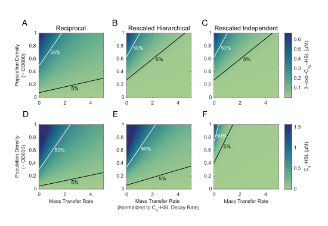
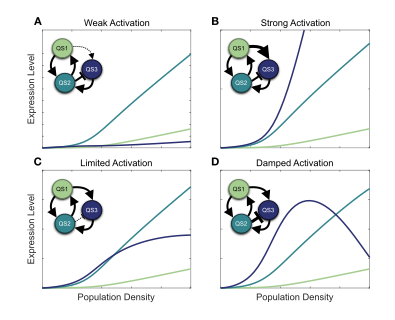

# Quantifying Multi-Signal Quorum Sensing Defines the Mapping from Environment to Bacterial Regulatory Responses

Stephen Thomas1, Ayatollah S. El-Zayat2, James Gurney3, Jennifer Rattray1,4, Sam P. Brown1

> 1. School of Biological Sciences, Georgia Institute of Technology, Atlanta, GA USA 30332.
> 2. Department of Microbiology, Faculty of Agriculture, Cairo University, Giza 12613, Egypt.
> 3. Department of Biology, College of Arts and Sciences, Georgia State University, Atlanta, GA USA 30303.
> 4. Present address: Sandia National Laboratories, Albuquerque, NM, USA.

**Abstract:** Bacterial quorum sensing is often mediated by multiple signaling systems that interact with each other. The quorum sensing systems of *Pseudomonas aeruginosa,* for example, are considered hierarchical, with the *las* system acting as a master regulator. By experimentally controlling the concentration of auto-inducer signals in a signal deficient strain (PAO1Δ*lasI*Δ*rhlI*), we show that the two primary quorum sensing systems—_las_ and _rhl_—act reciprocally rather than hierarchically. Just as the *las* system's 3‑oxo‑C12‑HSL can induce increased expression of *rhlI,* the *rhl* system's C4‑HSL increases the expression level of *lasI.* We develop a mathematical model to quantify relationships both within and between the *las* and *rhl* quorum sensing systems and the downstream genes they influence. The results show that not only do the systems interact in a reciprocal manner, but they do so asymmetrically, cooperatively, and nonlinearly, with the combination of C4‑HSL and 3‑oxo‑C12‑HSL increasing expression level far more than the sum of their individual effects. We next extend our parameterized mathematical model to generate quantitative predictions on how a QS-controlled effector gene (*lasB*) responds to changes in bacterial stationary phase density, and find close quantitative agreement with an independent dataset. Finally, we use our parameterized model to assess how changes in multi-signal interactions modulate functional responses to  variation in social (population density) and physical (mass transfer) environment and demonstrate that a reciprocal architecture is more responsive to density and more robust to mass transfer than a strict hierarchy.

### Significance Statement

Bacteria often sense and respond to their environment via _quorum sensing._ While we understand the core components of signal production and response in great molecular detail, we face a fundamental gap in our understanding of how these components combine to quantitatively map environmental properties onto behavioral responses. To address this gap, we develop a dynamical-systems approach, using controlled experimental data to parameterize and test a mathematical model of multi-signal QS, using *Pseudomonas aeruginosa* as a model system. Our approach provides a general and flexible methodology to quantify the multi-signal “wiring diagrams” of QS bacteria and functionally link these wiring diagrams to QS-controlled responses to environmental variation.

## Introduction

WIthin many bacterial species, cells communicate with each other by exchanging diffusible signal molecules [@Papenfort2016; @Whiteley2017]. This mechanism, known as quorum sensing (QS), has been well-studied at the level of specific molecular interactions. We now understand how those molecular interactions shape the creation of and response to signal molecules in model organisms such as *Pseudomonas aeruginosa* [@Pearson1997]. We have identified downstream effector genes such as virulence factors whose production depends on QS signals [@Chugani2001; @Kiratisin2002], and we have recognized that many species possess multiple QS circuits [@Papenfort2016]. Despite this knowledge, we face gaps in our understanding of how quorum sensing influences bacterial behavior. How does QS quantitatively guide bacterial actions in response to defined environmental conditions? What benefits do multiple QS circuits provide? And ultimately, how does QS contribute to bacterial fitness? Answering these questions requires an understanding of quorum sensing at the dynamical systems level as well as the molecular level.

Quorum sensing relies on several components interacting in a dynamical system [@Popat2015; @Perez2018]. Individual cells synthesize small molecules called signals or inducers. These diffuse or are actively transported between the intracellular and extracellular environments [@Pearson1999]. Within cells, signal molecules bind to receptor proteins that serve as transcription factors [@Bottomley2007]. As signal concentration grows, genes activated by these transcription factors trigger a change in the cell\'s behavior [@Whiteley1999]. Those molecules related to a particular signal—the signal synthase, the signal molecule, and the cognate receptor—form a quorum sensing system. Some bacterial species have multiple QS systems, the opportunistic pathogen *Pseudomonas aeruginosa* among them. Among its multiple systems, *las* and *rhl* acyl-homoserine lactone (AHL) signaling systems have been especially well studied [@Pesci1997; @Lee2015]. The *las* system includes the LasI signal synthase, N-(3-oxododecanoyl)-l-homoserine lactone (3‑oxo‑C12‑HSL) signal, and LasR receptor. The corresponding components of the *rhl* system are RhlI, N-butyryl-homoserine lactone (C4‑HSL), and RhlR. Schuster and Greenberg [-@Schuster2007] estimate that these two systems control expression of as much as 10% of the bacterial genome.

*P. aeruginosa* provides a model for understanding interactions between multiple QS systems. How does the behavior of one system, determined by the concentration of signal it produces, affect the behavior of a different system? How does expression of the one system's synthase or receptor respond to the concentration of another systems signal? We classify possible multi-system architectures into three broad patterns shown in Figure [-@fig:architectures]. *Independent systems* (Figure [-@fig:architectures]A) have no influence on each other; *hierarchical systems* (Figure [-@fig:architectures]B) have a relationship but only in one direction, and *reciprocal systems* (Figure [-@fig:architectures]C) each exert influence on the other. At this level we do not consider the underlying mechanism(s) of the inter-system effects. For example, the signal of one system may bind directly to the receptor of the other; alternatively, the signal/receptor complex of one system may act as a transcriptional regulator of components in the second system. In both cases we simply denote the first system as influencing the second.

{#fig:architectures}

**Figure [-@fig:architectures]. The *P. aeruginosa* QS regulatory network is typically viewed as a hierarchy with the *las* system on top.** In general, the regulatory network of two QS systems may be organized in three architectures: (A) Independent, in which the signal of each has no influence on the expression of synthase or receptor in the other. (B) Hierarchical, where one system's signal influences expression of the other's components but without reciprocation. And (C) reciprocal, where both systems' signals influence the others' components. The consensus of the review literature for *P. aeruginosa* (D) as summarized in 17 review papers published since 1996 (Tables S.1 and S.2), suggests a hierarchical architecture for the *las* and *rhl* systems. All papers show the *las* system affecting the *rhl* system, but none identify a *las* synthase or receptor gene as a target of the *rhl* system.

In the case of *las* and *rhl,* independent, isolated operation was eliminated as early as 1996 when Latifi et al. [-@Latifi1996] used *lacZ* transcriptional fusions to show that the combination of LasR and 3‑oxo‑C12‑HSL controls expression of *rhlR,* demonstrating that the *las* system influences the *rhl* system. These and other results have led many researchers to view *las* and *rhl* as a hierarchy, with the *las* system serving as master QS system controlling both its own activation and that of the *rhl* system (Figure [-@fig:architectures]D). We confirm this consensus perspective via a structured literature review of review articles (Tables S.1 and S.2). While the review literature is silent on whether the *rhl* signal C4‑HSL can influence the expression of the *las* synthase or receptor, several studies demonstrate that the _rhl_ system can activate even when the “top of the hierarchy” _lasR_ gene is deleted [@Dekimpe2009; @Kostylev2019], indicating limitations of the simple hiearchy model. If *lasI* or *lasR* respond to the *rhl* signal, then the strict hierarchical view may be missing an important factor that determines the overall system response.

Our experiments explicitly examine the influence of both QS systems on each other, and the resulting data reveal three key results. First, the traditional hierarchical view of *las* and *rhl* is incomplete. Our results confirm that *las* can exert control over the *rhl* system, but we also observe the converse: *rhl* substantially influences the *las* system, specifically expression of *lasI.* Second, we use our data to parameterize a new mathematical model of multi-signal regulatory dynamics, producing quantitative estimates on how signal modules influence each other, and the expression of downstream effector genes. Finally, we embed our multi-signal model in an explicit environmental context, to produce quantitative predictions on how QS-controlled behaviors change with changing physical and social conditions. Specifically, we show that, compared to a strict hierarchy, the reciprocity we observe provides more sensitivity to population density and more robustness to interfering physical environmental variation.

## Results

To uncover interactions between the *las* and *rhl* systems, we experimentally assess QS gene expression in an AHL null strain (PAO1Δ*lasI*Δ*rhlI*) exposed to defined, exogenous concentrations of the signal molecules 3‑oxo‑C₁₂‑HSL (*las* system) and C4‑HSL (*rhl* system). We use bioluminescence (lux) reporters for *lasI* and *rhlI* to estimate expression levels of the respective signal synthase genes. We then develop mathematical models to quantify the effects of each system on the other and their consequent responses to environmental variation.

### The _las_ and _rhl_ Systems Interact Reciprocally

We first evaluate quorum sensing behavior under the influence of a single signal. We establish a baseline expression level by measuring reporter luminescence with no signal present. We then observe the increase in luminescence as exogenously controlled signal concentration increases. The ratio of luminescence with signal to luminescence with no signal represents the fold-change in expression induced by the defined signal concentration. Figure [-@fig:observations]A,B shows the results for 3‑oxo‑C12‑HSL. As expected, expression of both genes increases as signal concentration increases. The availability of the *las* signal molecule influences the expression of *rhlI* as well as *lasI,* and, therefore, the *las* system affects the *rhl* system.

{#fig:observations}

**Figure [-@fig:observations]. Both the *las* signal 3‑oxo‑C12‑HSL and the *rhl* signal C4‑HSL increase the expression of *lasI* and *rhlI* in a signal null PAO1.** (A-C) *lasI* expression level as a function of defined concentrations of  3‑oxo‑C12‑HSL alone (A), C4‑HSL alone (B), and both signals together. (D-F) *rhlI* expression level under the same conditions. All plots show fold-change in RLU/OD (relative light units per optical density) values compared to baseline with no exogenous signals in NPAO1∆*lasI*∆*rhlI* cultures. Genomic reporter fusions *lasI:luxCDABE,* *rhlI:luxCDABE,* and *lasB:luxCDABE* were used to generate luminescence. Points are individual observations within the time window of peak expression; dashed lines show fitted Michaelis-Menten functions (Methods, Table S3). Figures S.1 and S.2 show the underlying expression data for the entire time course of the experiments. 

While we find no surprises with 3‑oxo‑C12‑HSL, our experiments with C4‑HSL challenge the conventional hierarchical view. Figure [-@fig:observations]C,D shows those results: expression of *las* and *rhlI* increases with higher C4‑HSL concentration. The response of *lasI* (Figure [-@fig:observations]C,DA) does not correspond to a simple hierarchy with *las* as the master. Here we find that the *rhl* system affects the *las* system.

To quantify the impact of each signal alone, we model gene expression using Michaelis-Menten kinetics under quasi-steady state assumptions (Methods, Figure [-@fig:observations]A-D), allowing us to estimate both the maximal fold-change under signal activation and sensitivity to signal (Table S.3). Our model fits indicate that while the *las* and *rhl* systems have reciprocal impacts, those impacts are not symmetrical. The *las* signal 3‑oxo‑C12‑HSL has a substantially greater influence on gene expression than C4‑HSL. In both cases the potential fold-change from 3‑oxo‑C12‑HSL is approximately six times greater than the potential fold-change from C4‑HSL. Both *lasI* and *rhlI* are also more sensitive to 3‑oxo‑C12‑HSL than to the C4‑HSL as the concentrations required to reach half of maximal expression are roughly 4 times and 30 times higher for the latter.

Figure [-@fig:observations]A-D considers the effects of each signal in isolation, but wildtype cells with functioning synthase genes can produce both signals. To understand environments where both signals are present, we use controlled concentrations of both signals in combination. Figure [-@fig:observations]E,F presents those results in the form of heat maps. The qualitative responses of both genes are similar: raising the concentration of either signal increases expression regardless of the concentration of the other signal. As with our observations of C4‑HSL alone, these results demonstrate again that the *rhl* system (via C4‑HSL) affects the *las* system (*lasI* expression).

### Quantifying the _las_ and _rhl_ Interactions Reveals Non-Linear and Synergistic Effects

Having established a simple Michaelis-Menten model for each signal in isolation (Figure [-@fig:observations]A-D), we next consider whether that model is sufficient to explain the effect of the signals in combination Figure [-@fig:observations]E,F. Can we estimate total expression as the sum of expression induced by each signal alone? Such a response could result from two independent binding sites in the promoter regions [@Buchler2003], one site for LasR/3‑oxo‑C12‑HSL and a separate site for RhlR/C4‑HSL. Figure [-@fig:reciprocal]A,B clearly shows that we cannot. The maximum expression observed, shown as a "ceiling" in that figure's panels, far exceeds the sum of the signals' individual influence. The presence of both signals boosts expression by as much as 30-fold beyond the level of what a simple sum would predict.

{#fig:reciprocal}

**Figure [-@fig:reciprocal]. The *las* and *rhl* QS systems have a reciprocal, synergistic, and unequal relationship.** (A) Single-signal models demonstrate that a single signal alone, either 3‑oxo‑C12‑HSL or C4‑HSL, cannot account for the maximal expression of *lasI* or *rhlI.* The green, flat surfaces in the plots indicate the maximum mean expression level measured across all combinations of signal concentrations. The plotted points represent observed expression levels when C4‑HSL is withheld (red) and when 3‑oxo‑C12‑HSL is withheld (yellow). Lines indicate the model predictions (Equation S.1, parameters in Table S.3). (B) Multi-signal models which incorporate non-zero concentrations of both signals capture the synergistic effects of both signals and match observed expression levels. Model estimates are shown as orange grid lines. Spheres show the mean value of expression observed at each combination of signal concentrations. Lines extend from these mean values to the relevant grid point for clarity. The coefficient of determination (R2) for the models is 0.82 and 0.77, respectively. Figures S.4 and S.5 present more detailed comparisons between model and observations. (C) Multi-signal model parameters show the relative contributions of each signal to total maximum fold-change for expression levels of *lasI* and *rhlI* and the relative half concentration values (on a logarithmic scale) for each signal. (D) The multi-signal model can be represented schematically with arrows indicating the relevant influence on expresion levels. Arrow thickness is proportional to maximum fold-change contribution.

To account for the synergy between the signals, we incorporate a cooperativity term in the gene expression model. Note that the cooperativity term is a multiplication of signals, and it alone cannot explain the full response, as the product is necessarily zero when any signal is absent. This term accounts for any non-additive interaction, for example the ability of one bound transcription factor to recruit the binding of a second transcription factor [@Kaplan2008]. Equation [-@eq:multisignal] shows the result. Each gene has a basal expression level, amplification from each signal alone, and additional amplification from each pair-wise combination of signals. The interaction from these pair-wise combinations captures the cooperative enhancement from the combined signals.
$$
E_i(\mathbf{S}) \ \ = \ \ \alpha_{i,0} \ \ \ + \ \ \ 
\sum_{j=1}^{\mathrm{N_S}}\alpha_{i,j}\frac{[S_j]}{[S_j] + K_{i,j}} \ \ \ + \ \ \
\sum_{j=1}^{\mathrm{N_S}-1}\sum_{j' = j+1}^{\mathrm{N_S}}
\alpha_{i,j,j'}\frac{[S_j][S_{j'}]}{([S_j] + K_{Qi,j,j'})([S_{j'}] + K_{Qi,j',j})}
$$ {#eq:multisignal}

For both *lasI* and *rhlI* we again minimize the sum of squared errors to estimate parameter values (non-linear regression using the Gauss-Newton algorithm). The resulting multi-signal models in Table S.4 have R^2^ values of 0.82 and 0.77. Figure [-@fig:reciprocal]C,D compares the model estimates with observations. For both genes, the model captures the effect of either signal in isolation and both signals in combination.

The parameter estimates in Table S.4 quantify the relative effect of individual and combined signals. For both *lasI* and *rhlI,* a single signal increases expression no more than 38- or 35-fold. Both signals combined, however, increase expression an *additional* 30- or 27-fold. The maximum expression induced by both signals nearly doubles compared to the maximum expression induced by any signal alone. Figure [-@fig:reciprocal]E summarizes the model parameters graphically. It answers the question posed in Figure [-@fig:architectures]D—the *rhl* system does influence the *las* system—and it shows the relative magnitudes of the effects.

### *las* and *rhl* Synergy Also Shapes Control of Quorum Sensing Effector Genes

Our results, summarized in Figure [-@fig:reciprocal], establish that both AHL signals influence the expression levels of both synthase genes in a synergistic manner. We note that the methods outlined in Figures [-@fig:observations]–[-@fig:reciprocal] for the *lasI* and *rhlI* synthase genes can be applied to any QS-controlled gene of interest and can quantify dual (or more) signal control over expression levels. Here we look at _lasB,_ a classic QS effector gene that codes for the secreted digestive enzyme LasB and is widely used as a model of  QS-mediated virulence [@Casilag2016; @Cigana2021] and cooperation [@Diggle2007; @Allen2016; @Sexton2017].

The prior literature provides a clear expectation that *lasB* expression will be positively influenced by both AHL signal molecules. [@Pearson1997; @Nouwens2003], but does not provide a quantitative summary of the relative importance of each signal’s contribution—alone and via synergistic effects. Using the approach outlined above, we measure luminescence of a *lasB* reporter in an AHL signal null strain exposed to defined, exogenous concentrations of both AHL signals, revealing maximal activation under dual-signal exposure (Figure [-@fig:lasb]A). Fitting Equation [-@eq:multisignal] to the data highlights that *lasB* expression is dominated by the synergistic combination of both signals rather than either signal in isolation (Figure [-@fig:lasb]B). Notably, *lasB* expression is more sensitive to C4‑HSL than to 3‑oxo‑C12‑HSL. (Figure [-@fig:lasb]C).

{#fig:lasb}

**Figure [-@fig:lasb]. Expression of *lasB* is maximal in the presence of both C4‑HSL and 3‑oxo‑C12‑HSL.** An analysis similar to Figure [-@fig:reciprocal] shows that (A) a single-signal model cannot account for the maximal expression of *lasB,* while (B) a multi-signal model incorporating synergistic effects can match observations. (C) Model parameters for *lasB* can be compared with those for *lasI* and *rhlI.* Figure S.3 shows underlying expression data for full time course of experiments; Table S.5 lists the parameter values, and Figures S.6 and S.7 provide a detailed comparison of model predictions and observations.

### Mathematical Models Incorporating Multi-signal Interactions Predict Quorum Sensing Response to Environmental Variation

Our parameterized gene expression model (Equation [-@eq:multisignal]) predicts gene *i*‘s expression *Ei* as a function of the AHL signal environment **S** (Figures [-@fig:reciprocal]C,D and S.6), which leaves open the question of how the signal environment **S** relates to underlying dimensions of environmental variation—the hypothesized sensing targets of quorum sensing (population density [@Fuqua1994], diffusion [@Redfield2002], efficiency [@Hense2007], containment [@Boedicker2009], genotypes [@Eldar2011; @Allen2016], combinations [@Cornforth2014], etc.)

To connect our gene expression model to critical environmental dimensions of bacterial population density and mass transfer (e.g. diffusion or advective flow), we build on previous models of extracellular signal dynamics [@James2000; @Dockery2001; @Ward2001; @Brown2013; @Cornforth2014]. We assume that signal concentration increases in proportion to the corresponding synthase’s expression level, multiplied by the number of cells expressing synthase, and decreases due to a constant rate of decay and removal via mass transfer. These assumptions lead to the differential equation model of Equation [-@eq:dynamics], where _Si_ is the concentration of signal _i_, _Ei_ (**S**) is the expression level of the synthase for signal _i_ (as a function of both signal concentrations, **S**, see Equation [-@eq:multisignal]) and _ci_ a proportionality constant, _N_ is the population density; _𝛿i_ is the decay rate of signal _i,_ and _m_ is the rate of mass transfer.
$$
\frac{\mathrm{d}S_i}{\mathrm{dt}} \ \ = \ \ 
c_i E_i(\mathbf{S})\cdot N \ \ - \ \ 
 \delta_i \cdot S_i \ \ - \ \ 
 m \cdot S_i
$$ {#eq:dynamics}

This equation models the dynamics of extracellular signal concentrations in response to environmental conditions defined by density *N* and mass transfer rate *m.* While it is possible to derive analytical equilibrium solutions to Equation [-@eq:dynamics] for either independent (Figure [-@fig:observations], Equation S.1) or synergistic (Equation [-@eq:multisignal]) signal activation *Ei*(**S**), the resulting solutions are cumbersome and do not yield clear insights into system behavior. (See supporting information.)

To numerically solve for equilibrium signal values in Equation [-@eq:dynamics] that result from given values of population density and mass transfer rate, we derive parameter estimates for synergistic _Ei_(**S**) from our experimental data (Equation [-@eq:multisignal], Table S.4). The remaining parameters, _ci_ and *𝜹i*, we estimate from published literature as detailed in the supporting information and summarized in Table S.3 and Figure S.8. We can connect these equilibrium signal values to QS-controlled effector behavior using our model of *lasB* expression (Equation [-@eq:multisignal] as parameterized by Table S.5). Integrating these steps allows us to probe how *lasB* expression varies as the social (*N*) and physical (*m*) environmentals change.

In Figure [-@fig:environment]A we illustrate our integrated model prediction of *lasB* expression as a function of change in stationary phase population density, *N* (solid line, Figure [-@fig:environment]A), capturing the causal chain from environment *N* to signal levels **S** (Equation [-@eq:dynamics]) and signals **S** to *lasB* expression (Equation [-@eq:multisignal], Figure [-@fig:lasb], Table S.5). To test this prediction using an independent dataset, we use previously published data on *lasB* expression as a function of stationary phase density [@Rattray2022]. Our model prediction is in strong agreement with the independently derived data (R2 = 0.91), demonstrating not only the utility of our approach but also providing theoretical support for the conclusions of the prior experimental study [@Rattray2022]: QS controlled behaviors in *P. aeruginosa* are not governed by a critical cell density or ‘quorum’ threshold separating off/on states, but are better described as producing graded or rheostatic responses to changes in stationary phase density.

{#fig:environment}

**Figure [-@fig:environment]. The models of Equations 1 and 2 in combination can predict responses to environmental variation.** (A) Given values for population density and mass transfer rate, Equation 2, parameterized by Table S.6, predicts equilibrium concentrations of 3‑oxo‑C12‑HSL and C4‑HSL. With those values Equation 1, parameterized by Table S.5, can predict the resulting *lasB* expression level. (B) Predictions resulting from this approach compared to experimental observations. The plot shows a reaction norm [@Stearns1989] of predicted _lasB_ expression level (solid line) as a function of population carrying capacity. The figure also shows independent experimental observations of _lasB_ expression as a function of bacterial carrying capacity, manipulated by varying the concentration of limiting carbon [@Rattray2022]. Model predictions are in good agreement with independent experimental data (R2 = 0.91) as both model and observations demonstrate that _lasB_ responds to changes in population density and mass transfer in a graded manner. Note that the model parameters are not fitted to the data in this figure. (C-H) Heat maps of _lasB_ expression level as a function of both mass transfer _m_ and population density _N_ given three quorum sensing architectures. (C-E) Architectures without rescaling; (F-H) architectures with rescaling to standardize maximum expression levels. The lines on each heat map indicate density and mass transfer values for which _lasB_ expression is constant, either 50% of its maximum value (white) or 5% of its maximum value (black).

### Multi-Signal Architectures Govern Functional Responses to Environmental Variation 

Following an initial validation of our quantitative predictions linking environmental properties to QS-controlled behaviors (Figure [-@fig:environment]A), we now turn to analyses of alternate model structures to assess how changes in model architecture translate to changes in the ability to sense and respond to differences in environmental conditions. Specifically, we  ask: how do reciprocal versus hierarchical versus independent architectures (Figure [-@fig:architectures]) influence QS signal and effector responses to variation in bacterial density and mass transfer? To answer that question, we recognize that Equation [-@eq:multisignal] is general enough to model hierarchical and independent architectures in addition to reciprocal architectures. Those alternatives emerge when specific *ɑ* parameter values are equal to zero.

Starting with our full reciprocal activation model (Table S.4), we can derive a _las_-controlled hierarchical model by setting *ɑ*1,2 and *ɑ*1,1,2 to zero (removing influences of the *rhl* system on the *las* system). To derive an independent model we additionally set *ɑ*2,1 and *ɑ*2,1,2 to zero (removing influences of the *las* system on the *rhl* system). These adjustments (parameters summarized in Table S.6) allow the multi-signal architecture to represent the alternate models Figure [-@fig:architectures] depicts, but they also diminish the total weight of QS activation processes. To compensate for this diminished activation we also examine rescaled hierarchical and rescaled independent parameter sets, where the maximal activation weightings are held constant across models (parameters in table S.7).

Using our alternate “counterfactual” models, we examine in Figure [-@fig:environment]B-G how equilibrium *lasB* expression changes over a range of population densities *N* and mass transfer rates *m*, for all three architectures. Note that in Figure [-@fig:environment]A (reciprocal architecture) with *m =* 0, we recover the graded response to increasing stationary density *N* predicted theoretically and confirmed empirically in Figure [-@fig:environment]. Looking across alternate models without rescaling (Figures [-@fig:environment]B-D) we see that removing activating processes from *rhl* to *las* (hierarchical model) and also from *las* to *rhl* (independent model) leads unsurprisingly to a general weakening of QS maximal response. In the re-scaled models (Figures [-@fig:environment]E-G) we normalize maximal expression, so we can contrast functional responses to changes in density and mass transfer. Comparing these panels we can see that changes in architecture change the functional response to environmental variables. In comparison to the hierarchical or independent models, the reciprocal architecture broadens the environmental parameter space where *lasB* expression is elevated (areas above 5% black line, and above 50% white line), and also reduces the slope of activation contours (angles of black and white lines). The change in contour slope indicates a greater robustness to increasing mass transfer, given a reciprocal activation architecture. In Figure S.8 we assess the temporal activation dynamics of *lasB* under the three alternate architectures, and highlight that even under the rescaled model the reciprocal architecture provides the most rapid activation process (given high density and low mass transfer).

## Discussion

As our knowledge of quorum sensing deepens across species, it is increasingly clear that the use of multiple QS signal molecules is the norm (e.g. *E. coli* [@Mayer2023], *B. subtilis* [Auchtung2006], *P. polymyxa* [@Voichek2020], *V. harveyi* [@Henke2004], and *V. cholerae* [@Bridges2019]). While this widespread design feature has been probed extensively on a molecular mechanistic scale to produce detailed intracellular “wiring diagrams” [@Papenfort2016; @Mok2003]. we still lack a general understanding of the dynamical capacities and functional sensing role(s) of these more complex architectures. In this study we use the model QS organism *Pseudomonas aeruginosa* to quantify the dynamical interactions among the *las* and *rhl* signaling sub-systems, and place this dynamical behavior in the functional context of sensing both physical and social environmental variation.

Our experimental data show that the conventional *las-rhl* hierarchical view of QS in *P. aeruginosa* (Figure [-@fig:architectures]D) is incomplete. Specifically, we quantify a substantial six-fold increase in *lasI* expression compared to basal levels given exposure to the _rhl_ signal C4‑HSL (Figure [-@fig:observations]C,D). Fitting mathematical models to data, we quantify within- and among-module interactions, and we demonstrate that the *las-rhl* system functions as a biased, reciprocally-activating and cooperative network (Figure -@fig:reciprocal). To place this intracellular network in an environmental context, we extend our mathematical model to incorporate environmental variation, and find close quantitative support for our model predictions using existing data (Figure [-@fig:environment]A). Finally, we use our parameterized model to examine the impact of changing inter-module wiring, and conclude that the reciprocal architecture results in QS-controlled gene expression that is more sensitive to population density and more robust in the presence of environmental interference (Figure [-@fig:environment]B-G).

Turning to the most common functional rationales for QS, the parameterized Figure [-@fig:environment]B rejects both the basic “density sensing” and “diffusion sensing” models, as responsiveness to a fixed density is dependent on the level of mass transfer, and vice-versa. While the reciprocal architecture allows greater robustness to increasing mass transfer *m,* it is still the case that maximal *lasB* expression is concentrated in conditions of high density and low mass transfer, consistent with previous models of “efficiency sensing” [@Hense2007] and combinatorial quorum sensing [@Cornforth2014]. Under the combinatorial QS model, information on both social and physical conditions (*N* and *m*) are encoded into the distribution of multiple signals (given differences in signal decay, *𝛿i*, and auto-regulation, *ɑi,i*, across signals), which can then be decoded by effectors given non-additive responses to multiple signal inputs. Prior work supports the assumptions of differing rates of environmental decay across AHL signals, and varied non-additive responses across effector genes, including AND-gate control of *lasB* [@Cornforth2014], while our current analysis additionally supports specific predictions on auto-regulation rates (stronger rates of auto-regulation for the more fragile 3‑oxo‑C12‑HSL signal, Table S.4).

Prior combinatorial QS analyses assumed independent signal activation and a simple threshold activation model for each signal, assumptions that are rejected by the results of the current study. To further assess the combinatorial QS model in light of our new model and data, we plot equilibrium signal concentrations for 3‑oxo‑C12‑HSL and C4‑HSL as a function of environmental conditions, and across our 3 alternate multi-signal architectures (Figure [-@fig:2signals]). Our analyses illustrate that the prediction of differential signal responses to changing environmental parameters is substantial given the independent architecture (different contour slopes in Figure [-@fig:2signals]C,F), but is attenuated given the reciprocal achitecture (Figure [-@fig:2signals]A,D). This attenuation is not surprising given that a reciprocal architecture of activation will strengthen the coupling of activation levels between the two signals, therefore limiting the ability of two signals to report independently on distinct environmental conditions. In Figure S.11 we show that despite the attenuation of differences between the two signals, the ratio of signals still changes substantially (two-fold) across the (*m, N*) parameter space examined, therefore maintaining an encoding of environmental conditions in the distribution of signals.

{#fig:2signals}

**Figure [-@fig:2signals]. Extracellular signal concentration as a function of density and mass transfer varies based on the quorum sensing architecture.** Heat maps of equilibrium 3‑oxo‑C12‑HSL (A-C) and C4‑HSL (D-F) concentration as a function of mass transfer _m_ and population density _N_ for three quorum sensing architectures. Both population density and mass transfer rate are varied over the same ranges for all heatmaps. The lines on each heat map indicate density and mass transfer values for which equilibrium concentration is constant, either 50% of its maximum value (white) or 5% of its maximum value (black). Equilibrium concentrations calculated from equation [-@eq:multisignal] model with parameters to normalize maximal expression across the three archictures (Tables S.8). Figure S.10 reports the same outputs using non-rescaled model parameters.

By focusing on extracellular signal concentration as the factor determining behavior, our approach accommodates multiple possible molecular mechanisms. It does mean, however, that we cannot easily distinguish between alternate mechanistic accounts linking signal exposure to changes in gene expression. For example, C4‑HSL could be causing an increase in *lasI* expression by enabling the formation of LasR dimers, albeit less efficiently than 3‑oxo‑C12‑HSL. Alternatively, it could be the case that the RhlR/C4‑HSL complex serves as an activating transcription factor for *lasI.* Additional experiments would be required to distinguish between these two cases. Our results highlighting gene expression cooperativity (Figures [-@fig:observations]E,F and [-@fig:reciprocal]A,B) raise additional mechanistic questions. In particular, Figure [-@fig:reciprocal]A,B raises challenges for standard additive [@Long2009] or multiplicative [@Kaplan2008] models of gene expression as a function of multiple inputs. Sauer et al. [-@Sauer1995] make related observations for a protein complex in Drosophila melanogaster; both of the developmental regulators BCD and HB alone induce a 6-fold increase by themselves but combine to induce a greater than 65-fold increase. These convergent results across large phylogenetic distances offer a tantalizing possibility that further investigations into the mechanisms of P. aeruginosa quorum sensing interactions can provide insights into more general gene regulatory network models.

Finally, we highlight that our model is not constrained to dual-signal QS, or to mutually enhancing interactions among signal systems. Figure [-@fig:3signals] takes our two-signal _las_–_rhl_ baseline and add a third signal module that qualitatively mirrors the *pqs* system of *P. aeruginosa* (__pqs_ is both induced by the _las_ system and repressed by the _rhl_ sytem and it, in turn, can induce the _rhl_ system [@McGrath2004; @Lee2015]). Figure [-@fig:3signals] shows that shifts in the relative strengths of activation and repression can result in qualitative difference in behavioral outputs of the three-signal system. In sum, our methodology provides a general and flexible methodology to quantify the multi-signal “wiring diagrams” of quorum-sensing bacteria and functionally link these wiring diagrams to QS-controlled responses to environmental variation.

{#fig:3signals}

  **Figure [-@fig:3signals]. Interaction strength for both induction and repression determines population behavior.** The figure considers hypothetical architectures for a quorum sensing network with three QS systems. The first two, mimicking the architecture of _las_ and _rhl,_ are mutually reinforcing. The third system is both induced and repressed by the other two, matching the reported interactions of _pqs._ The panels show all three synthase expression levels as a function of population density. As the four panels show, even within the constraints of a particular architecture, a wide variety of responses are possible. (A) Baseline case with weak activation of system 3 by system 1 (low 𝛼3,1). (B) Strong activation (high 𝛼3,1). (C) Limited activation with weak repression of system 3 by system 2 (moderately negative 𝛼3,2). (D) Damped activation (strongly negative 𝛼3,2). Table S.9 lists the specific parameters used for all panels.

## Methods

### Literature Review

The PubMed database of the US National Institutes of Health was queried on 20 July 2021 using the query [`PubMed Search ("review"[Title/Abstract] OR "review"[Publication Type]) AND "quorum sensing"[Title] AND "pseudomonas aeruginosa"[Title/Abstract]`](https://pubmed.ncbi.nlm.nih.gov/?term=%28%22review%22%5BTitle%2FAbstract%5D+OR+%22review%22%5BPublication+Type%5D%29+AND+%22quorum+sensing%22%5BTitle%5D+AND+%22pseudomonas+aeruginosa%22%5BTitle%2FAbstract%5D&sort=), resulting in 76 results with publication dates from 1996 to 2021. Papers that included a diagram of the gene transcription networks for the *las* and *rhl* quorum sensing systems were further analyzed to interpret the interactions present in those diagrams. Tables S.1 and S.2 show the results. Of the papers analyzed, all show the *las* system positively activating the *rhl* system, and none show the *rhl* system postively activating the *las* system.

### Data Collection

We used three strains for the experimental observations: l*asB:luxCDABE* genomic reporter fusion in NPAO1∆*lasI*∆*rhlI,* *lasI:luxCDABE* genomic reporter fusion in NPAO1∆*lasI*∆*rhlI,* and *rhlI:luxCDABE* genomic reporter fusion in NPAO1∆*lasI*∆*rhlI.* We streaked out all strains in Luria-Bertani (LB) agar at 37°C for 24 hours and then subcultured a single colony in 10 mL LB, incubated at 37°C under shaking conditions (180 rpm) for 24 hours.

We prepared 3‑oxo‑C12‑HSL and C4‑HSL in methanol at 7 different concentrations: 0.1, 0.5, 1, 2, 3, 4 and 5 µM, each diluted from 100 mM stock. We centrifuged all cultures and washed each three times using PBS. We then re-suspended in LB and diluted to an OD (600) of 0.05. We then transferred 200 µl of each culture to a black 96-well plate with a clear bottom and inoculated with signals at the indicated concentrations. We repeated each experiment to generate five replicates. Methanol with no signal was used as a control. The plates were incubated in BioSpa at 37°c for 18 h. Measurements of OD (600) and RLU (Relative Luminescence Units) were collected every hour.

### Data Analysis

We estimated parameter values in Tables S.3, S.4, S.5, and S.6 with non-linear regression by least squares using the Gauss-Newton algorithm [@Ratkowsky1983]. Observations were limited to time ranges with peak expression values. (See supporting Information for detailed time course analysis.) Comparisons of model predictions and observed values are available in supporting Information. Equilibrium values shown in Figure [-@fig:environment] were computed using a Trust-Region-Dogleg Algorithm [@Powell1968]. Analyses performed and data visualizations created with _MATLAB: Version 9.13 (R2022b)_ from The MathWorks Inc., Natick, MA and *Stata Statistical Software: Release 17* from StataCorp LLC, College Station, TX. All original code is available on GitHub at https://github.com/GaTechBrownLab.

Additional third-party modules:

Jann B. “PALETTES: Stata module to provide color palettes, symbol palettes, and line pattern palettes,” *Statistical Software Components* S458444, Boston College Department of Economics, 2017, revised 27 May 2020.

Jann B. “COLRSPACE: Stata module providing a class-based color management system in Mata,” *Statistical Software Components* S458597, Boston College Department of Economics, 2019, revised 06 Jun 2020.

Jann B. “HEATPLOT: Stata module to create heat plots and hexagon plots,” _Statistical Software Components_ S458598, Boston College Department of Economics, 2019, revised 13 Oct 2020.

Custom color schemes adapted from seaboarn.

Watson ML. “seaborn: statistical data visualization.” *Journal of Open Source Software* 2021 Apr 06;**6(60)**: doi: 10.21105/joss.03021.

## References

