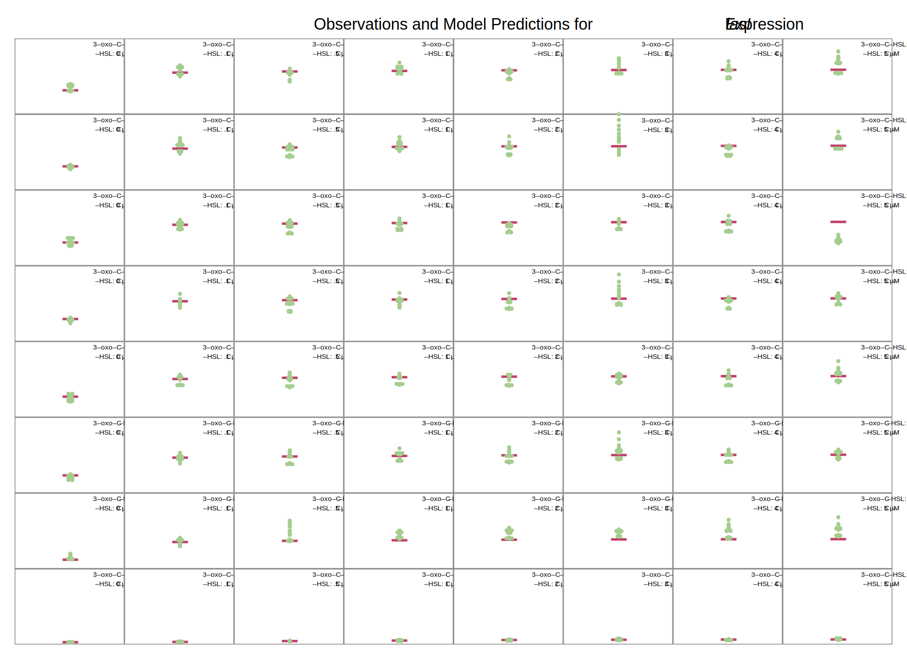
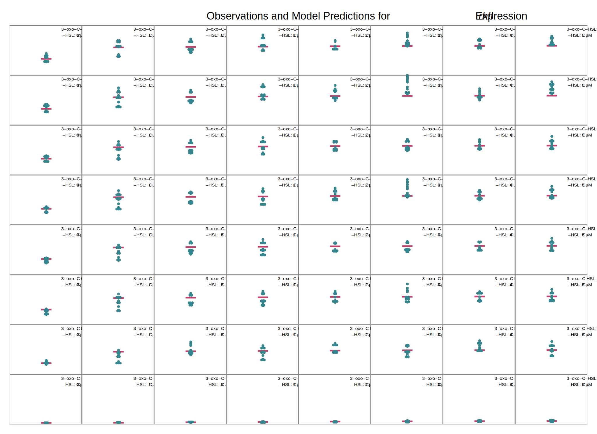
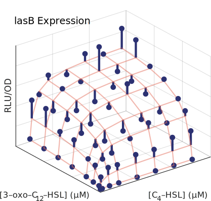
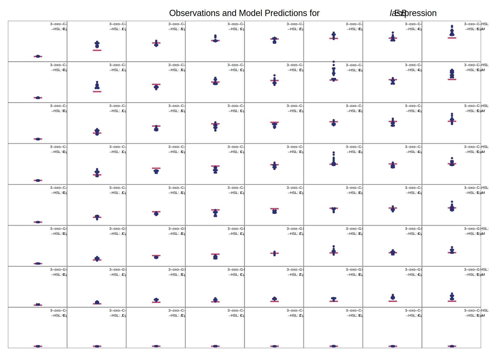
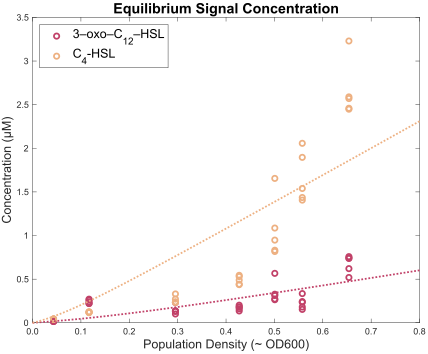
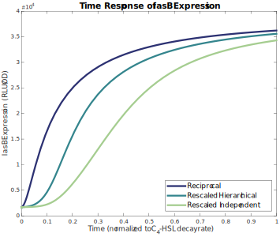
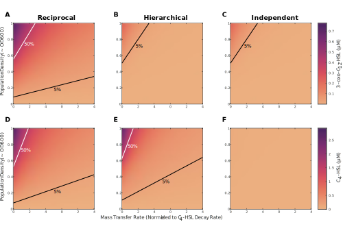
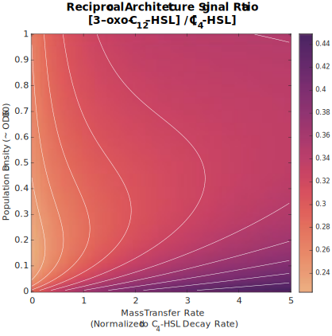

# The *las* and *rhl* Quorum Sensing Systems in *Pseudomonas aeruginosa* Form a Multi-Signal Reciprocal Network Which Can Tune Reactivity to Variations in Physical and Social Environments

## Supporting Information

### Literature Search

The PubMed database of the US National Institutes of Health was queried on 20 July 2021 using the query [`PubMed Search ("review"[Title/Abstract] OR "review"[Publication Type]) AND "quorum sensing"[Title] AND "pseudomonas aeruginosa"[Title/Abstract]`](https://pubmed.ncbi.nlm.nih.gov/?term=%28%22review%22%5BTitle%2FAbstract%5D+OR+%22review%22%5BPublication+Type%5D%29+AND+%22quorum+sensing%22%5BTitle%5D+AND+%22pseudomonas+aeruginosa%22%5BTitle%2FAbstract%5D&sort=), resulting in 76 results with publication dates from 1996 to 2021. Papers that incluced a daigram of the gene transcription networks for the *las* and *rhl* quorum sensing systems were further analyzed to show the interactions present on those diagrams. Tables S.[-@tbl:lasr] and S.[-@tbl:rhlr] show the results. Of the papers analyzed, all show the *las* system positively activating the *rhl* system, and none show the *rhl* system postively activating the *las* system.

| Paper | PMID | →_lasI_ | →_lasR_ | →_rhlI_ | →_rhlR_ | →elastase |
| ---- | :--: | :--: | :--: | :--: | :--: | :--: |
| [@GarcíaReyes2020] | [31794380](https://pubmed.ncbi.nlm.nih.gov/31794380/) | ● | ○ | ● | ● | ● |
| [@Rutherford2012] | [23125205](https://pubmed.ncbi.nlm.nih.gov/23125205/) | ● | ○ | ● | ● |  |
|[@Proctor2020] |[31971503](https://pubmed.ncbi.nlm.nih.gov/31971503/) | ● | ○ | ○ | ● |  |
|[@Jakobsen2013] |[23841636](https://pubmed.ncbi.nlm.nih.gov/23841636/) | ● | ○ | ● | ● |  |
|[@Soukarieh2018] |[29999316](https://pubmed.ncbi.nlm.nih.gov/29999316/) | ● | ● | ● | ● |  |
|[@Tateda2005] |[15926474](https://pubmed.ncbi.nlm.nih.gov/15926474/) | ● | ○ | ● | ○ | ● |
|[@Williams2007] |[19249239](https://pubmed.ncbi.nlm.nih.gov/19249239/) | ○ | ○ | ● | ● |  |
|[@Heurlier2006] |[16503417](https://pubmed.ncbi.nlm.nih.gov/16503417/) | ● | ○ | ● | ○ |  |
|[@LeBerre2006] |[16631332](https://pubmed.ncbi.nlm.nih.gov/16631332/) | ○ | ○ | ● | ● |  |
|[@Juhas2005] |[15816912](https://pubmed.ncbi.nlm.nih.gov/15816912/) | ● | ● | ● | ● | ● |
|[@Donabedian2003] |[12799145](https://pubmed.ncbi.nlm.nih.gov/12799145/) | ● | ○ | ● | ● | ● |
|[@Reuter2016] |[26819549](https://pubmed.ncbi.nlm.nih.gov/26819549/) | ● | ○ | ○ | ● | ● |
|[@Yong2013] |[22767136](https://pubmed.ncbi.nlm.nih.gov/22767136/) | ● | ○ | ● | ● | ● |
|[@Welsh2016] |[27268906](https://pubmed.ncbi.nlm.nih.gov/27268906/) |  |  | ● | ● | ● |
|[@DeSordi2009] |[19845041](https://pubmed.ncbi.nlm.nih.gov/19845041/) | ● | ○ | ● | ○ |  |
|[@Winzer2001] |[11437336](https://pubmed.ncbi.nlm.nih.gov/11437336/) | ● | ○ | ○ | ● | ● |
|[@Schuster2013] |[23682605](https://pubmed.ncbi.nlm.nih.gov/23682605/) | ● | ○ | ● | ● |  |
|[@Papaioannou2013] |[24065108](https://pubmed.ncbi.nlm.nih.gov/24065108/) | ● | ● | ○ | ● | ● |
|[@Roy2011] |[22112397](https://pubmed.ncbi.nlm.nih.gov/22112397/) | ● | ○ | ● | ● |  |

Table: lasr {#tbl:lasr}

**Table S.[-@tbl:lasr].** Activation of QS genes by LasR/3‑oxo‑C12‑HSL in review of published literature. Solid dots indicate positive activation in the paper’s diagram of gene transcription, while hollow dots indicate that the diagram shows no effect. No diagrams indicated repression. Note that some papers made no attempt to indicate particular interactions; several, for example, concentrated strictly on the QS genes themselves and did not show the effect on downstream genes such as those for elastase.

| Paper | PMID | →_lasI_ | →_lasR_ | →_rhlI_ | →_rhlR_ | →elastase |
| ---- | :--: | :--: | :--: | :--: | :--: | :--: |
| [@GarcíaReyes2020] | [31794380](https://pubmed.ncbi.nlm.nih.gov/31794380/) | ○ | ○ | ○ | ○ | ● |
| [@Rutherford2012] | [23125205](https://pubmed.ncbi.nlm.nih.gov/23125205/) | ○ | ○ | ● | ○ |  |
|[@Proctor2020] |[31971503](https://pubmed.ncbi.nlm.nih.gov/31971503/) | ○ | ○ | ● | ○ | |
|[@Jakobsen2013] |[23841636](https://pubmed.ncbi.nlm.nih.gov/23841636/) | ○ | ○ | ● | ○ | |
|[@Soukarieh2018] |[29999316](https://pubmed.ncbi.nlm.nih.gov/29999316/) | ○ | ○ | ○ | ○ | |
|[@Tateda2005] |[15926474](https://pubmed.ncbi.nlm.nih.gov/15926474/) | ○ | ○ | ● | ○ | ● |
|[@Williams2007] |[19249239](https://pubmed.ncbi.nlm.nih.gov/19249239/) | ○ | ○ | ○ | ○ | |
|[@Heurlier2006] |[16503417](https://pubmed.ncbi.nlm.nih.gov/16503417/) | ○ | ○ | ● | ○ | |
|[@LeBerre2006] |[16631332](https://pubmed.ncbi.nlm.nih.gov/16631332/) | ○ | ○ | ○ | ○ | |
|[@Juhas2005] |[15816912](https://pubmed.ncbi.nlm.nih.gov/15816912/) | ○ | ○ | ● | ● | ● |
|[@Donabedian2003] |[12799145](https://pubmed.ncbi.nlm.nih.gov/12799145/) | ○ | ○ | ○ | ○ | ● |
|[@Reuter2016] |[26819549](https://pubmed.ncbi.nlm.nih.gov/26819549/) | ○ | ○ | ○ | ○ | ● |
|[@Yong2013] |[22767136](https://pubmed.ncbi.nlm.nih.gov/22767136/) | ○ | ○ | ● | ○ | ● |
|[@Welsh2016] |[27268906](https://pubmed.ncbi.nlm.nih.gov/27268906/) | ○ | ○ |  |  | ○ |
|[@DeSordi2009] |[19845041](https://pubmed.ncbi.nlm.nih.gov/19845041/) | ○ | ○ | ● | ○ | |
|[@Winzer2001] |[11437336](https://pubmed.ncbi.nlm.nih.gov/11437336/) | ○ | ○ | ● | ○ | ● |
|[@Schuster2013] |[23682605](https://pubmed.ncbi.nlm.nih.gov/23682605/) | ○ | ○ | ● | ○ |  |
|[@Papaioannou2013] |[24065108](https://pubmed.ncbi.nlm.nih.gov/24065108/) | ○ | ○ | ● | ○ | ● |
|[@Roy2011] |[22112397](https://pubmed.ncbi.nlm.nih.gov/22112397/) | ○ | ○ | ○ | ○ |  |

Table: rhlr {#tbl:rhlr}

**Table S.[-@tbl:rhlr].** Activation of QS genes by RhlR/C4‑HSL in review of published literature. Same notation as previous table.

### Data Analysis

Gene expression data for *lasI,* *rhlI,* and *lasB* was collected every hour for a 24-hour period. Observations used for analysis were limited to a two-hour window that contained the peak expression level for each gene. Figures S.[-@fig:lasi_time], S.[-@fig:rhli_time], and S.[-@fig:lasb_time] show the full time course of expression levels and highlight the intervals used for analysis. Those windows were 8–10 hours, 3–5 hours, and 4–6 hours for *lasI,* *rhlI,* and *lasB,* respectively.

{#fig:lasi_time}

**Figure S.[-@fig:lasi_time]. Expression level of _lasI_ over time course of experiment.** Shaded regions highlight peak expression and indicate two-hour period used in analysis.

{#fig:rhli_time}

**Figure S.[-@fig:rhli_time]. Expression level of _rhlI_ over time course of experiment.** Shaded regions highlight peak expression and indicate two-hour period used in analysis.

{#fig:lasb_time}

**Figure S.[-@fig:lasb_time]. Expression level of _lasB_ over time course of experiment.** Shaded regions highlight peak expression and indicate two-hour period used in analysis.

### Single-Signal Models

Table S.[-@tbl:singlesignal] shows the parameter estimates for the single-signal model of Equation 1 as maximum fold-change ((*ɑ* + *ɑ*0) / *ɑ*0) and half-concentration values (_K_) for both signals.

| Gene   | Signal                   | Parameter        |                Derivation                 |          Estimate          |      95% C.I. |
| ------ | ------------------------ | ---------------- | :---------------------------------------: | :------------------------: | ------------: |
| *lasI* |                          | Basal expression |              *ɑ*0              | 1670 <small>RLU/OD</small> |   1619 – 1721 |
|        | 3‑oxo‑C12‑HSL | Max fold-change  | (*ɑ* + *ɑ*0) / *ɑ*0 |            38 ×            |       36 – 40 |
|        |                          | ½ conc.          |                    *K*                    |          0.24 μM           |   0.17 – 0.30 |
|        | C4‑HSL        | Max fold-change  | (*ɑ* + *ɑ*0) / *ɑ*0 |           6.4 ×            |     5.8 – 7.0 |
|        |                          | ½ conc.          |                    *K*                    |           1.0 μM           |     0.7 – 1.4 |
| *rhlI* |                          | Basal expression |              *ɑ0*              | 1861 <small>RLU/OD</small> |   1798 – 1923 |
|        | 3‑oxo‑C12‑HSL | Max fold-change  | (*ɑ* + *ɑ*0) / *ɑ*0 |            35 ×            |       34 – 36 |
|        |                          | ½ conc.          |                    *K*                    |          0.052 μM          | 0.031 – 0.073 |
|        | C4‑HSL        | Max fold-change  | (*ɑ* + *ɑ*0) / *ɑ*0 |           6.4 ×            |     5.3 – 7.4 |
|        |                          | ½ conc.          |                    *K*                    |           1.6 μM           |     0.8 – 2.4 |

Table: singlesignal {#tbl:singlesignal}

**Table S.[-@tbl:singlesignal]. Single Signal Parameter Estimates.** Estimated fold-change, derived from raw parameters of Equation 1 (main text) as (*ɑ* + *ɑ*0) / *ɑ*0 , and half-concentration, *K*, values for gene expression as a function of a single signal in isolation. Values shown with 95% confidence intervals.

### Multi-Signal Models

Table S.[-@tbl:multisignal] shows the parameter estimates for the multi-signal model of Equation 2.

| Gene   | Signal                   | Parameter                            |                          Derivation                          |          Estimate          |      95% C.I. |
| ------ | ------------------------ | ------------------------------------ | :----------------------------------------------------------: | :------------------------: | ------------: |
| *lasI* |                          | Basal expression                     |                      *ɑ*1,0                       | 1670 <small>RLU/OD</small> |   1619 – 1721 |
|        | 3‑oxo‑C12‑HSL | Max fold-change                      | (*ɑ*1,1 + *ɑ*1,0) / *ɑ*1,0  |            38 ×            |       36 – 40 |
|        |                          | ½ conc.                              |                      *K*1,1                       |          0.24 μM           |   0.17 – 0.30 |
|        | C4‑HSL        | Max fold-change                      | (*ɑ*1,2 + *ɑ*1,0) / *ɑ*1,0  |           6.4 ×            |     5.8 – 7.0 |
|        |                          | ½ conc.                              |                      *K*1,2                       |           1.0 μM           |     0.7 – 1.4 |
|        | Combined                 | Max fold-change                      | (*ɑ*1,1,2 + *ɑ*1,0) / *ɑ*1,0 |            30 ×            |       29 – 31 |
|        |                          | ½ conc. for 3‑oxo‑C12‑HSL |                    *K**Q*1,1,2                    |         < 0.001 μM         |               |
|        |                          | ½ conc. for C4-HSL        |                    *K**Q*1,2,1                    |          0.003 μM          |     0 – 0.011 |
| *rhlI* |                          | Basal expression                     |                      *ɑ*2,0                       | 1861 <small>RLU/OD</small> |   1798 – 1923 |
|        | 3‑oxo‑C12‑HSL | Max fold-change                      | (*ɑ*2,1 + *ɑ*2,0) / *ɑ*2,0  |            35 ×            |       34 – 36 |
|        |                          | ½ conc.                              |                      *K*2,1                       |          0.052 μM          | 0.031 – 0.073 |
|        | C4‑HSL        | Max fold-change                      | (*ɑ*2,2 + *ɑ*2,0) / *ɑ*2,0  |           6.4 ×            |     5.3 – 7.4 |
|        |                          | ½ conc.                              |                      *K*2,2                       |           1.6 μM           |     0.8 – 2.4 |
|        | Combined                 | Max fold-change                      | (*ɑ*2,1,2 + *ɑ*1,0) / *ɑ*1,0 |            27 ×            |       26 – 28 |
|        |                          | ½ conc. for 3‑oxo‑C12‑HSL |                    *K**Q*2,1,2                    |         < 0.001 μM         |               |
|        |                          | ½ conc. for C4-HSL        |                    *K**Q*2,2,1                    |         < 0.001 μM         |               |

Table: multisignal {#tbl:multisignal}

**Table S.[-@tbl:multisignal]. Multi-signal parameter estimates.** Model parameters for gene expression as a function of multiple signal concentrations. Parameter definitions are the same as in Table S.[-@tbl:singlesignal] with addition of cooperative fold-change, again derived from raw parameters as (*ɑ* + *ɑ*0) / *ɑ*0 ,and cooperative half-concentration *KQ.* Values shown with 95% confidence intervals.

Figure 7 in the main text summarizes the predictions of the multi-signal models for *lasI* and *rhlI* expression. The following figures provide a more detailed comparison of the model predictions for both genes.

{#fig:model_lasi}

**Figure S.[-@fig:model_lasi]. Multi-signal model for _lasI_ expression.** Panels compare model predictions to observations for all combinations of signal concentrations. Horizontal bars indicate model predictions, while plotted points show observed values.

{#fig:model_rhli}

**Figure S.[-@fig:model_rhli]. Multi-signal model for _rhlI_ expression.** Panels compare model predictions to observations for all combinations of signal concentrations. Horizontal bars indicate model predictions, while plotted points show observed values.

Table S.[-@tbl:explasb] shows the parameter estimates for *lasB* expression.

| Signal                   | Parameter                            |                          Derivation                          |          Estimate          |    95% C.I. |
| ------------------------ | ------------------------------------ | :----------------------------------------------------------: | :------------------------: | ----------: |
|                          | Basal Expression                     |                      *ɑ*3,0                       | 1588 <small>RLU/OD</small> |  1516 –1660 |
| 3‑oxo‑C12‑HSL | Max fold-change                      | (*ɑ*3,1 + *ɑ*3,0) / *ɑ*3,0  |           6.1 ×            |   5.6 – 6.7 |
|                          | ½ conc.                              |                      *K*3,1                       |           2.5 μM           |   1.0 – 3.0 |
| C4‑HSL        | Max fold-change                      | (*ɑ*3,2 + *ɑ*3,0) / *ɑ*3,0  |           1.1 ×            |   1.1 – 1.1 |
|                          | ½ conc.                              |                      *K*3,2                       |         < 0.001 μM         |             |
| Combined                 | Max fold-change                      | (*ɑ*3,1,2 + *ɑ*3,0) / *ɑ*3,0 |            23 ×            |     22 – 24 |
|                          | ½ conc. for 3‑oxo‑C12‑HSL |                    *K**Q*3,1,2                    |          0.42 μM           | 0.35 – 0.48 |
|                          | ½ conc. for C4-HSL        |                    *K**Q*3,2,1                    |          0.22 μM           | 0.18 – 0.25 |

Table: explasb {#tbl:explasb}

**Table S.[-@tbl:explasb]. Multi-signal parameter estimates for *lasB.*** Model parameters for *lasB* expression as a function of multiple signal concentrations. Parameter definitions are the same as in Table S.[-@tbl:multisignal]. Values shown with 95% confidence intervals. Half-concentration estimates less than 0.001 μM are below the limits of precision of the experimental data.

Using the parameter values, the model predicts lasB expression as shown in Figure S.[-@fig:lasb_model].

{#fig:lasb_model}

**Figure S.[-@fig:lasb_model]. Multi-signal model for _lasB_ expression.** Panels compare model predictions to observations for all combinations of signal concentrations. Horizontal bars indicate model predictions, while plotted points show observed values.

Figure S.[-@fig:model_lasb] presents a more detailed comparison of the model predictions and observations.

{#fig:model_lasb}

**Figure S.[-@fig:model_lasb]. Multi-signal model for _lasB_ expression.** Panels compare model predictions to observations for all combinations of signal concentrations. Horizontal bars indicate model predictions, while plotted points show observed values.

### Signal Dynamics

We analyze signal dynamics using the model from the main text where the per-capita single production rater is assumed to be proportional to the synthase expression level, $E_i(\mathbf{S})$. The proportionality constant is $c_i$.

$$
\frac{\mathrm{d}S_i}{\mathrm{dt}} \ \ = \ \ c_i E_i(\mathbf{S})\cdot N \ \ - \ \  \delta_i \cdot S_i \ \ - \ \  m \cdot S_i
$$

We consider the equilibrium signal concentration (where $\mathrm{d}S/\mathrm{dt} = 0$) and normalize to the decay rate of  C4‑HSL ($\delta_2$). When there is no mass transfer ($m = 0$), these simplifications result in an equation for  C4‑HSL,

$$
0 \ \ = \ \ \frac{ c_2 }{ \delta_2 } E_2(\mathbf{S})\cdot N \ \ - \ \ S_2
$$

which can be solved for $c_2 / \delta_2$ in terms of *rhlI* expression $E_2(\mathbf{S})$, density $N$, and C4‑HSL concentration $S_2$. The corresponding equation for 3‑oxo‑C12‑HSL includes an additional factor $\delta_1/\delta_2$ which, from [@Cornforth2014], we take to be approximately 1.7.

$$
0 \ \ = \ \ \frac{ c_1 }{ \delta_2 } E_1(\mathbf{S})\cdot N \ \ - \ \ \frac{ \delta_1 }{ \delta_2 } S_1
$$

Data from [@Rattray2022] includes measurements of equilibrium signal concentrations at multiple population densities. We combine those measurements of $N$ and $S_i$ with our model’s estimate of synthase expression level $E_i(\mathbf{S})$ and use non-linear least squares to estimate the proportionality constants.

| Signal _i_                   | Proportionality Constant $c_i/\delta_2$ |
| :--------------------------- | --------------------------------------: |
| **3‑oxo‑C12‑HSL** |                             12.7 pM/RLU |
| **C4‑HSL**        |                             25.4 pM/RLU |

Table: const {#tbl:const}

**Table S.[-@tbl:const].** Estimated proportionality constants that relate synthase expression levels to per-capita signal production rates. Final column shows adjusted R2 of non-linear least squares estimate.

{#fig:constants}

**Figure S.[-@fig:constants]. Equilibrium signal concentration predicted using proportionality constants.** Individual data points show experimental observations and dashed lines indicate model predictions.

### Analytic Solutions for Equilibrium

It is possible to derive analytic solutions of Equation 2 (main text) for equilibrium concentrations in all architectures; however, the results are not especially helpful for deriving insights into the system behavior. For example, the independent architecture, which is the simplest considered, has the following equilibrium concentration of 3‑oxo‑C 12‑HSL.
$$
S_1^* = \frac{
\begin{align}
c_1\,N\,(\alpha_{1,0} +\alpha_{1,1}) \\ - K_{1,1}\,(m+\delta_1)
\end{align}
\;+\sqrt{
\begin{aligned}
{K_{1,1} }^2 \,{\delta_1 }^2 +2\,{K_{1,1} }^2 \,\delta_1 \,m+{K_{1,1} }^2 \,m^2
+2\,K_{1,1} \,N\,\alpha_{1,0} \,c_1 \,\delta_1 \\
+2\,K_{1,1} \,N\,\alpha_{1,0} \,c_1 \,m -2\,K_{1,1} \,N\,\alpha_{1,1} \,c_1 \,\delta_1 -2\,K_{1,1} \,N\,\alpha_{1,1} \,c_1 \,m \\
+N^2 \,{\alpha_{1,0} }^2 \,{c_1 }^2 +2\,N^2 \,\alpha_{1,0} \,\alpha_{1,1} \,{c_1 }^2
+N^2 \,{\alpha_{1,1} }^2 \,{c_1 }^2
\end{aligned}
}
}{2\,{\left(\delta_1 +m\right)}}
$$

### Alternate QS Architectures

Table S.[-@tbl:architectures] shows the parameter values that allow Equation 2 (main text) to represent various QS architectures.

| Gene   | Signal                   | Parameter       |                          Derivation                          | Reciprocal Architecture | Hierarchical  Architecture | Independent Architecture |
| ------ | ------------------------ | --------------- | :----------------------------------------------------------: | :---------------------: | :------------------------: | :----------------------: |
| *lasI* | 3‑oxo‑C12‑HSL | Max fold-change | (*ɑ*1,1 + *ɑ*1,0) / *ɑ*1,0  |          38 ×           |            38 ×            |           38 ×           |
|        | C4‑HSL        | Max fold-change | (*ɑ*1,2 + *ɑ*1,0) / *ɑ*1,0  |          6.4 ×          |            1 ×             |           1 ×            |
|        | Combined                 | Max fold-change | (*ɑ*1,1,2 + *ɑ*1,0) / *ɑ*1,0 |          30 ×           |            1 ×             |           1 ×            |
| *rhlI* | 3‑oxo‑C12‑HSL | Max fold-change | (*ɑ*2,1 + *ɑ*2,0) / *ɑ*2,0  |          35 ×           |            35 ×            |           1 ×            |
|        | C4‑HSL        | Max fold-change | (*ɑ*2,2 + *ɑ*2,0) / *ɑ*2,0  |          6.4 ×          |           6.4 ×            |          6.4 ×           |
|        | Combined                 | Max fold-change | (*ɑ*2,1,2 + *ɑ*1,0) / *ɑ*1,0 |          27 ×           |            27 ×            |           1 ×            |

Table: architectures {#tbl:architectures}

**Table S.[-@tbl:architectures]. Hierarchical and independent architectures are special cases of the reciprocal architecture.** The multi-signal model of Equation 2 (main text) can represent hypothetical, alternative QS architectures by setting appropriate *ɑ* values to zero. Zero *ɑ* values result in a corresponding maximum fold-change of 1. For a hierarchical architecture, this setting nullifies the effect of C4‑HSL on *lasI.* For an independent archictecture, this setting additionally nullifies the effect of 3‑oxo‑C12‑HSL on *rhlI.*

### Normalizing Alternate QS Architectures

Table S.[-@tbl:architectures] analyzes hypothetical, alternative architectures by eliminating the influence of specific signals on specific genes. For example, the hierarchical architecture nullifies the influence of C4‑HSL on *lasI* without modifying the effect of 3‑oxo‑C12‑HSL on *lasI.* This change necessarily reduces the maximum expression level of *lasI,* and that reduction partially explains the different *lasB* response in a hierarchical architecture. Reducing maximum *lasI* expression alone, however, does not explain all of the differences in the *lasB* response. To expose those additional differences, we make additional adjustments to the model. In particular, we increase the expression of *lasI* due to 3‑oxo‑C12‑HSL to precisely compensate for the loss of expression due to C4‑HSL. Table S.[-@tbl:architectures2] shows the full set of adjustments required to normalize the maximum synthase expression levels across all architectures.

| Gene | Signal | Parameter | Derivation | Reciprocal Architecture | Hierarchical  Architecture | Independent Architecture |
|-|-|--------|:------:|:------:|:------:|:------:|
| *lasI* | 3‑oxo‑C12‑HSL | Max fold-change | (*ɑ*1,1 + *ɑ*1,0) / *ɑ*1,0 | 38 × | 73 × | 73 × |
|  | C4‑HSL | Max fold-change | (*ɑ*1,2 + *ɑ*1,0) / *ɑ*1,0 | 6.4 × |            1 ×             | 1 × |
|  | Combined | Max fold-change | (*ɑ*1,1,2 + *ɑ*1,0) / *ɑ*1,0 | 30 × | 1 × | 1 × |
| *rhlI* | 3‑oxo‑C12‑HSL | Max fold-change | (*ɑ*2,1 + *ɑ*2,0) / *ɑ*2,0 | 35 × | 35 × | 1 × |
| | C4‑HSL | Max fold-change | (*ɑ*2,2 + *ɑ*2,0) / *ɑ*2,0 | 6.4 × | 6.4 × | 66 × |
| | Combined | Max fold-change | (*ɑ*2,1,2 + *ɑ*1,0) / *ɑ*1,0 | 27 × | 27 × | 1 × |

Table: architectures {#tbl:architectures2}

**Table S.[-@tbl:architectures2]. Models of hierarchical and independent architectures can be normalized to ensure that maximum synthase expression is the same for all architectures.** Parameters are the same as those in Table S.[-@tbl:architectures] but with increased values where appropriate.

### Temporal Dynamics

{#fig:lasb_time_response}

**Figure S.[-@fig:lasb_time_response]. Time response of *lasB* expression for reciprocal, rescaled hierarchical, and rescaled independent architectures.** Dynamics are those of Equation 3 (main text) with parameters from Table S.[-@tbl:architectures2].

### Signal Concentration Response

{#fig:signals_heatmaps}

**Figure S.[-@fig:signals_heatmaps]. Signal concentration as a function of density and mass transfer varies based on the quorum sensing architecture.** The figure shows heat maps of equilibrium 3‑oxo‑C12‑HSL and C4‑HSL concentration for three quorum sensing architectures. Both population density and mass transfer rate are varied over the same ranges for all heatmaps. The lines on each heat map indicate density and mass transfer values for which equilibrium concentration is constant, either 50% of its maximum value (white) or 5% of its maximum value (black). Equilibrium concentrations calculated from equation 3 model with parameters from Table S.[-@tbl:multisignal].

{#fig:signal_ratio}

**Figure S.[-@fig:signal_ratio]. Ratio of signal concentrations as a function of density and mass transfer varies based on the quorum sensing architecture.** The figure shows heat maps of the ratio of equilibrium 3‑oxo‑C12‑HSL to C4‑HSL concentration for the reciprocal architecture. Equilibrium concentrations calculated from equation 3 model with parameters from Table S.[-@tbl:multisignal].

### Three Signal Models

The hypothetical three-signal models of the main text’s discussion are based oh a simplified version of the _las_ and _rhl_ interactions. Table S.[-@tbl:multisignal] provides the starting point for the models. For ease of computation, the second-order effects are ignored by setting _ɑi,j,j`_ to zero. Parameters for the third signal (_i_ = 3) are initailly based on convenient intermediate values between those of _las_ and _rhl_ and then varied as neccessary to demontrate the various responses. Table S.[-@tbl:three_signal] shows the values for all non-zero parameters in all models.

| Parameter                   | Weak                | Strong              | Limited             | Damped              |
| --------------------------- | ------------------- | ------------------- | ------------------- | ------------------- |
| 𝛼1,0             | 1670                | 1670                | 1670                | 1670                |
| 𝛼2,0             | 1861                | 1861                | 1861                | 1861                |
| 𝛼3,0             | 10000               | 10000               | 10000               | 10000               |
| 𝛼1,1             | 61000               | 61000               | 61000               | 61000               |
| 𝛼2,2             | 10000               | 10000               | 10000               | 10000               |
| 𝛼3,3             | 10000               | 10000               | 10000               | 10000               |
| 𝛼1,2             | 9000                | 9000                | 9000                | 9000                |
| 𝛼2,1             | 63000               | 63000               | 63000               | 63000               |
| 𝛼2,3             | 10000               | 10000               | 10000               | 10000               |
| 𝛼3,1             | 10000               | 1000000             | 158000              | 630000              |
| 𝛼3,2             | -10000              | -10000              | -245                | -1580000            |
| K1,1             | 0.24                | 0.24                | 0.24                | 0.24                |
| K2,2             | 1.6                 | 1.6                 | 1.6                 | 1.6                 |
| K3,3             | 1                   | 1                   | 1                   | 1                   |
| K1,2             | 1                   | 1                   | 1                   | 1                   |
| K2,1             | 0.052               | 0.052               | 0.052               | 0.052               |
| K2,3             | 0.32                | 0.32                | 0.32                | 0.32                |
| K3,1             | 0.32                | 0.32                | 0.032               | 0.032               |
| K3,2             | 0.32                | 0.32                | 4.0                 | 3.2                 |
| c1/𝛿2 | 1.3⨉10-5 | 1.3⨉10-5 | 1.3⨉10-5 | 1.3⨉10-5 |
| c2/𝛿2 | 2.5⨉10-5 | 2.5⨉10-5 | 2.5⨉10-5 | 2.5⨉10-5 |
| c3/𝛿2 | 1.9⨉10-5 | 1.9⨉10-5 | 1.9⨉10-5 | 1.9⨉10-5 |
| 𝛿1/𝛿2 | 1.7                 | 1.7                 | 1.7                 | 1.7                 |
| 𝛿2/𝛿2 | 1                   | 1                   | 1                   | 1                   |
| 𝛿3/𝛿2 | 1.35                | 1.35                | 1.35                | 1.35                |

Table: three_signal {#tbl:three_signal}

**Table S.[-@tbl:three_signal]. Model parameters for hypothetical three-signal architectures.** Different parameter values result in the different responses of the third QS system's synthase expression level as population density increases.

## References

