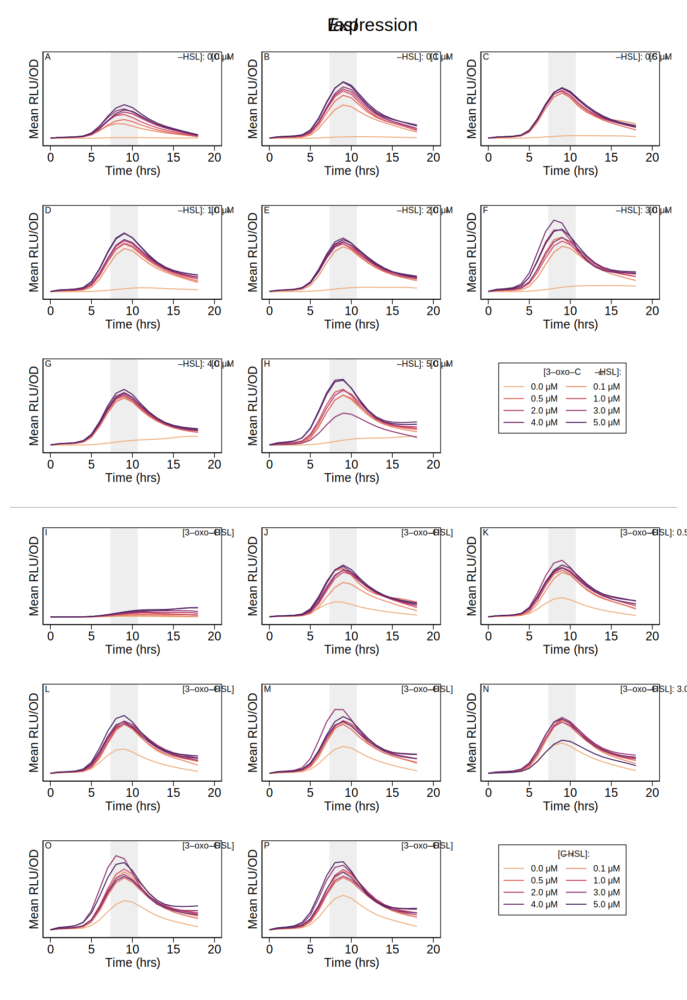
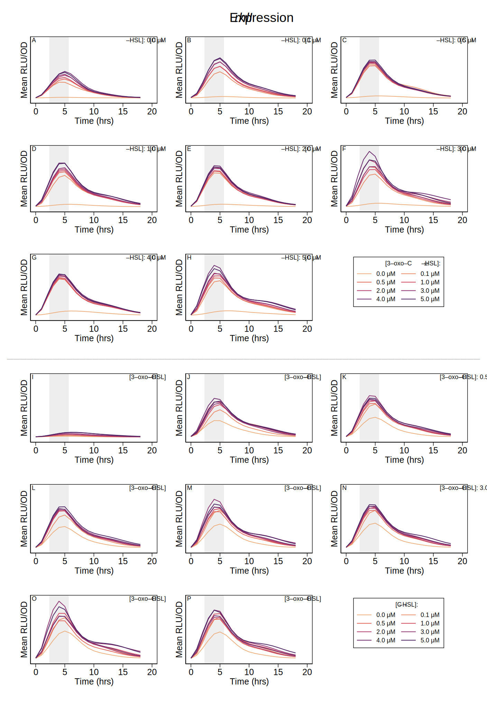
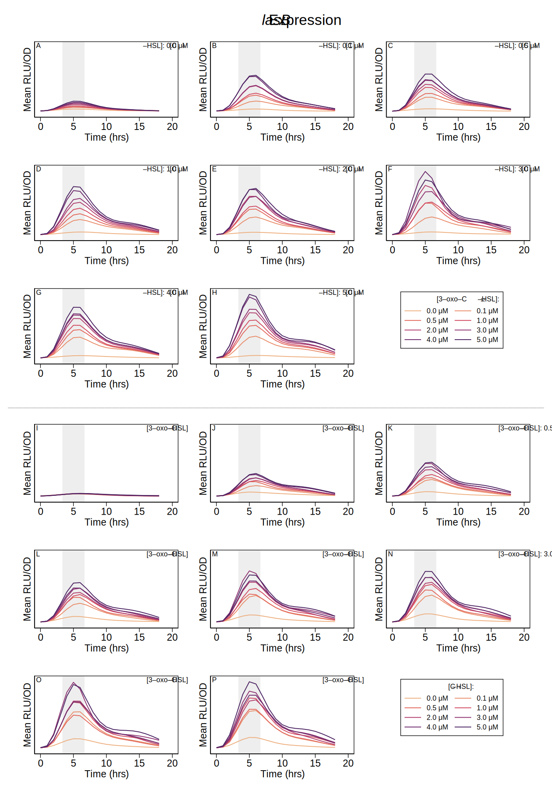

# The *las* and *rhl* Quorum Sensing Systems in *Pseudomonas aeruginosa* Form a Multi-Signal Reciprocal Network Which Can Tune Reactivity to Variations in Physical and Social Environments

## Supporting Information

### Structured Literature Search

The PubMed database of the US National Institutes of Health was queried on 20 July 2021 using the query [`PubMed Search ("review"[Title/Abstract] OR "review"[Publication Type]) AND "quorum sensing"[Title] AND "pseudomonas aeruginosa"[Title/Abstract]`](https://pubmed.ncbi.nlm.nih.gov/?term=%28%22review%22%5BTitle%2FAbstract%5D+OR+%22review%22%5BPublication+Type%5D%29+AND+%22quorum+sensing%22%5BTitle%5D+AND+%22pseudomonas+aeruginosa%22%5BTitle%2FAbstract%5D&sort=), resulting in 76 results with publication dates from 1996 to 2021. Papers that incluced a daigram of the gene transcription networks for the *las* and *rhl* quorum sensing systems were further analyzed to show the interactions present on those diagrams. Tables S.[-@tbl:lasr] and S.[-@tbl:rhlr] show the results. Of the papers analyzed, all show the *las* system positively activating the *rhl* system, and none show the *rhl* system postively activating the *las* system.

| Paper | PMID | →_lasI_ | →_lasR_ | →_rhlI_ | →_rhlR_ | →elastase |
| ---- | :--: | :--: | :--: | :--: | :--: | :--: |
| [@GarcíaReyes2020] | [31794380](https://pubmed.ncbi.nlm.nih.gov/31794380/) | ● | ○ | ● | ● | ● |
| [@Rutherford2012] | [23125205](https://pubmed.ncbi.nlm.nih.gov/23125205/) | ● | ○ | ● | ● |  |
|[@Proctor2020] |[31971503](https://pubmed.ncbi.nlm.nih.gov/31971503/) | ● | ○ | ○ | ● |  |
|[@Jakobsen2013] |[23841636](https://pubmed.ncbi.nlm.nih.gov/23841636/) | ● | ○ | ● | ● |  |
|[@Soukarieh2018] |[29999316](https://pubmed.ncbi.nlm.nih.gov/29999316/) | ● | ● | ● | ● |  |
|[@Tateda2005] |[15926474](https://pubmed.ncbi.nlm.nih.gov/15926474/) | ● | ○ | ● | ○ | ● |
|[@Williams2007] |[19249239](https://pubmed.ncbi.nlm.nih.gov/19249239/) | ○ | ○ | ● | ● |  |
|[@Heurlier2006] |[16503417](https://pubmed.ncbi.nlm.nih.gov/16503417/) | ● | ○ | ● | ○ |  |
|[@LeBerre2006] |[16631332](https://pubmed.ncbi.nlm.nih.gov/16631332/) | ○ | ○ | ● | ● |  |
|[@Juhas2005] |[15816912](https://pubmed.ncbi.nlm.nih.gov/15816912/) | ● | ● | ● | ● | ● |
|[@Donabedian2003] |[12799145](https://pubmed.ncbi.nlm.nih.gov/12799145/) | ● | ○ | ● | ● | ● |
|[@Reuter2016] |[26819549](https://pubmed.ncbi.nlm.nih.gov/26819549/) | ● | ○ | ○ | ● | ● |
|[@Yong2013] |[22767136](https://pubmed.ncbi.nlm.nih.gov/22767136/) | ● | ○ | ● | ● | ● |
|[@Welsh2016] |[27268906](https://pubmed.ncbi.nlm.nih.gov/27268906/) |  |  | ● | ● | ● |
|[@DeSordi2009] |[19845041](https://pubmed.ncbi.nlm.nih.gov/19845041/) | ● | ○ | ● | ○ |  |
|[@Winzer2001] |[11437336](https://pubmed.ncbi.nlm.nih.gov/11437336/) | ● | ○ | ○ | ● | ● |
|[@Schuster2013] |[23682605](https://pubmed.ncbi.nlm.nih.gov/23682605/) | ● | ○ | ● | ● |  |
|[@Papaioannou2013] |[24065108](https://pubmed.ncbi.nlm.nih.gov/24065108/) | ● | ● | ○ | ● | ● |
|[@Roy2011] |[22112397](https://pubmed.ncbi.nlm.nih.gov/22112397/) | ● | ○ | ● | ● |  |

Table: lasr {#tbl:lasr}

**Table S.[-@tbl:lasr].** Activation of QS genes by LasR/3‑oxo‑C12‑HSL in review of published literature. Solid dots indicate positive activation in the paper’s diagram of gene transcription, while hollow dots indicate that the diagram shows no effect. No diagrams indicated repression. Note that some papers made no attempt to indicate particular interactions; several, for example, concentrated strictly on the QS genes themselves and did not show the effect on downstream genes such as those for elastase.

| Paper | PMID | →_lasI_ | →_lasR_ | →_rhlI_ | →_rhlR_ | →elastase |
| ---- | :--: | :--: | :--: | :--: | :--: | :--: |
| [@GarcíaReyes2020] | [31794380](https://pubmed.ncbi.nlm.nih.gov/31794380/) | ○ | ○ | ○ | ○ | ● |
| [@Rutherford2012] | [23125205](https://pubmed.ncbi.nlm.nih.gov/23125205/) | ○ | ○ | ● | ○ |  |
|[@Proctor2020] |[31971503](https://pubmed.ncbi.nlm.nih.gov/31971503/) | ○ | ○ | ● | ○ | |
|[@Jakobsen2013] |[23841636](https://pubmed.ncbi.nlm.nih.gov/23841636/) | ○ | ○ | ● | ○ | |
|[@Soukarieh2018] |[29999316](https://pubmed.ncbi.nlm.nih.gov/29999316/) | ○ | ○ | ○ | ○ | |
|[@Tateda2005] |[15926474](https://pubmed.ncbi.nlm.nih.gov/15926474/) | ○ | ○ | ● | ○ | ● |
|[@Williams2007] |[19249239](https://pubmed.ncbi.nlm.nih.gov/19249239/) | ○ | ○ | ○ | ○ | |
|[@Heurlier2006] |[16503417](https://pubmed.ncbi.nlm.nih.gov/16503417/) | ○ | ○ | ● | ○ | |
|[@LeBerre2006] |[16631332](https://pubmed.ncbi.nlm.nih.gov/16631332/) | ○ | ○ | ○ | ○ | |
|[@Juhas2005] |[15816912](https://pubmed.ncbi.nlm.nih.gov/15816912/) | ○ | ○ | ● | ● | ● |
|[@Donabedian2003] |[12799145](https://pubmed.ncbi.nlm.nih.gov/12799145/) | ○ | ○ | ○ | ○ | ● |
|[@Reuter2016] |[26819549](https://pubmed.ncbi.nlm.nih.gov/26819549/) | ○ | ○ | ○ | ○ | ● |
|[@Yong2013] |[22767136](https://pubmed.ncbi.nlm.nih.gov/22767136/) | ○ | ○ | ● | ○ | ● |
|[@Welsh2016] |[27268906](https://pubmed.ncbi.nlm.nih.gov/27268906/) | ○ | ○ |  |  | ○ |
|[@DeSordi2009] |[19845041](https://pubmed.ncbi.nlm.nih.gov/19845041/) | ○ | ○ | ● | ○ | |
|[@Winzer2001] |[11437336](https://pubmed.ncbi.nlm.nih.gov/11437336/) | ○ | ○ | ● | ○ | ● |
|[@Schuster2013] |[23682605](https://pubmed.ncbi.nlm.nih.gov/23682605/) | ○ | ○ | ● | ○ |  |
|[@Papaioannou2013] |[24065108](https://pubmed.ncbi.nlm.nih.gov/24065108/) | ○ | ○ | ● | ○ | ● |
|[@Roy2011] |[22112397](https://pubmed.ncbi.nlm.nih.gov/22112397/) | ○ | ○ | ○ | ○ |  |

Table: rhlr {#tbl:rhlr}

**Table S.[-@tbl:rhlr].** Activation of QS genes by RhlR/C4‑HSL in review of published literature. Same notation as previous table.

### Data Analysis

Gene expression data for *lasI,* *rhlI,* and *lasB* was collected every hour for a 24-hour period. Observations used for analysis were limited to a two-hour window that contained the peak expression level for each gene. Figures S.[-@fig:lasi_time], S.[-@fig:rhli_time], and S.[-@fig:lasb_time] show the full time course of expression levels and highlight the intervals used for analysis. Those windows were 8–10 hours, 3–5 hours, and 4–6 hours for *lasI,* *rhlI,* and *lasB,* respectively.

{#fig:lasi_time}

**Figure S.[-@fig:lasi_time]. Expression level of _lasI_ over time course of experiment.** Shaded regions highlight peak expression and indicate two-hour period used in analysis.

{#fig:rhli_time}

**Figure S.[-@fig:rhli_time]. Expression level of _rhlI_ over time course of experiment.** Shaded regions highlight peak expression and indicate two-hour period used in analysis.

{#fig:lasb_time}

**Figure S.[-@fig:lasb_time]. Expression level of _lasB_ over time course of experiment.** Shaded regions highlight peak expression and indicate two-hour period used in analysis.

## References

